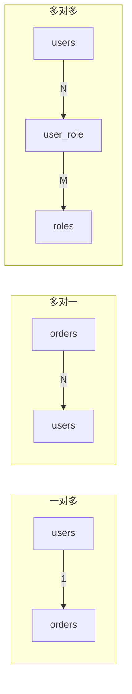
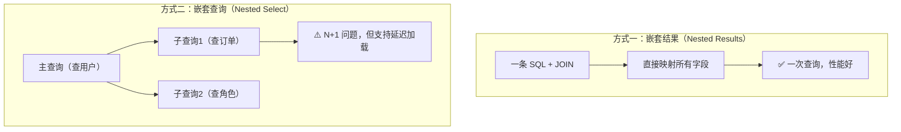
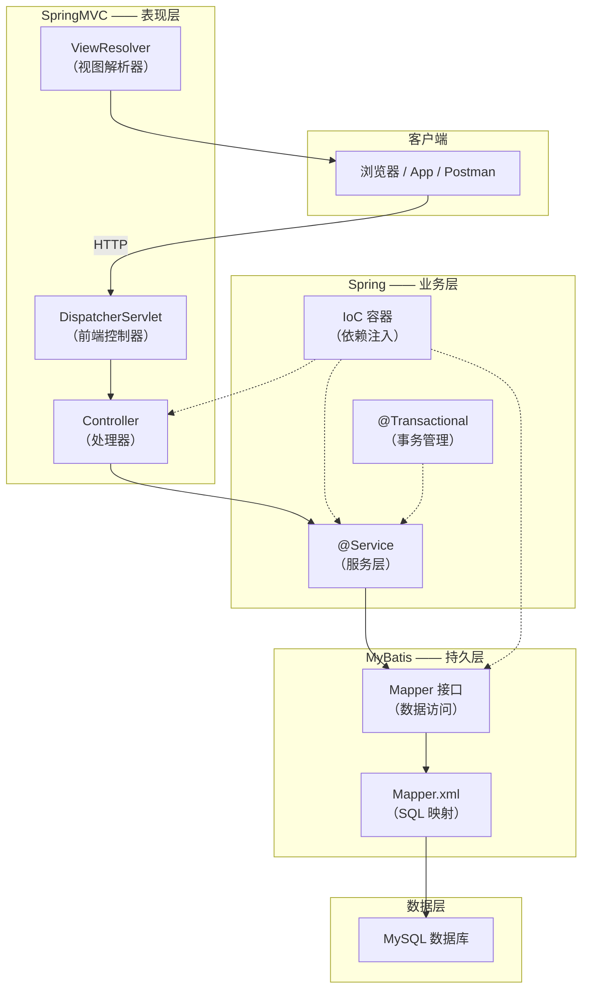
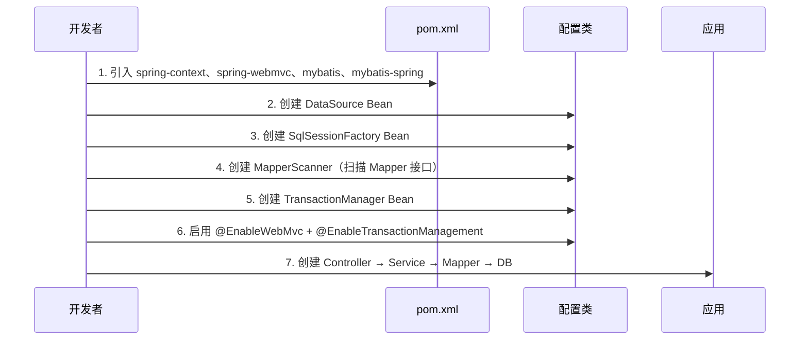
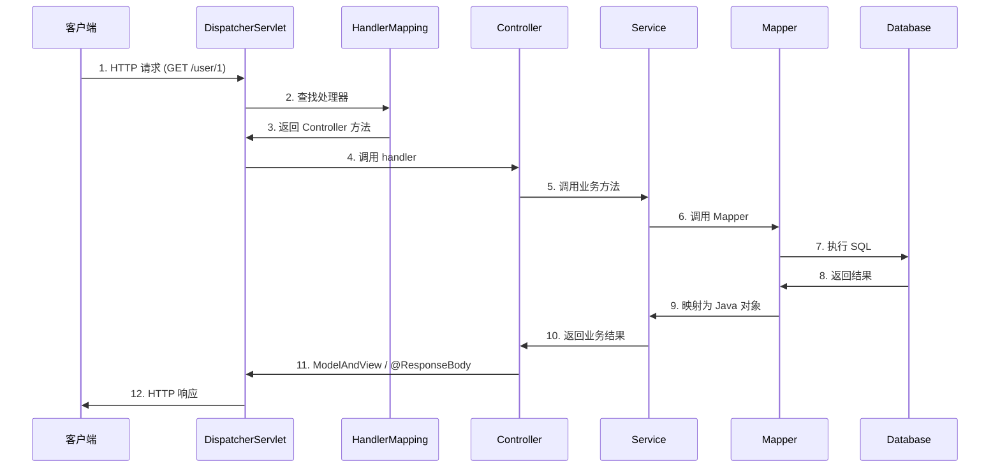
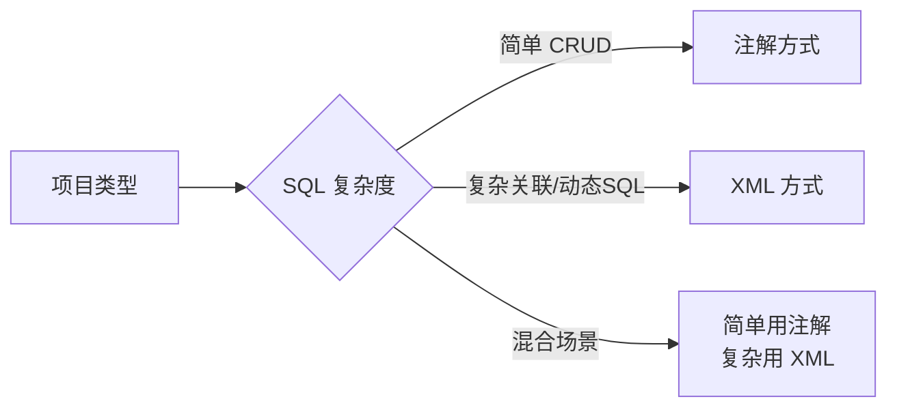

# MyBatis 进阶开发指南

> 配套项目：`Mybatis-02/` —— 关联映射（一对多/多对一/多对多）+ 注解开发 + SSM 综合运用 完整演示。

---

## 目录

1. [MyBatis 关联映射](#1-mybatis-关联映射)
   - 1.1 [关联关系概述](#11-关联关系概述)
   - 1.2 [一对多（One-to-Many）](#12-一对多one-to-many)
   - 1.3 [多对一（Many-to-One）](#13-多对一many-to-one)
   - 1.4 [多对多（Many-to-Many）](#14-多对多many-to-many)
   - 1.5 [嵌套结果 vs 嵌套查询](#15-嵌套结果-vs-嵌套查询)
   - 1.6 [延迟加载](#16-延迟加载)
2. [MyBatis 注解开发](#2-mybatis-注解开发)
   - 2.1 [四大基础注解](#21-四大基础注解)
   - 2.2 [@Results 与 @Result](#22-results-与-result)
   - 2.3 [@One 与 @Many](#23-one-与-many)
   - 2.4 [XML vs 注解对比](#24-xml-vs-注解对比)
3. [SSM 框架综合运用](#3-ssm-框架综合运用)
   - 3.1 [SSM 三层架构](#31-ssm-三层架构)
   - 3.2 [SSM 整合步骤](#32-ssm-整合步骤)
   - 3.3 [完整配置示例](#33-完整配置示例)
   - 3.4 [SSM 执行流程](#34-ssm-执行流程)
4. [总结](#4-总结)
5. [二十道高频面试题](#5-二十道高频面试题)

---

## 1. MyBatis 关联映射

### 1.1 关联关系概述

在关系数据库中，表与表之间存在三种核心关系：



| 关系类型 | 数据库实现 | MyBatis 标签 | Java 属性类型 |
|---------|-----------|-------------|-------------|
| 一对多 | 主表 PK → 从表 FK | `<collection>` | `List<Order>` |
| 多对一 | 从表 FK → 主表 PK | `<association>` | `User` |
| 多对多 | 中间表 + 两个 FK | `<collection>` × 2 | `List<Role>` |

### 1.2 一对多（One-to-Many）

**场景**：一个用户（User）拥有多个订单（Order）。

```
users 表                          orders 表
┌────┬──────────┐    ┌────┬──────────────┬─────────┐
│ id │ username │    │ id │ order_no     │ user_id │
├────┼──────────┤    ├────┼──────────────┼─────────┤
│ 1  │ 张三     │───→│ 1  │ ORD-2024001  │    1    │
│    │          │    │ 2  │ ORD-2024002  │    1    │
└────┴──────────┘    └────┴──────────────┴─────────┘
```

#### XML 方式 —— 嵌套结果映射

```xml
<resultMap id="userWithOrdersMap" type="User" extends="userResultMap">
    <!--
        <collection> 关键属性：
        - property:  User 类中的集合属性名
        - ofType:    集合中元素的类型
        - columnPrefix: 给关联列加前缀，避免列名冲突
    -->
    <collection property="orders" ofType="Order" columnPrefix="ord_">
        <id property="id"          column="id"/>
        <result property="orderNo"     column="order_no"/>
        <result property="totalAmount" column="total_amount"/>
        <result property="status"      column="status"/>
    </collection>
</resultMap>

<select id="findUserWithOrders" resultMap="userWithOrdersMap">
    SELECT
        u.id, u.username, u.email,
        o.id AS ord_id, o.order_no AS ord_order_no,
        o.total_amount AS ord_total_amount, o.status AS ord_status
    FROM users u
    LEFT JOIN orders o ON u.id = o.user_id
    WHERE u.id = #{id}
</select>
```

#### 注解方式 —— @Many

```java
@Select("SELECT id, username, email FROM users WHERE id = #{id}")
@Results(id = "userWithOrders", value = {
    @Result(property = "id",       column = "id", id = true),
    @Result(property = "username", column = "username"),
    @Result(property = "email",    column = "email"),
    @Result(property = "orders",   column = "id",
            many = @Many(select = "com.spring.demo.mapper.OrderAnnoMapper.findByUserId",
                         fetchType = FetchType.LAZY))
})
User findUserWithOrders(Long id);
```

> **column 参数的作用**：将主查询结果中的 `id` 列的值，作为参数传给 `findByUserId` 方法。

### 1.3 多对一（Many-to-One）

**场景**：多个订单（Order）属于一个用户（User）。

```
orders 表                          users 表
┌────┬──────────────┬─────────┐    ┌────┬──────────┐
│ id │ order_no     │ user_id │    │ id │ username │
├────┼──────────────┼─────────┤    ├────┼──────────┤
│ 1  │ ORD-2024001  │    1    │───→│ 1  │ 张三     │
│ 2  │ ORD-2024002  │    1    │    └────┴──────────┘
└────┴──────────────┴─────────┘
```

#### XML 方式 —— `<association>`

```xml
<resultMap id="orderWithUserMap" type="Order" extends="orderResultMap">
    <!--
        <association> 关键属性：
        - property:  Order 类中的 User 属性名
        - javaType:  属性的类型
        - columnPrefix: 避免列名冲突
    -->
    <association property="user" javaType="User" columnPrefix="u_">
        <id property="id"       column="id"/>
        <result property="username" column="username"/>
        <result property="email"    column="email"/>
    </association>
</resultMap>

<select id="findOrderWithUser" resultMap="orderWithUserMap">
    SELECT
        o.id, o.order_no, o.total_amount,
        u.id AS u_id, u.username AS u_username, u.email AS u_email
    FROM orders o
    LEFT JOIN users u ON o.user_id = u.id
    WHERE o.id = #{id}
</select>
```

#### 注解方式 —— @One

```java
@Select("SELECT id, order_no, user_id, total_amount FROM orders WHERE id = #{id}")
@Results(id = "orderWithUser", value = {
    @Result(property = "id",      column = "id", id = true),
    @Result(property = "orderNo", column = "order_no"),
    @Result(property = "user",    column = "user_id",
            one = @One(select = "com.spring.demo.mapper.UserAnnoMapper.findById",
                       fetchType = FetchType.LAZY))
})
Order findOrderWithUser(Long id);
```

### 1.4 多对多（Many-to-Many）

**场景**：用户（User）和角色（Role）之间的多对多关系，需要中间表 `user_role`。

```
users            user_role              roles
┌────┬──────┐    ┌─────────┬─────────┐   ┌────┬──────────┐
│ id │ name │    │ user_id │ role_id │   │ id │ role_name│
├────┼──────┤    ├─────────┼─────────┤   ├────┼──────────┤
│ 1  │ 张三 │───→│    1    │    1    │←──│ 1  │ ADMIN    │
│    │      │    │    1    │    2    │←──│ 2  │ USER     │
│ 2  │ 李四 │───→│    2    │    2    │   └────┴──────────┘
│    │      │    │    2    │    3    │←──│ 3  │ VIP      │
└────┴──────┘    └─────────┴─────────┘
```

#### XML 方式

```xml
<resultMap id="userWithRolesMap" type="User" extends="userResultMap">
    <collection property="roles" ofType="Role" columnPrefix="role_">
        <id property="id"          column="id"/>
        <result property="roleName"    column="role_name"/>
        <result property="description" column="description"/>
    </collection>
</resultMap>

<select id="findUserWithRoles" resultMap="userWithRolesMap">
    SELECT
        u.id, u.username,
        r.id AS role_id, r.role_name AS role_role_name, r.description AS role_description
    FROM users u
    LEFT JOIN user_role ur ON u.id = ur.user_id
    LEFT JOIN roles r ON ur.role_id = r.id
    WHERE u.id = #{id}
</select>
```

#### 注解方式

```java
@Select("SELECT r.id, r.role_name, r.description FROM roles r " +
        "INNER JOIN user_role ur ON r.id = ur.role_id WHERE ur.user_id = #{userId}")
@Results(id = "roleResult", value = {
    @Result(property = "id",          column = "id", id = true),
    @Result(property = "roleName",    column = "role_name"),
    @Result(property = "description", column = "description")
})
List<Role> findByUserId(Long userId);
```

> **核心要点**：多对多的本质是两个"一对多"。MyBatis 中同样使用 `<collection>` 映射，多表 JOIN 查询即可。

### 1.5 嵌套结果 vs 嵌套查询



| 对比维度 | 嵌套结果（JOIN） | 嵌套查询（子Select） |
|---------|-----------------|-------------------|
| SQL 次数 | 1 次 | 1 + N 次 |
| 性能 | 好（大数据量注意笛卡尔积） | N+1 问题 |
| 延迟加载 | ❌ 不支持 | ✅ 支持 |
| 分页兼容 | ⚠️ JOIN 后分页可能不准 | ✅ 主查询先分页 |
| 适用场景 | 数据量小、关联固定 | 数据量大、需要按需加载 |

### 1.6 延迟加载

**核心配置**（`mybatis-config.xml`）：

```xml
<settings>
    <!-- 开启延迟加载（默认 true） -->
    <setting name="lazyLoadingEnabled" value="true"/>
    <!-- 按需加载（false = 只有访问关联属性时才查，true = 加载主对象时全部加载） -->
    <setting name="aggressiveLazyLoading" value="false"/>
</settings>
```

**延迟加载的效果**：

```java
// 执行这条 SQL: SELECT * FROM users WHERE id = 1
User user = userMapper.findUserWithOrdersAndRoles(1L);

// 此时只加载了 User 基本信息，未加载 orders 和 roles

// 第一次访问 orders → 触发 SQL: SELECT * FROM orders WHERE user_id = 1
user.getOrders();

// 第一次访问 roles  → 触发 SQL: SELECT * FROM roles ... JOIN user_role ...
user.getRoles();
```

> ⚠️ **注意**：延迟加载依赖 MyBatis 代理对象。如果 SqlSession 已关闭，尝试访问未加载的关联属性会抛出 `LazyInitializationException`。

---

## 2. MyBatis 注解开发

### 2.1 四大基础注解

| 注解 | 对应 SQL | 示例 |
|-----|---------|------|
| `@Select` | SELECT | `@Select("SELECT * FROM users WHERE id = #{id}")` |
| `@Insert` | INSERT | `@Insert("INSERT INTO users(...) VALUES(...)")` |
| `@Update` | UPDATE | `@Update("UPDATE users SET ... WHERE id = #{id}")` |
| `@Delete` | DELETE | `@Delete("DELETE FROM users WHERE id = #{id}")` |

```java
public interface UserAnnoMapper {

    @Insert("INSERT INTO users(username, email, age) VALUES(#{username}, #{email}, #{age})")
    @Options(useGeneratedKeys = true, keyProperty = "id")  // ← 主键回填
    int insert(User user);

    @Select("SELECT id, username, email, age, create_time FROM users WHERE id = #{id}")
    User findById(Long id);

    @Update("UPDATE users SET username=#{username}, email=#{email}, age=#{age} WHERE id=#{id}")
    int update(User user);

    @Delete("DELETE FROM users WHERE id = #{id}")
    int deleteById(Long id);
}
```

### 2.2 @Results 与 @Result

`@Results` 用于定义结果映射，等同于 XML 中的 `<resultMap>`：

```java
@Select("SELECT id, username, email, age, create_time FROM users WHERE id = #{id}")
@Results(id = "userResult", value = {           // id = 可在其他方法中复用
    @Result(property = "id",         column = "id",         id = true),
    @Result(property = "username",   column = "username"),
    @Result(property = "email",      column = "email"),
    @Result(property = "age",        column = "age"),
    @Result(property = "createTime", column = "create_time")
})
User findById(Long id);

// 复用已定义的 @Results
@Select("SELECT id, username, email FROM users")
@ResultMap("userResult")   // 引用上面的 id = "userResult"
List<User> findAll();
```

### 2.3 @One 与 @Many

```java
// ==================== @One：多对一/一对一 ====================
@Select("SELECT id, order_no, user_id, total_amount FROM orders WHERE id = #{id}")
@Results(id = "orderWithUser", value = {
    @Result(property = "id",      column = "id",   id = true),
    @Result(property = "orderNo", column = "order_no"),
    @Result(property = "user",    column = "user_id",  // column 值作为参数
            one = @One(select = "com.spring.demo.mapper.UserAnnoMapper.findById",
                       fetchType = FetchType.LAZY))    // LAZY = 延迟加载
})
Order findOrderWithUser(Long id);

// ==================== @Many：一对多/多对多 ====================
@Select("SELECT id, username, email FROM users WHERE id = #{id}")
@Results(id = "userWithOrders", value = {
    @Result(property = "id",       column = "id", id = true),
    @Result(property = "username", column = "username"),
    @Result(property = "orders",   column = "id",
            many = @Many(select = "com.spring.demo.mapper.OrderAnnoMapper.findByUserId",
                         fetchType = FetchType.LAZY))
})
User findUserWithOrders(Long id);
```

| 属性 | 说明 |
|-----|------|
| `select` | 指定另一个 Mapper 方法（全限定名），用于嵌套查询 |
| `fetchType` | `FetchType.LAZY`（延迟） / `FetchType.EAGER`（立即） |
| `column` | 将当前查询结果的哪个列作为参数传递给 `select` 方法 |

### 2.4 XML vs 注解对比

| 维度 | XML | 注解 |
|-----|-----|------|
| SQL 可读性 | ⭐⭐⭐⭐⭐ SQL 与 Java 分离 | ⭐⭐⭐ 长 SQL 可读性差 |
| 动态 SQL | ⭐⭐⭐⭐⭐ `<if>/<where>/<foreach>` 完善 | ⭐⭐ 需用 `<script>` 包裹或用 Provider |
| 关联映射 | ⭐⭐⭐⭐⭐ 灵活强大 | ⭐⭐⭐ 嵌套查询简单，嵌套结果复杂 |
| 编译检查 | ❌ 字符串拼写错误编译期不报错 | ✅ Java 代码编译期检查 |
| 维护成本 | 两个文件需同步修改 | 只需维护接口 |
| 适用场景 | 复杂 SQL、大型项目 | 简单 CRUD、快速开发 |

> **最佳实践**：简单 CRUD 用注解，复杂 SQL 和关联映射用 XML，两者可以混合使用。

---

## 3. SSM 框架综合运用

### 3.1 SSM 三层架构

SSM = **Spring** + **SpringMVC** + **MyBatis**，是 Java Web 开发最经典的框架组合。



**各框架职责**：

| 框架 | 层 | 核心职责 |
|-----|---|---------|
| **SpringMVC** | 表现层 | 请求分发、参数绑定、视图渲染、拦截器 |
| **Spring** | 业务层 | IoC 容器、AOP、事务管理、Bean 生命周期 |
| **MyBatis** | 持久层 | SQL 映射、ORM 转换、动态 SQL、关联映射 |

### 3.2 SSM 整合步骤



**关键整合点**：

1. **mybatis-spring** 桥接包：提供 `SqlSessionFactoryBean` 和 `MapperScannerConfigurer`
2. **Spring 管理数据源**：不再使用 MyBatis 自带的 `<environments>`
3. **Spring 管理事务**：`DataSourceTransactionManager` + `@Transactional`
4. **Mapper 自动注入**：`MapperScannerConfigurer` 将 Mapper 接口注册为 Spring Bean

### 3.3 完整配置示例

#### 3.3.1 Maven 依赖

```xml
<!-- Spring -->
<dependency>
    <groupId>org.springframework</groupId>
    <artifactId>spring-context</artifactId>
    <version>6.1.6</version>
</dependency>
<dependency>
    <groupId>org.springframework</groupId>
    <artifactId>spring-webmvc</artifactId>
    <version>6.1.6</version>
</dependency>
<dependency>
    <groupId>org.springframework</groupId>
    <artifactId>spring-jdbc</artifactId>
    <version>6.1.6</version>
</dependency>

<!-- MyBatis -->
<dependency>
    <groupId>org.mybatis</groupId>
    <artifactId>mybatis</artifactId>
    <version>3.5.16</version>
</dependency>
<dependency>
    <groupId>org.mybatis</groupId>
    <artifactId>mybatis-spring</artifactId>
    <version>3.0.4</version>           <!-- ★ 桥接包 -->
</dependency>

<!-- 数据库 -->
<dependency>
    <groupId>com.mysql</groupId>
    <artifactId>mysql-connector-j</artifactId>
    <version>8.3.0</version>
</dependency>
<dependency>
    <groupId>com.zaxxer</groupId>
    <artifactId>HikariCP</artifactId>
    <version>5.1.0</version>
</dependency>
```

#### 3.3.2 MyBatis 配置类

```java
@Configuration
public class MyBatisAdvanceConfig {

    @Bean
    public DataSource dataSource() {
        HikariDataSource ds = new HikariDataSource();
        ds.setJdbcUrl("jdbc:mysql://localhost:3306/mybatis_advance_demo?...");
        ds.setUsername("root");
        ds.setPassword("123456");
        return ds;
    }

    @Bean
    public SqlSessionFactoryBean sqlSessionFactory(DataSource dataSource) {
        SqlSessionFactoryBean factory = new SqlSessionFactoryBean();
        factory.setDataSource(dataSource);
        factory.setConfigLocation(new ClassPathResource("mybatis-config.xml"));
        factory.setMapperLocations(new Resource[]{
            new ClassPathResource("mapper/UserMapper.xml"),
            new ClassPathResource("mapper/OrderMapper.xml")
        });
        return factory;
    }

    @Bean
    public MapperScannerConfigurer mapperScannerConfigurer() {
        MapperScannerConfigurer scanner = new MapperScannerConfigurer();
        scanner.setBasePackage("com.spring.demo.mapper");
        return scanner;
    }

    @Bean
    public DataSourceTransactionManager transactionManager(DataSource ds) {
        return new DataSourceTransactionManager(ds);
    }
}
```

#### 3.3.3 SSM 总配置类

```java
@Configuration
@ComponentScan(basePackages = {"com.spring.demo.service", "com.spring.demo.controller"})
@EnableWebMvc                    // Spring MVC 注解驱动
@EnableTransactionManagement     // 事务管理
@Import(MyBatisAdvanceConfig.class)  // 导入 MyBatis 配置
public class SSMConfig {
    // 可添加视图解析器、静态资源映射等
}
```

### 3.4 SSM 执行流程



---

## 4. 总结

### 4.1 关联映射速查表

| 标签 | 关系 | 映射的属性类型 | 属性 |
|-----|------|-------------|------|
| `<association>` | 多对一/一对一 | 单个对象 `User` | `property`, `javaType`, `columnPrefix` |
| `<collection>` | 一对多/多对多 | 集合 `List<Order>` | `property`, `ofType`, `columnPrefix` |
| `@One` | 多对一/一对一 | 单个对象 `User` | `select`, `fetchType` |
| `@Many` | 一对多/多对多 | 集合 `List<Order>` | `select`, `fetchType` |

### 4.2 开发模式选择



### 4.3 关键注意事项

| 要点 | 说明 |
|-----|------|
| **N+1 问题** | 嵌套查询中，查 N 条主记录会产生 N 条子查询，关联数据多时优先用 JOIN |
| **columnPrefix** | JOIN 时多表有同名列，必须用前缀或别名区分 |
| **延迟加载前提** | `lazyLoadingEnabled=true` + `aggressiveLazyLoading=false` + SqlSession 未关闭 |
| **分页与 JOIN** | 一对多 JOIN 后再分页会导致每页条数不对，应使用嵌套查询分页 |
| **Mapper 注入** | Mapper 接口通过 `MapperScannerConfigurer` 自动注册，Service 中直接 `@Autowired` |

---

## 5. 二十道高频面试题

### 基础篇

**Q1：MyBatis 中 #{} 和 ${} 的区别？**

| | `#{}` | `${}` |
|---|------|------|
| 处理方式 | 预编译占位符 `?` | 字符串直接拼接 |
| SQL 注入 | ✅ 安全 | ❌ 有风险 |
| 使用场景 | 参数值（推荐） | 动态表名、列名、ORDER BY |

**Q2：MyBatis 的工作原理？**

1. 读取 MyBatis 配置文件 → 创建 `SqlSessionFactory`
2. 通过 `SqlSessionFactory` 获取 `SqlSession`
3. `SqlSession` 内部通过 `Executor` 执行 SQL
4. 根据 `MappedStatement` 找到对应的 SQL 和映射规则
5. 执行 SQL，将结果映射为 Java 对象返回

**Q3：MyBatis 的缓存机制？**

| 缓存 | 作用域 | 生命周期 | 默认 |
|-----|-------|---------|------|
| 一级缓存 | SqlSession | SqlSession 关闭时清除 | ✅ 开启 |
| 二级缓存 | namespace (Mapper) | 应用级别 | ❌ 需手动开启 |

**Q4：MyBatis 中 resultType 和 resultMap 的区别？**

- `resultType`：直接指定返回类型（POJO 全限定名或别名），要求列名和属性名一致
- `resultMap`：自定义映射规则，解决列名不一致、关联查询、构造器注入等复杂场景

---

### 关联映射篇

**Q5：`<association>` 和 `<collection>` 的区别？**

- `<association>`：映射**单个对象**（多对一/一对一），用 `javaType` 指定类型
- `<collection>`：映射**集合**（一对多/多对多），用 `ofType` 指定集合元素类型

**Q6：嵌套结果映射和嵌套查询有什么区别？**

| | 嵌套结果（JOIN） | 嵌套查询（子 Select） |
|---|---|---|
| SQL 数量 | 1 条 | 1 + N 条 |
| 性能 | 单次查询，但可能返回大量冗余数据 | N+1 问题 |
| 延迟加载 | 不支持 | 支持 |
| 适用 | 关联数据少的场景 | 大数据量、按需加载场景 |

**Q7：什么是 N+1 查询问题？如何解决？**

- **问题**：查询 N 条主记录 → 每条记录触发 1 次子查询 → 共 N+1 次查询
- **解决**：
  1. 使用嵌套结果映射（JOIN），1 条 SQL 完成
  2. 在 `<collection>` 中启用延迟加载，只在需要时查询
  3. 使用 MyBatis 的 `fetchSize` 或分页减少单次数据量

**Q8：MyBatis 如何处理多对多关联？**

多对多本质是两个一对多，通过中间表实现：先 JOIN 中间表，再 JOIN 关联表，使用 `<collection>` 映射。

```sql
SELECT u.*, r.*
FROM users u
LEFT JOIN user_role ur ON u.id = ur.user_id
LEFT JOIN roles r ON ur.role_id = r.id
```

**Q9：`columnPrefix` 的作用是什么？什么场景使用？**

当多表 JOIN 查询出现**同名列**时（如多个表都有 `id` 字段），使用 `columnPrefix` 前缀区分：

```xml
<collection property="orders" ofType="Order" columnPrefix="ord_">
<!-- o.id 变成 ord_id, o.create_time 变成 ord_create_time -->
```

**Q10：延迟加载的配置和原理？**

```xml
<setting name="lazyLoadingEnabled" value="true"/>      <!-- 开启 -->
<setting name="aggressiveLazyLoading" value="false"/>   <!-- 按需 -->
```

**原理**：MyBatis 使用 CGLIB/Javassist 创建代理对象，当访问关联属性时才触发 SQL。前提：SqlSession 必须处于打开状态。

---

### 注解开发篇

**Q11：@Results 中 id 属性的作用？**

`id` 用于给 `@Results` 命名，其他方法可通过 `@ResultMap("id值")` 复用，避免重复定义：

```java
@Results(id = "userResult", value = {...})
@Select("SELECT * FROM users WHERE id = #{id}")
User findById(Long id);

@ResultMap("userResult")
@Select("SELECT * FROM users")
List<User> findAll();
```

**Q12：@One 和 @Many 中 fetchType 的区别？**

- `FetchType.LAZY`：延迟加载，访问属性时才查询
- `FetchType.EAGER`：立即加载，主查询完成后立即执行子查询

**Q13：注解方式如何实现动态 SQL？**

三种方式：
1. 使用 `<script>` 标签包裹（不推荐，可读性差）
2. 使用 `@SelectProvider` / `@InsertProvider` 等 Provider 类
3. 结合 XML 方式（简单用注解，动态 SQL 用 XML）

**Q14：XML 和注解各适合什么场景？**

| 方式 | 适用场景 |
|-----|---------|
| 注解 | 简单 CRUD、SQL 固定、快速原型 |
| XML | 复杂关联映射、动态 SQL、SQL 需要 DBA 审核 |
| 混合 | 简单操作用注解，复杂操作用 XML（最佳实践） |

---

### SSM 篇

**Q15：SSM 分别是哪三个框架？各自的作用？**

- **Spring**：IoC 容器 + AOP + 事务管理，贯穿所有层
- **SpringMVC**：Web 层框架，处理 HTTP 请求、参数绑定、视图渲染
- **MyBatis**：持久层框架，完成 Java 对象与数据库的映射

**Q16：SSM 中 Spring 如何整合 MyBatis？**

通过 **mybatis-spring** 桥接包：
1. `SqlSessionFactoryBean`：替代原生 `SqlSessionFactoryBuilder`，由 Spring 管理
2. `MapperScannerConfigurer`：自动扫描 Mapper 接口并注册为 Spring Bean
3. 数据源和事务管理完全交给 Spring 容器

**Q17：SSM 中一个请求的完整执行流程？**

```
浏览器 → DispatcherServlet → HandlerMapping(找Controller)
→ Controller(处理请求) → Service(业务逻辑) → Mapper(SQL执行) → DB
→ 结果映射 → Service → Controller → View/JSON → 浏览器
```

**Q18：SSM 中事务是如何管理的？**

1. 配置 `DataSourceTransactionManager` Bean
2. 启用 `@EnableTransactionManagement`
3. 在 Service 方法上加 `@Transactional`
4. Spring AOP 在方法调用前后自动 begin/commit/rollback

---

### 综合与优化篇

**Q19：MyBatis 批量插入如何实现？性能优化策略有哪些？**

```xml
<insert id="batchInsert" useGeneratedKeys="true" keyProperty="id">
    INSERT INTO users(username, email, age) VALUES
    <foreach collection="users" item="user" separator=",">
        (#{user.username}, #{user.email}, #{user.age})
    </foreach>
</insert>
```

**优化策略**：
1. 批量操作使用 BATCH Executor 模式
2. 合理使用延迟加载，避免不必要查询
3. 大数据量分页用游标或流式查询
4. 二级缓存谨慎使用（注意一致性）

**Q20：项目中如何防止 SQL 注入？**

1. **永远使用 `#{}`** 而非 `${}` 传递参数值
2. `${}` 仅用于动态表名、列名、ORDER BY 等无法预编译的场景
3. 对 `${}` 传入的值做白名单校验
4. Service 层做参数合法性校验

---

> 📁 **配套源码**：`Mybatis-02/` 目录  
> 📖 **上篇入门**：[MyBatis 数据库开发指南](../Mybatis/MyBatis-指南.md)  
> 🚀 **运行步骤**：先执行 `init.sql` 初始化数据库 → 修改 `MyBatisAdvanceConfig.java` 中的数据库密码 → 运行 `App.main()`
