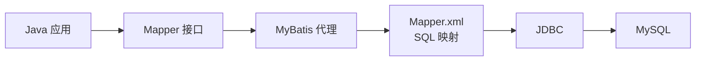
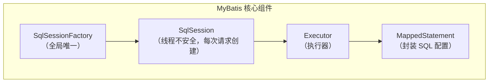
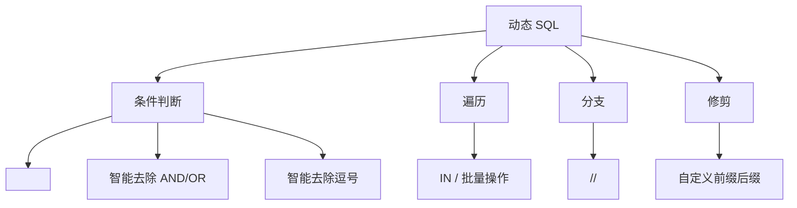
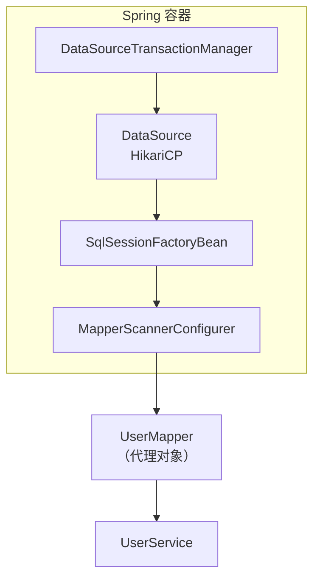
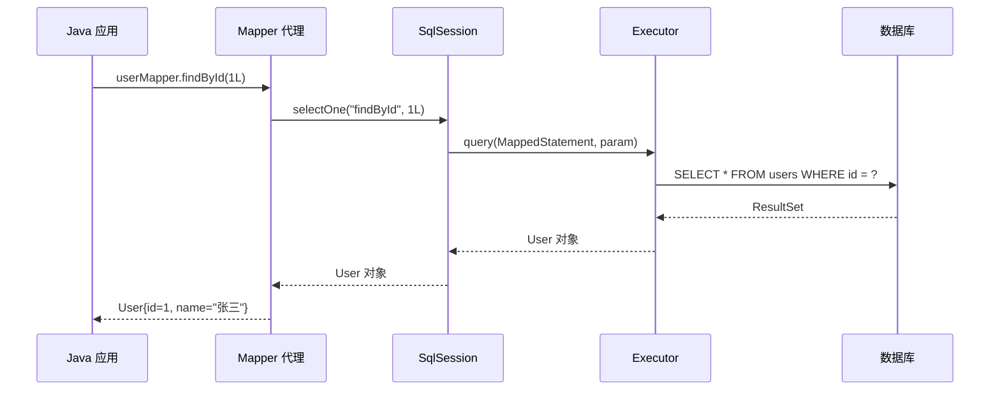

# MyBatis 数据库开发指南

> 配套项目：`Mybatis/` —— MyBatis + Spring 集成，涵盖 CRUD、动态SQL、配置映射完整演示。

---

## 目录

1. [MyBatis 简介](#1-mybatis-简介)
2. [核心配置文件 —— mybatis-config.xml](#2-核心配置文件--mybatis-configxml)
3. [SQL 映射文件 —— Mapper.xml](#3-sql-映射文件--mapperxml)
4. [查增删改（CRUD）详解](#4-查增删改crud详解)
5. [动态 SQL](#5-动态-sql)
6. [MyBatis 与 Spring 集成](#6-mybatis-与-spring-集成)
7. [总结](#7-总结)
8. [十道高频面试题](#8-十道高频面试题)

---

## 1. MyBatis 简介

### 1.1 什么是 MyBatis？

MyBatis 是一款**半自动 ORM 持久层框架**，它封装了 JDBC 的繁杂操作，让开发者只需关注 SQL 本身，而无需处理连接获取、Statement 创建、ResultSet 遍历等重复劳动。



### 1.2 MyBatis vs JDBC vs JPA

| 对比维度 | JDBC 原生 | MyBatis | JPA/Hibernate |
|---------|----------|---------|---------------|
| SQL 控制 | 完全手写 | 手写 SQL，框架映射 | 自动生成 |
| 结果映射 | 手动 ResultSet | 自动/半自动 | 全自动 |
| 灵活性 | 最高 | 高 | 低 |
| 学习曲线 | 低 | 中 | 高 |
| 适用场景 | 简单脚本 | 复杂 SQL、遗留系统 | 标准 CRUD |

> **核心理念**：MyBatis 不屏蔽 SQL，而是帮助你更好地使用 SQL。

### 1.3 核心组件



| 组件 | 说明 |
|-----|------|
| `SqlSessionFactory` | 创建 SqlSession 的工厂，应用生命周期内只有一个 |
| `SqlSession` | 执行 SQL 的门面接口，非线程安全 |
| `Executor` | 内部执行器，负责 SQL 执行、缓存维护 |
| `MappedStatement` | 封装了 `<select>`/`<insert>` 等标签的配置信息 |

---

## 2. 核心配置文件 —— mybatis-config.xml

`mybatis-config.xml` 是 MyBatis 的**全局配置文件**，控制 MyBatis 的运行时行为。

### 2.1 配置结构（按顺序）

```xml
<?xml version="1.0" encoding="UTF-8" ?>
<!DOCTYPE configuration
        PUBLIC "-//mybatis.org//DTD Config 3.0//EN"
        "http://mybatis.org/dtd/mybatis-3-config.dtd">
<configuration>

    <!-- 1. properties：外部属性文件（如 jdbc.properties） -->
    <properties resource="jdbc.properties"/>

    <!-- 2. settings：全局行为设置（★ 最重要） -->
    <settings>
        <setting name="mapUnderscoreToCamelCase" value="true"/>
        <setting name="lazyLoadingEnabled" value="true"/>
        <setting name="logImpl" value="STDOUT_LOGGING"/>
        <setting name="cacheEnabled" value="true"/>
    </settings>

    <!-- 3. typeAliases：类型别名 -->
    <typeAliases>
        <typeAlias type="com.spring.demo.model.User" alias="User"/>
        <!-- 或批量扫描 -->
        <package name="com.spring.demo.model"/>
    </typeAliases>

    <!-- 4. environments：环境配置（Spring 集成时可省略） -->
    <environments default="development">
        <environment id="development">
            <transactionManager type="JDBC"/>
            <dataSource type="POOLED">
                <property name="driver" value="com.mysql.cj.jdbc.Driver"/>
                <property name="url" value="jdbc:mysql://localhost:3306/mybatis_demo"/>
                <property name="username" value="root"/>
                <property name="password" value="123456"/>
            </dataSource>
        </environment>
    </environments>

    <!-- 5. mappers：注册 SQL 映射文件 -->
    <mappers>
        <mapper resource="mapper/UserMapper.xml"/>
        <!-- 或批量注册 -->
        <package name="com.spring.demo.mapper"/>
    </mappers>

</configuration>
```

### 2.2 Settings 关键配置

| 配置项 | 默认值 | 说明 |
|-------|--------|------|
| `mapUnderscoreToCamelCase` | false | **强烈建议开启**：自动将 `user_name` → `userName` |
| `lazyLoadingEnabled` | false | 延迟加载开关 |
| `aggressiveLazyLoading` | true | 建议设为 false，按需加载 |
| `logImpl` | 无 | `STDOUT_LOGGING` 控制台打印 SQL |
| `cacheEnabled` | true | 二级缓存开关 |
| `useGeneratedKeys` | false | 是否使用 JDBC `getGeneratedKeys` 获取自增主键 |
| `defaultStatementTimeout` | 无 | SQL 超时时间（秒） |

### 2.3 与 Spring 集成时的变化

集成 Spring 后，`environments` 中的数据源和事务管理由 Spring 容器接管，`mybatis-config.xml` 只需保留：

- `<settings>` — 全局行为
- `<typeAliases>` — 类型别名

```java
// Spring 配置类中的 SqlSessionFactoryBean
@Bean
public SqlSessionFactoryBean sqlSessionFactory(DataSource dataSource) {
    SqlSessionFactoryBean factoryBean = new SqlSessionFactoryBean();
    factoryBean.setDataSource(dataSource);                    // 数据源
    factoryBean.setConfigLocation(new ClassPathResource("mybatis-config.xml"));  // 主配置
    factoryBean.setMapperLocations(...);                       // 映射文件
    return factoryBean;
}
```

---

## 3. SQL 映射文件 —— Mapper.xml

### 3.1 映射文件基本结构

```xml
<?xml version="1.0" encoding="UTF-8" ?>
<!DOCTYPE mapper
        PUBLIC "-//mybatis.org//DTD Mapper 3.0//EN"
        "http://mybatis.org/dtd/mybatis-3-mapper.dtd">

<!-- namespace 必须与 Mapper 接口的全限定名一致 -->
<mapper namespace="com.spring.demo.mapper.UserMapper">

    <!-- 可复用 SQL 片段 -->
    <sql id="baseColumns">id, username, email, age, create_time</sql>

    <!-- ResultMap：自定义结果映射 -->
    <resultMap id="userResultMap" type="com.spring.demo.model.User">
        <id property="id" column="id"/>
        <result property="username" column="username"/>
        <result property="createTime" column="create_time"/>
    </resultMap>

    <!-- CRUD 标签 -->
    <select id="findById" resultMap="userResultMap">...</select>
    <insert id="insert" useGeneratedKeys="true" keyProperty="id">...</insert>
    <update id="update">...</update>
    <delete id="deleteById">...</delete>

</mapper>
```

### 3.2 参数占位符：`#{}` vs `${}`

| | `#{}` | `${}` |
|---|------|------|
| 原理 | 预编译 `PreparedStatement` → `?` | 字符串直接拼接 |
| SQL 注入 | ✅ 安全 | ❌ 不安全 |
| 使用场景 | 普通参数值（99% 场景） | 动态表名、列名、ORDER BY |
| 示例 | `WHERE id = #{id}` | `ORDER BY ${column}` |

```xml
<!-- ✅ 安全：WHERE id = ? -->
<select id="findById" resultType="User">
    SELECT * FROM users WHERE id = #{id}
</select>

<!-- ⚠️ 仅限动态排序：ORDER BY username DESC -->
<select id="findAll" resultType="User">
    SELECT * FROM users ORDER BY ${orderColumn} ${orderDirection}
</select>
```

### 3.3 `<resultMap>` —— 解决字段映射问题

当数据库字段与 Java 属性名不一致时：

```xml
<!-- 方案一：全局开启驼峰映射（推荐，简单场景） -->
<setting name="mapUnderscoreToCamelCase" value="true"/>

<!-- 方案二：显式 resultMap（复杂场景：关联查询、嵌套对象） -->
<resultMap id="userResultMap" type="com.spring.demo.model.User">
    <!-- id：主键字段，提升性能 -->
    <id property="id" column="id"/>

    <!-- result：普通字段 -->
    <result property="username" column="username"/>
    <result property="createTime" column="create_time"/>

    <!-- association：一对一关联 -->
    <!-- collection：一对多关联 -->
</resultMap>
```

### 3.4 `<sql>` 片段 —— DRY 原则

```xml
<!-- 定义 -->
<sql id="baseColumns">id, username, email, age, create_time</sql>

<!-- 使用 -->
<select id="findAll" resultType="User">
    SELECT <include refid="baseColumns"/> FROM users
</select>
```

---

## 4. 查增删改（CRUD）详解

### 4.1 增（INSERT）

```xml
<!-- 基本新增：回填自增主键 -->
<insert id="insert" parameterType="com.spring.demo.model.User"
        useGeneratedKeys="true" keyProperty="id">
    INSERT INTO users(username, email, age)
    VALUES (#{username}, #{email}, #{age})
</insert>
```

**关键属性：**

| 属性 | 说明 |
|-----|------|
| `useGeneratedKeys="true"` | 使用数据库自增主键 |
| `keyProperty="id"` | 将生成的主键回填到参数的哪个属性 |
| `keyColumn="id"` | 数据库主键列名（与 keyProperty 同名时可省略） |

**使用效果**：
```java
User user = new User("张三", "zhangsan@example.com", 25);
userMapper.insert(user);
System.out.println(user.getId()); // 自动回填，非 null！
```

---

### 4.2 删（DELETE）

```xml
<!-- 单条删除 -->
<delete id="deleteById" parameterType="long">
    DELETE FROM users WHERE id = #{id}
</delete>

<!-- 批量删除：使用 <foreach> -->
<delete id="deleteByIds">
    DELETE FROM users WHERE id IN
    <foreach collection="ids" item="id" open="(" separator="," close=")">
        #{id}
    </foreach>
</delete>
```

**`<foreach>` 标签参数：**

| 属性 | 说明 |
|-----|------|
| `collection` | 集合参数名（`@Param("ids")` 或默认 `list`/`array`） |
| `item` | 每次迭代的变量名 |
| `open` | 循环开始拼接的字符 |
| `close` | 循环结束拼接的字符 |
| `separator` | 分隔符 |
| `index` | 索引（Map 时为 key） |

---

### 4.3 改（UPDATE）

```xml
<!-- 全字段更新 -->
<update id="update" parameterType="com.spring.demo.model.User">
    UPDATE users
    SET username = #{username},
        email    = #{email},
        age      = #{age}
    WHERE id = #{id}
</update>

<!-- 动态更新：只更新非空字段 ★ -->
<update id="updateSelective" parameterType="com.spring.demo.model.User">
    UPDATE users
    <set>
        <if test="username != null and username != ''">
            username = #{username},
        </if>
        <if test="email != null and email != ''">
            email = #{email},
        </if>
        <if test="age != null">
            age = #{age},
        </if>
    </set>
    WHERE id = #{id}
</update>
```

> `<set>` 标签的妙用：自动处理 SET 子句末尾多余的逗号，且当所有 `<if>` 都不成立时不会生成 SET（避免 SQL 语法错误）。

---

### 4.4 查（SELECT）

```xml
<!-- 按 ID 查询（单条） -->
<select id="findById" parameterType="long" resultType="com.spring.demo.model.User">
    SELECT id, username, email, age, create_time
    FROM users WHERE id = #{id}
</select>

<!-- 查询所有（多条） -->
<select id="findAll" resultType="com.spring.demo.model.User">
    SELECT <include refid="baseColumns"/>
    FROM users ORDER BY id DESC
</select>

<!-- 模糊查询 -->
<select id="findByUsername" resultType="User">
    SELECT * FROM users
    WHERE username LIKE CONCAT('%', #{username}, '%')
</select>

<!-- 统计 -->
<select id="count" resultType="long">
    SELECT COUNT(*) FROM users
</select>
```

**`resultType` vs `resultMap`：**

| | `resultType` | `resultMap` |
|---|-------------|-------------|
| 场景 | 简单映射（列名 = 属性名） | 复杂映射（关联、嵌套、不一致） |
| 要求 | 开启驼峰映射或列名完全一致 | 显式定义映射关系 |
| 写法 | `resultType="User"` | `resultMap="userResultMap"` |

---

## 5. 动态 SQL

动态 SQL 是 MyBatis 最强大的特性之一，基于 OGNL 表达式在 XML 中实现条件判断和循环。

### 5.1 `<if>` —— 条件判断

```xml
<select id="findByCondition" resultType="User">
    SELECT * FROM users
    WHERE 1=1
    <if test="username != null and username != ''">
        AND username LIKE CONCAT('%', #{username}, '%')
    </if>
    <if test="email != null and email != ''">
        AND email = #{email}
    </if>
</select>
```

> ⚠️ `WHERE 1=1` 的写法不够优雅，推荐使用 `<where>` 标签。

---

### 5.2 `<where>` —— 智能 WHERE 子句

```xml
<select id="findByCondition" resultType="User">
    SELECT * FROM users
    <where>
        <if test="username != null and username != ''">
            AND username LIKE CONCAT('%', #{username}, '%')
        </if>
        <if test="minAge != null">
            AND age &gt;= #{minAge}
        </if>
        <if test="maxAge != null">
            AND age &lt;= #{maxAge}
        </if>
    </where>
</select>
```

**`<where>` 做了什么？**
1. 至少有一个条件时，自动插入 `WHERE` 关键字
2. 自动去掉开头多余的 `AND` 或 `OR`
3. 所有条件都不满足时，不生成 `WHERE` 子句

---

### 5.3 `<set>` —— 智能 SET 子句

```xml
<update id="updateSelective">
    UPDATE users
    <set>
        <if test="username != null">username = #{username},</if>
        <if test="email != null">email = #{email},</if>
        <if test="age != null">age = #{age},</if>
    </set>
    WHERE id = #{id}
</update>
```

**`<set>` 做了什么？**
1. 自动插入 `SET` 关键字
2. 自动去掉末尾多余的逗号

---

### 5.4 `<foreach>` —— 遍历集合

```xml
<!-- IN 查询 -->
<select id="findByIds" resultType="User">
    SELECT * FROM users
    WHERE id IN
    <foreach collection="ids" item="id" open="(" separator="," close=")">
        #{id}
    </foreach>
</select>

<!-- 批量插入 -->
<insert id="batchInsert">
    INSERT INTO users(username, email, age) VALUES
    <foreach collection="users" item="user" separator=",">
        (#{user.username}, #{user.email}, #{user.age})
    </foreach>
</insert>
```

**生成的实际 SQL：**

```sql
-- IN 查询
SELECT * FROM users WHERE id IN ( 1 , 2 , 3 )

-- 批量插入
INSERT INTO users(username, email, age) VALUES
    (  ?  ,  ?  ,  ?  ),
    (  ?  ,  ?  ,  ?  )
```

---

### 5.5 `<choose>` / `<when>` / `<otherwise>` —— 分支选择

相当于 Java 的 `switch-case-default`：

```xml
<select id="findByChoice" resultType="User">
    SELECT * FROM users
    <where>
        <choose>
            <when test="username != null">
                AND username = #{username}
            </when>
            <when test="email != null">
                AND email = #{email}
            </when>
            <otherwise>
                AND age > 18
            </otherwise>
        </choose>
    </where>
</select>
```

> 只执行**第一个**满足条件的 `<when>`，都不满足则执行 `<otherwise>`。

---

### 5.6 `<trim>` —— 自定义修剪

`<where>` 和 `<set>` 的本质是 `<trim>` 的特定用法：

```xml
<!-- <where> 等价于 -->
<trim prefix="WHERE" prefixOverrides="AND |OR ">
    ...
</trim>

<!-- <set> 等价于 -->
<trim prefix="SET" suffixOverrides=",">
    ...
</trim>
```

| `<trim>` 属性 | 说明 |
|--------------|------|
| `prefix` | 在内容前添加的前缀 |
| `suffix` | 在内容后添加的后缀 |
| `prefixOverrides` | 去除内容开头的指定字符 |
| `suffixOverrides` | 去除内容末尾的指定字符 |

---

### 5.7 动态 SQL 汇总



---

## 6. MyBatis 与 Spring 集成

### 6.1 集成架构



### 6.2 集成配置类

```java
@Configuration
public class MyBatisConfig {

    // 1. 数据源
    @Bean
    public DataSource dataSource() {
        HikariDataSource ds = new HikariDataSource();
        ds.setJdbcUrl("jdbc:mysql://localhost:3306/mybatis_demo?...");
        ds.setUsername("root");
        ds.setPassword("123456");
        return ds;
    }

    // 2. SqlSessionFactory
    @Bean
    public SqlSessionFactoryBean sqlSessionFactory(DataSource dataSource) {
        SqlSessionFactoryBean factoryBean = new SqlSessionFactoryBean();
        factoryBean.setDataSource(dataSource);
        factoryBean.setConfigLocation(new ClassPathResource("mybatis-config.xml"));
        return factoryBean;
    }

    // 3. Mapper 扫描 —— 自动将 Mapper 接口注册为 Spring Bean
    @Bean
    public MapperScannerConfigurer mapperScannerConfigurer() {
        MapperScannerConfigurer configurer = new MapperScannerConfigurer();
        configurer.setBasePackage("com.spring.demo.mapper");
        return configurer;
    }

    // 4. 事务管理器
    @Bean
    public DataSourceTransactionManager transactionManager(DataSource dataSource) {
        return new DataSourceTransactionManager(dataSource);
    }
}
```

### 6.3 关键类说明

| 类 | 作用 |
|---|------|
| `SqlSessionFactoryBean` | 创建 `SqlSessionFactory`，整合数据源和配置文件 |
| `MapperScannerConfigurer` | 扫描指定包，将 Mapper 接口转为 Spring Bean（JDK 动态代理） |
| `DataSourceTransactionManager` | 管理 JDBC 事务，配合 `@Transactional` 使用 |

> Spring Boot 中更简单：`mybatis-spring-boot-starter` + `@MapperScan` 注解即可。

---

## 7. 总结

### 7.1 MyBatis 核心工作流



### 7.2 最佳实践

| 实践 | 说明 |
|-----|------|
| ✅ 开启驼峰映射 | `mapUnderscoreToCamelCase=true`，省去大量 resultMap |
| ✅ 优先使用 `#{}` | 防止 SQL 注入，`${}` 仅用于动态表名/排序 |
| ✅ 使用 `<sql>` 片段 | 避免重复书写字段列表 |
| ✅ 动态更新用 `<set>` | 只更新传了值的字段，避免误覆盖 |
| ✅ 条件查询用 `<where>` | 代替 `WHERE 1=1` |
| ✅ Mapper 接口 + XML | XML 管理复杂 SQL，简单 SQL 可用注解 |
| ✅ 日志开启 | 开发阶段开启 `STDOUT_LOGGING`，方便调试 SQL |
| ❌ 避免 N+1 查询 | 使用关联查询或延迟加载 |
| ❌ 避免大事务 | 事务范围尽量小，避免长事务锁表 |

### 7.3 快速对照：JDBC → MyBatis

| JDBC 步骤 | MyBatis 对应 |
|----------|-------------|
| 获取 Connection | DataSource（连接池自动管理） |
| 创建 PreparedStatement | Mapper.xml 中的 SQL 标签 |
| 设置参数 `ps.setString(1, ...)` | `#{paramName}` 占位符 |
| 执行 `ps.executeQuery()` | MyBatis 内部 Executor 执行 |
| 遍历 ResultSet | 自动映射到 resultType/resultMap |
| 关闭资源 `finally { close() }` | 框架自动管理 |

---

## 8. 十道高频面试题

### Q1：MyBatis 中 `#{}` 和 `${}` 的区别是什么？

**`#{}`**：
- 预编译占位符，相当于 `PreparedStatement` 的 `?`
- **防止 SQL 注入**，自动加引号
- 用于 99% 的参数传递场景

**`${}`**：
- 字符串直接拼接（替换后编译）
- **存在 SQL 注入风险**
- 仅用于动态表名、列名、ORDER BY 等无法预编译的场景

```xml
<!-- #{} → WHERE username = ? -->
<select id="findByName">
    SELECT * FROM users WHERE username = #{username}
</select>

<!-- ${} → ORDER BY username DESC（仅限动态排序） -->
<select id="findAll">
    SELECT * FROM users ORDER BY ${column} ${direction}
</select>
```

---

### Q2：MyBatis 如何实现一对一、一对多关联查询？

使用 `<resultMap>` 中的 `<association>` 和 `<collection>`：

```xml
<!-- 一对一：用户 → 身份证 -->
<resultMap id="userWithCard" type="User">
    <id property="id" column="id"/>
    <result property="username" column="username"/>
    <association property="idCard" javaType="IdCard"
                 column="card_id" select="findCardById"/>
    <!-- 或嵌套查询 -->
</resultMap>

<!-- 一对多：用户 → 订单列表 -->
<resultMap id="userWithOrders" type="User">
    <id property="id" column="id"/>
    <collection property="orders" ofType="Order"
                column="id" select="findOrdersByUserId"/>
</resultMap>
```

---

### Q3：MyBatis 一级缓存和二级缓存的区别？

| 维度 | 一级缓存（Local Cache） | 二级缓存（Second Level Cache） |
|-----|----------------------|---------------------------|
| 作用范围 | **SqlSession** 级别 | **Mapper（namespace）** 级别 |
| 默认状态 | ✅ 默认开启，无法关闭 | ❌ 默认关闭，需手动配置 |
| 生命周期 | SqlSession 关闭即清空 | 整个应用生命周期（可过期） |
| 共享性 | 不跨 Session | 跨 Session 共享 |
| 风险 | 无 | 脏读风险（需谨慎使用） |

```xml
<!-- 开启二级缓存 -->
<cache eviction="LRU" flushInterval="60000" size="512" readOnly="true"/>

<!-- 某条 SQL 不使用缓存 -->
<select id="findById" resultType="User" useCache="false">
    ...
</select>
```

---

### Q4：MyBatis 分页有哪几种方式？

**1. 逻辑分页（RowBounds）**：
```java
RowBounds rowBounds = new RowBounds(offset, limit);
List<User> users = sqlSession.selectList("findAll", null, rowBounds);
```
> ⚠️ 将所有数据查出来再在内存中截取，**大数据量慎用**。

**2. 物理分页（推荐）**：
```xml
<!-- 手动传参 -->
<select id="findByPage" resultType="User">
    SELECT * FROM users LIMIT #{offset}, #{limit}
</select>
```

**3. PageHelper 插件（最常用）**：
```java
PageHelper.startPage(pageNum, pageSize);
List<User> users = userMapper.findAll();
PageInfo<User> pageInfo = new PageInfo<>(users);
```

---

### Q5：MyBatis 插件（Plugin）的原理是什么？

MyBatis 插件基于**责任链模式 + JDK 动态代理**，可以拦截以下四大对象的调用：

| 拦截对象 | 可拦截方法 |
|---------|----------|
| `Executor` | update、query、commit、rollback |
| `ParameterHandler` | getParameterObject、setParameters |
| `ResultSetHandler` | handleResultSets、handleOutputParameters |
| `StatementHandler` | prepare、parameterize、batch、update、query |

```java
@Intercepts({
    @Signature(type = Executor.class, method = "query",
        args = {MappedStatement.class, Object.class, RowBounds.class, ResultHandler.class})
})
public class MyPlugin implements Interceptor {
    @Override
    public Object intercept(Invocation invocation) throws Throwable {
        // 前置处理
        Object result = invocation.proceed();  // 执行原方法
        // 后置处理
        return result;
    }
}
```

> PageHelper 分页插件就是拦截 `Executor.query()` 实现的。

---

### Q6：Dao 接口（Mapper）没有实现类，为什么可以执行 SQL？

MyBatis 在启动时通过 **JDK 动态代理** 为每个 Mapper 接口生成代理对象：

```java
// MyBatis 内部等价逻辑
UserMapper proxy = (UserMapper) Proxy.newProxyInstance(
    UserMapper.class.getClassLoader(),
    new Class[]{UserMapper.class},
    new MapperProxy<>(sqlSession, UserMapper.class)
);
```

`MapperProxy.invoke()` 中：
1. 根据**接口全限定名 + 方法名**找到对应的 `MappedStatement`
2. 根据方法签名判断 SQL 类型（SELECT/INSERT/UPDATE/DELETE）
3. 调用 `SqlSession.selectOne()` / `insert()` / `update()` / `delete()`

---

### Q7：当实体类属性名和数据库字段名不一致时，有哪些解决方案？

**方案一（推荐）**：开启驼峰映射
```xml
<setting name="mapUnderscoreToCamelCase" value="true"/>
```

**方案二**：SQL 别名
```xml
SELECT user_name AS userName, create_time AS createTime FROM users
```

**方案三**：`<resultMap>` 显式映射
```xml
<resultMap id="userMap" type="User">
    <result property="userName" column="user_name"/>
    <result property="createTime" column="create_time"/>
</resultMap>
```

---

### Q8：MyBatis 的延迟加载（Lazy Loading）是如何实现的？

```xml
<settings>
    <setting name="lazyLoadingEnabled" value="true"/>
    <setting name="aggressiveLazyLoading" value="false"/>
</settings>
```

**原理**：
1. 查询用户时只查 `users` 表
2. 当首次调用 `user.getOrders()` 时，才触发订单查询
3. MyBatis 通过 **CGLIB 代理** 拦截 getter 方法，按需执行关联查询

> ⚠️ 注意：延迟加载依赖于 SqlSession 生命周期。若 Service 层关闭了 SqlSession，再访问延迟属性会报 `LazyInitializationException`。

---

### Q9：如何获取 MyBatis 自动生成的主键？

```xml
<insert id="insert" useGeneratedKeys="true" keyProperty="id" keyColumn="id">
    INSERT INTO users(username, email, age)
    VALUES (#{username}, #{email}, #{age})
</insert>
```

```java
User user = new User("张三", "z@test.com", 25);
userMapper.insert(user);
System.out.println(user.getId());  // 插入后自动回填
```

对于不支持自增主键的数据库（如 Oracle Sequence），可使用 `<selectKey>`：
```xml
<insert id="insert">
    <selectKey keyProperty="id" order="BEFORE" resultType="long">
        SELECT seq_users.NEXTVAL FROM DUAL
    </selectKey>
    INSERT INTO users(id, username) VALUES (#{id}, #{username})
</insert>
```

---

### Q10：MyBatis 的批量操作有哪几种方式？各有什么优缺点？

| 方式 | 实现 | 优点 | 缺点 |
|-----|------|------|------|
| **foreach 拼接** | `<foreach>` 生成多组 VALUES | SQL 简单，一条语句 | 超长 SQL 可能被数据库限制 |
| **BatchExecutor** | `sqlSession.insert("insert", list)` + BatchExecutor | 真正的 JDBC 批处理 | 需手动 flush/commit |
| **循环调用** | `for` 循环中逐个 `insert()` | 代码简单 | 性能最差 |

**推荐方案 —— 与 Spring 结合**：
```java
@Transactional
public int batchInsert(List<User> users) {
    // 使用 BatchExecutor 的 SqlSession
    SqlSession sqlSession = sqlSessionFactory.openSession(ExecutorType.BATCH);
    UserMapper mapper = sqlSession.getMapper(UserMapper.class);
    try {
        for (User user : users) {
            mapper.insert(user);
        }
        sqlSession.commit();
    } finally {
        sqlSession.close();
    }
}
```

---

## 项目结构导航

```
Mybatis/
├── pom.xml                          # Maven 依赖（MyBatis + Spring + MySQL）
├── init.sql                         # 数据库初始化脚本
└── src/
    └── main/
        ├── java/com/spring/demo/
        │   ├── App.java             # 主程序（CRUD + 动态SQL 演示）
        │   ├── config/
        │   │   └── MyBatisConfig.java  # MyBatis-Spring 集成配置
        │   ├── mapper/
        │   │   └── UserMapper.java     # Mapper 接口（方法定义）
        │   ├── model/
        │   │   └── User.java           # 实体类
        │   └── service/
        │       └── UserService.java    # 业务层（调用 Mapper）
        └── resources/
            ├── mybatis-config.xml      # MyBatis 主配置（settings/aliases）
            └── mapper/
                └── UserMapper.xml      # SQL 映射文件（CRUD + 动态SQL）
```

## 快速启动

1. **创建数据库**：执行 `init.sql`
2. **修改数据库连接**：编辑 `MyBatisConfig.java` 中的 `jdbcUrl`、`username`、`password`
3. **运行主程序**：执行 `App.main()`
