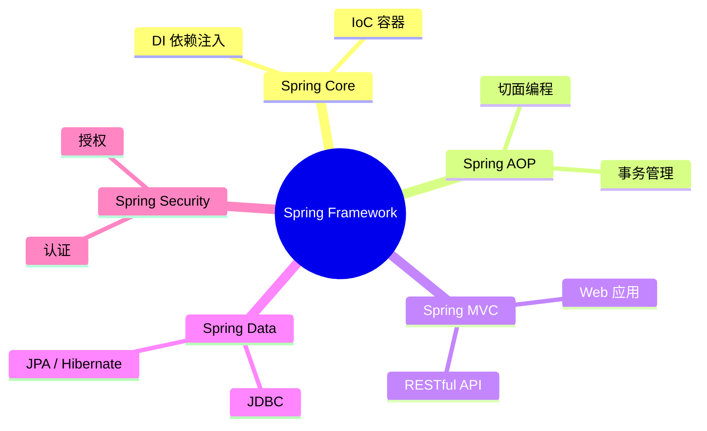
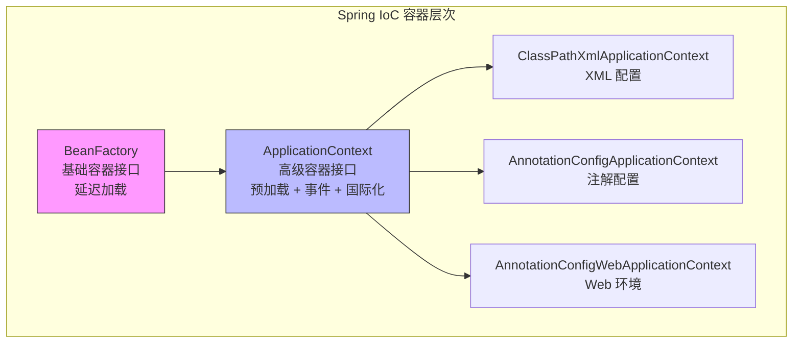
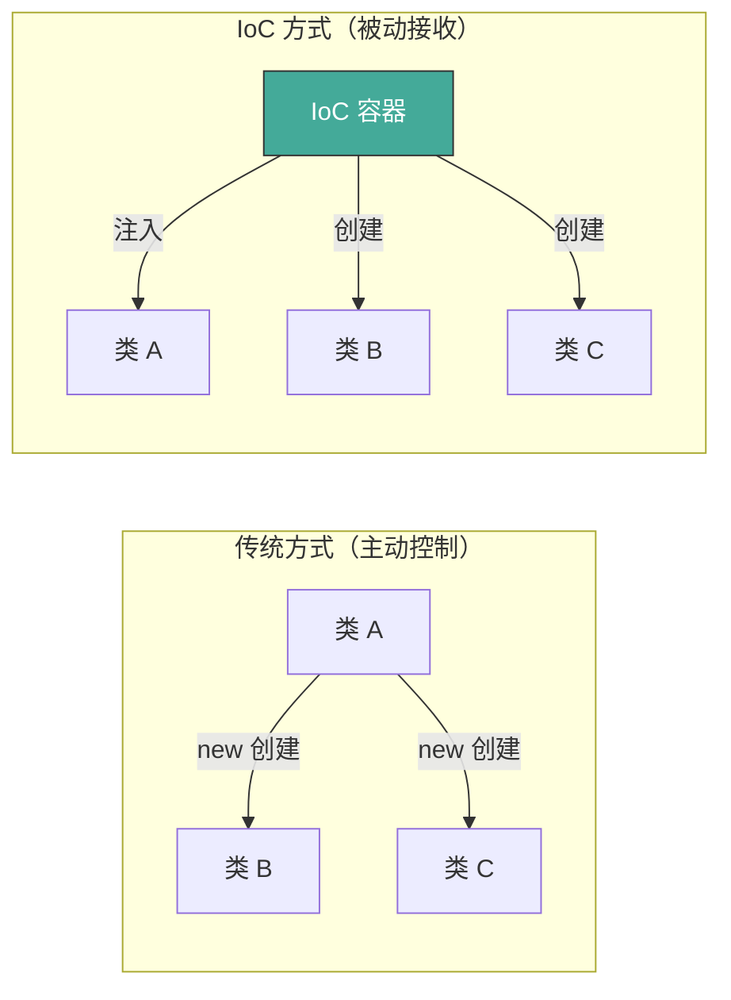
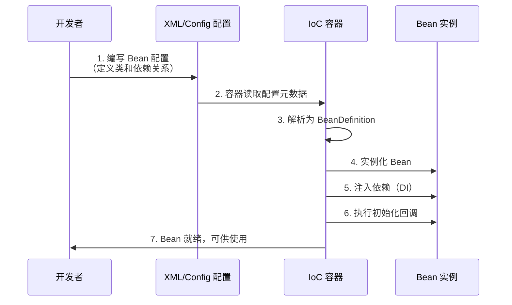
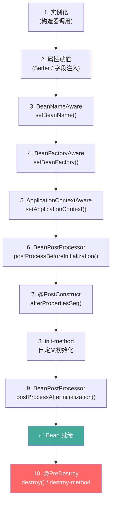
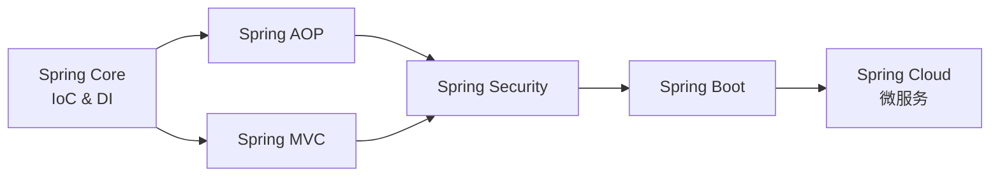

# Spring Framework 入门指南

> **Spring-01 项目文档** | 基于 Spring Framework 6.1.x + Java 17  

---

## 目录

1. [Spring 概述](#1-spring-概述)
2. [Spring 的核心容器和入门程序](#2-spring-的核心容器和入门程序)
3. [DI 和 IoC 的概念](#3-di-和-ioc-的概念)
4. [Bean 类的构建和工厂方式实例化](#4-bean-类的构建和工厂方式实例化)
5. [Bean 类的作用域](#5-bean-类的作用域)
6. [Bean 类的生命周期](#6-bean-类的生命周期)
7. [Bean 类的装配方式](#7-bean-类的装配方式)
8. [总结](#8-总结)
9. [大厂面试题精选（附答案）](#9-大厂面试题精选附答案)

---

## 1. Spring 概述

### 1.1 什么是 Spring？

**Spring** 是 Java 企业级应用开发中 **最广泛使用** 的开源框架，由 Rod Johnson 于 2003 年创建。它的核心使命是 **简化 Java 开发**——让开发者专注于业务逻辑，而非基础设施代码。



### 1.2 为什么需要 Spring？

在 Spring 出现之前的 J2EE 时代（EJB 2.x），开发者面临的问题：

| 问题 | Spring 的解决方案 |
|------|------------------|
| **高耦合**：对象之间硬编码依赖 | **IoC / DI**：容器管理依赖关系，松耦合 |
| **重量级**：EJB 需要应用服务器，启动慢 | **轻量级**：普通 Java 对象（POJO），不依赖特定服务器 |
| **样板代码多**：JDBC 需要 try-catch-finally | **模板类**：`JdbcTemplate` 封装重复代码 |
| **难以测试**：依赖难以 mock | **DI 天然支持测试**：轻松注入 mock 对象 |
| **横切关注点分散**：日志、事务散落各处 | **AOP**：集中处理横切关注点 |

### 1.3 Spring 的核心模块

```
spring-core        → IoC 容器、DI 的基础
spring-beans       → Bean 定义、BeanFactory
spring-context     → ApplicationContext、事件、国际化
spring-expression  → SpEL（Spring 表达式语言）
spring-aop         → 面向切面编程支持
spring-jdbc        → JDBC 抽象层、事务管理
spring-web / mvc   → Web 应用与 MVC 框架
```

### 1.4 Spring 版本演进

| 版本 | 年份 | 关键特性 |
|------|------|---------|
| Spring 2.5 | 2007 | 注解支持 (`@Autowired`, `@Component`) |
| Spring 3.0 | 2009 | Java Config、SpEL、REST 支持 |
| Spring 4.0 | 2013 | Java 8 支持、`@RestController` |
| Spring 5.0 | 2017 | WebFlux（响应式）、Kotlin 支持 |
| **Spring 6.x** | 2022-2024 | **Java 17+**、Jakarta EE 9+、AOT 编译 |

---

## 2. Spring 的核心容器和入门程序

### 2.1 核心容器架构

Spring 容器的核心是 **`org.springframework.beans`** 和 **`org.springframework.context`** 两个包。



**BeanFactory vs ApplicationContext**：

| 特性 | BeanFactory | ApplicationContext |
|------|------------|-------------------|
| 加载时机 | **懒加载**（使用时才创建 Bean） | **预加载**（启动时创建所有单例 Bean） |
| 国际化（i18n） | ❌ 不支持 | ✅ 支持 `MessageSource` |
| 事件发布 | ❌ 不支持 | ✅ 支持 `ApplicationEvent` |
| 注解支持 | 需手动注册 `BeanPostProcessor` | ✅ 自动支持 `@PostConstruct` 等 |
| 推荐程度 | 仅内存受限场景 | **实际开发首选** |

### 2.2 ApplicationContext 的创建方式

#### 方式一：XML 配置（经典方式）

```java
// 从类路径加载 XML 配置
ApplicationContext context = 
    new ClassPathXmlApplicationContext("applicationContext.xml");

// 获取 Bean
User user = context.getBean("user", User.class);
```

**applicationContext.xml** 示例：

```xml
<beans xmlns="http://www.springframework.org/schema/beans"
       xmlns:xsi="http://www.w3.org/2001/XMLSchema-instance"
       xsi:schemaLocation="http://www.springframework.org/schema/beans
           http://www.springframework.org/schema/beans/spring-beans.xsd">

    <!-- 定义一个 Bean -->
    <bean id="user" class="com.spring.demo.beans.User">
        <property name="name" value="张三"/>
        <property name="email" value="zhangsan@spring.com"/>
    </bean>

</beans>
```

#### 方式二：Java Config（推荐、Spring Boot 风格）

```java
@Configuration  // ★ 标记为配置类，等价于 XML 配置文件
public class AppConfig {

    @Bean  // ★ 将返回值注册为 Bean，默认方法名作为 id
    public UserDao userDao() {
        return new UserDao();
    }

    @Bean
    public UserService userService() {
        UserService service = new UserService();
        service.setUserDao(userDao()); // ★ Spring 会代理此调用，确保返回同一实例
        return service;
    }
}

// 使用注解容器
ApplicationContext context = 
    new AnnotationConfigApplicationContext(AppConfig.class);
```

### 2.3 Maven 依赖

```xml
<properties>
    <spring.version>6.1.6</spring.version>
</properties>

<dependencies>
    <!-- spring-context 包含 core、beans、context、expression 四大核心模块 -->
    <dependency>
        <groupId>org.springframework</groupId>
        <artifactId>spring-context</artifactId>
        <version>${spring.version}</version>
    </dependency>
</dependencies>
```

### 2.4 项目结构速览

```
Spring-01/
├── pom.xml                          # Maven 配置
└── src/main/
    ├── java/com/spring/demo/
    │   ├── App.java                 # ★ 主入口：创建容器、获取 Bean
    │   ├── beans/                   # Bean 类
    │   │   ├── User.java            #   演示 Setter 注入
    │   │   ├── Order.java           #   演示构造器注入
    │   │   ├── UserDao.java         #   模拟数据访问层
    │   │   └── UserService.java     #   DI 依赖注入（ref 引用）
    │   ├── factory/                 # 工厂方式
    │   │   ├── Car.java             #   产品类
    │   │   ├── StaticCarFactory.java    # 静态工厂
    │   │   ├── InstanceCarFactory.java  # 实例工厂
    │   │   └── CarFactoryBean.java      # FactoryBean 方式
    │   ├── lifecycle/               # 生命周期
    │   │   ├── LifecycleBean.java
    │   │   └── CustomBeanPostProcessor.java
    │   └── config/
    │       └── AppConfig.java       # Java Config 配置类
    └── resources/
        └── applicationContext.xml   # XML 配置
```

---

## 3. DI 和 IoC 的概念

### 3.1 什么是 IoC（控制反转）？

**IoC（Inversion of Control）** 是一种设计思想：将 **对象的创建和依赖关系的管理权** 从程序代码 **转移给外部容器**。



**生活的类比**：

> 传统方式：你想喝水，自己拿杯子去厨房倒水。  
> IoC 方式：你想喝水，有人（容器）已经倒好水递到你面前。

### 3.2 什么是 DI（依赖注入）？

**DI（Dependency Injection）** 是 IoC 的 **具体实现方式**。容器在创建 Bean 时，**自动将依赖对象注入** 到 Bean 中。

两者的关系：**IoC 是思想，DI 是实现手段。**

### 3.3 三种注入方式

```java
// ========== 1. 构造器注入（推荐）==========
// 优点：依赖不可变、确保不为空、便于测试
public class Order {
    private final String orderId;   // final 确保不可变
    private final Double amount;

    public Order(String orderId, Double amount) {  // 构造器注入
        this.orderId = orderId;
        this.amount = amount;
    }
}
```

```xml
<!-- XML 配置构造器注入 -->
<bean id="order" class="com.spring.demo.beans.Order">
    <constructor-arg index="0" value="ORD-20240001"/>
    <constructor-arg index="1" value="299.99"/>
</bean>
```

```java
// ========== 2. Setter 注入 ==========
// 适用于：可选依赖、需要重新配置的场景
public class User {
    private String name;

    public void setName(String name) {   // Setter
        this.name = name;
    }
}
```

```xml
<!-- XML 配置 Setter 注入 -->
<bean id="user" class="com.spring.demo.beans.User">
    <property name="name" value="张三"/>
</bean>
```

```java
// ========== 3. @Autowired 字段注入（不推荐）==========
// 缺点：隐藏依赖、不利于测试、无法使用 final
@Service
public class UserService {
    @Autowired
    private UserDao userDao;  // 通过反射注入，依赖不透明
}
```

| 注入方式 | 不可变性 | 测试便利性 | 推荐场景 |
|---------|---------|-----------|---------|
| **构造器注入** ⭐ | ✅ `final` | ✅ 直接传参 | **首选、强制依赖** |
| Setter 注入 | ❌ 可被修改 | ⚠️ 需手动设值 | 可选依赖 |
| 字段注入 | ❌ | ❌ 需反射 | **不推荐** |

### 3.4 IoC 容器的工作流程



---

## 4. Bean 类的构建和工厂方式实例化

### 4.1 Bean 是什么？

在 Spring 中，**Bean** 就是由 **IoC 容器管理其生命周期**的 Java 对象。普通的 `new` 出来的对象 **不是** Spring Bean。

```java
// ❌ 普通对象（不受 Spring 管理）
User user = new User();

// ✅ Spring Bean（由容器创建和管理）
ApplicationContext ctx = ...;
User user = ctx.getBean("user", User.class);
```

### 4.2 Bean 的三种实例化方式

#### 方式一：构造器实例化（最常用）

```xml
<!-- 默认调用无参构造器 -->
<bean id="userDao" class="com.spring.demo.beans.UserDao"/>
```

#### 方式二：静态工厂方法

```java
// 静态工厂
public class StaticCarFactory {
    public static Car createCar() {
        Car car = new Car();
        car.setBrand("BMW");
        car.setPrice(450000.0);
        return car;
    }
}
```

```xml
<!-- 指定 factory-method 为静态方法 -->
<bean id="carByStaticFactory" 
      class="com.spring.demo.factory.StaticCarFactory"
      factory-method="createCar"/>
```

> 适用场景：创建复杂对象、第三方库不具备无参构造器的类。

#### 方式三：实例工厂方法

```java
// 实例工厂（工厂自身也是 Bean）
public class InstanceCarFactory {
    public Car createCar() {
        Car car = new Car();
        car.setBrand("Audi");
        return car;
    }
}
```

```xml
<!-- 先定义工厂 Bean -->
<bean id="instanceCarFactory" class="...InstanceCarFactory"/>

<!-- 通过 factory-bean 引用工厂 -->
<bean id="carByInstanceFactory" 
      factory-bean="instanceCarFactory"
      factory-method="createCar"/>
```

#### 方式四：FactoryBean 接口（高级）

```java
// 实现 FactoryBean<T> 接口
@Component
public class CarFactoryBean implements FactoryBean<Car> {

    @Override
    public Car getObject() {          // 返回 Bean 实例
        return new Car("Mercedes", "Silver", 520000.0);
    }

    @Override
    public Class<?> getObjectType() {  // 返回 Bean 类型
        return Car.class;
    }

    @Override
    public boolean isSingleton() {     // 是否单例
        return true;
    }
}
```

```java
// 获取 Bean → 得到的是 getObject() 返回值
Car car = ctx.getBean("carFactoryBean", Car.class);   // 注意：id 是 "carFactoryBean"

// 获取 FactoryBean 本身 → 需要加 "&" 前缀
CarFactoryBean factory = ctx.getBean("&carFactoryBean", CarFactoryBean.class);
```

> `FactoryBean` 在 Spring 内部广泛使用，如 MyBatis 的 `SqlSessionFactoryBean`、事务代理 `ProxyFactoryBean`。

---

## 5. Bean 类的作用域

### 5.1 五种作用域

| 作用域 | 说明 | 生命周期 |
|--------|------|---------|
| **singleton**（默认） | IoC 容器中 **只有一个** 实例 | 随容器创建，随容器销毁 |
| **prototype** | 每次获取 **都创建新实例** | 创建后由调用者管理 |
| request | 每个 HTTP 请求一个实例 | 请求结束销毁 |
| session | 每个 HTTP Session 一个实例 | Session 过期销毁 |
| application | 每个 ServletContext 一个实例 | 随 Web 应用销毁 |

> `request`、`session`、`application` 仅在 Web 环境下有效。

### 5.2 代码演示

```java
// singleton 验证
User s1 = ctx.getBean("singletonBean", User.class);
User s2 = ctx.getBean("singletonBean", User.class);
System.out.println(s1 == s2);  // true — 同一个实例！

// prototype 验证
User p1 = ctx.getBean("prototypeBean", User.class);
User p2 = ctx.getBean("prototypeBean", User.class);
System.out.println(p1 == p2);  // false — 不同实例！
```

```xml
<!-- singleton（默认，可省略 scope） -->
<bean id="singletonBean" class="...User" scope="singleton"/>

<!-- prototype -->
<bean id="prototypeBean" class="...User" scope="prototype"/>
```

```java
// Java Config 方式
@Bean
@Scope("prototype")  // ★ 注解指定作用域
public User prototypeUser() {
    return new User();
}
```

### 5.3 注意事项

- **singleton Bean 不保证线程安全**——线程安全由 Bean 自身实现决定
- singleton 依赖 prototype 时，**prototype 只会注入一次**——需要动态获取时使用 `@Lookup` 或 `ApplicationContext.getBean()`
- 有状态的 Bean 用 prototype，无状态的 Bean 用 singleton

---

## 6. Bean 类的生命周期

### 6.1 完整生命周期流程



### 6.2 生命周期回调接口

| 阶段 | 实现方式 | 说明 |
|------|---------|------|
| 实例化 | 构造器 | 创建对象 |
| 属性赋值 | Setter / 字段 | 注入依赖 |
| BeanNameAware | `setBeanName(String)` | 获取自己在容器中的 id |
| BeanFactoryAware | `setBeanFactory(BeanFactory)` | 获取 BeanFactory |
| **初始化前** | `BeanPostProcessor.postProcessBeforeInitialization()` | 所有 Bean 的通用前置处理 |
| 初始化 | `@PostConstruct` | JSR-250 注解（优先执行） |
| 初始化 | `afterPropertiesSet()` | `InitializingBean` 接口 |
| 初始化 | `init-method` 属性 | XML 配置 |
| **初始化后** | `BeanPostProcessor.postProcessAfterInitialization()` | 生成代理对象（AOP 的关键！） |
| 销毁 | `@PreDestroy` | JSR-250 注解 |
| 销毁 | `destroy()` | `DisposableBean` 接口 |
| 销毁 | `destroy-method` 属性 | XML 配置 |

> 🔑 **关键理解**：AOP 代理对象是在 `BeanPostProcessor.postProcessAfterInitialization()` 阶段生成的！

### 6.3 代码示例

```java
public class LifecycleBean implements InitializingBean, DisposableBean,
        BeanNameAware, BeanFactoryAware {

    public LifecycleBean() {
        System.out.println("[1] 构造器 — 实例化");
    }

    public void setData(String data) {
        System.out.println("[2] 属性注入: " + data);
    }

    @Override
    public void setBeanName(String name) {
        System.out.println("[3] BeanNameAware: " + name);
    }

    @PostConstruct
    public void postConstruct() {
        System.out.println("[5] @PostConstruct");
    }

    @Override
    public void afterPropertiesSet() {
        System.out.println("[6] InitializingBean.afterPropertiesSet()");
    }

    public void customInit() {
        System.out.println("[7] 自定义 init-method");
    }

    @PreDestroy
    public void preDestroy() {
        System.out.println("[8] @PreDestroy");
    }

    @Override
    public void destroy() {
        System.out.println("[9] DisposableBean.destroy()");
    }
}
```

**初始化回调的执行顺序**：`@PostConstruct` → `afterPropertiesSet()` → `init-method`

**销毁回调的执行顺序**：`@PreDestroy` → `destroy()` → `destroy-method`

---

## 7. Bean 类的装配方式

### 7.1 什么是装配？

**装配（Wiring）** 就是告诉 Spring 容器如何处理 **Bean 之间的依赖关系**。

### 7.2 三种装配方式

```mermaid
graph LR
    subgraph "XML 显式装配"
        X1[property / constructor-arg]
    end
    subgraph "Java Config 显式装配"
        J1[@Bean 方法中手动组装]
    end
    subgraph "自动装配 Autowiring"
        A1[@Autowired / @Resource]
    end
```

#### 方式一：XML 显式装配

```xml
<bean id="userDao" class="...UserDao"/>

<bean id="userService" class="...UserService">
    <!-- ref 引用另一个 Bean → DI -->
    <property name="userDao" ref="userDao"/>
</bean>
```

#### 方式二：Java Config 显式装配

```java
@Configuration
public class AppConfig {

    @Bean
    public UserDao userDao() {
        return new UserDao();
    }

    @Bean
    public UserService userService() {
        UserService service = new UserService();
        service.setUserDao(userDao()); // 显式注入
        return service;
    }
}
```

#### 方式三：自动装配（最常用）

```java
@Service
public class UserService {

    private final UserDao userDao;

    // ★ 构造器注入 — Spring 自动识别并注入
    public UserService(UserDao userDao) {
        this.userDao = userDao;
    }
}

@Repository
public class UserDao { }
```

### 7.3 @Autowired 装配规则

| 规则 | 说明 |
|------|------|
| 默认按 **类型** 匹配 | 容器中查找同类型的 Bean |
| 多个同类型 Bean | 按 **名称** 匹配（字段名/参数名） |
| 都不匹配 | 抛出 `NoUniqueBeanDefinitionException` |
| 找不到 Bean | 抛出 `NoSuchBeanDefinitionException` |
| `required = false` | 没有也不报错 |
| `@Qualifier("id")` | 显式指定 Bean 名称 |
| `@Primary` | 同类型多个 Bean 时，标记首选的 |

```java
// 多个同类型 Bean 时的解决方案
@Configuration
public class Config {
    @Bean
    @Primary  // ★ 标记为首选
    public DataSource mysqlDataSource() { ... }

    @Bean
    public DataSource h2DataSource() { ... }
}

// 注入时
@Autowired
private DataSource dataSource;  // 注入 mysqlDataSource（@Primary）

@Autowired
@Qualifier("h2DataSource")     // ★ 显式指定
private DataSource h2;
```

### 7.4 @Autowired vs @Resource

| 对比项 | @Autowired | @Resource |
|--------|-----------|-----------|
| 来源 | Spring 框架 | JSR-250（JDK 标准） |
| 注入顺序 | 先按类型，再按名称 | 先按名称，再按类型 |
| 支持位置 | 构造器、Setter、字段、参数 | 字段、Setter |
| 必填控制 | `required = false` | 不支持 |

---

## 8. 总结

### 核心知识点回顾

```
┌──────────────────────────────────────────────────┐
│                  Spring 核心全景                    │
├──────────────────────────────────────────────────┤
│                                                    │
│   IoC（控制反转）                                   │
│   └── 对象创建权从代码 → 容器                       │
│   └── 实现：DI（依赖注入）                          │
│       ├── 构造器注入（⭐ 首选）                      │
│       ├── Setter 注入（可选依赖）                    │
│       └── 字段注入（不推荐）                         │
│                                                    │
│   核心容器                                          │
│   ├── BeanFactory（基础，懒加载）                    │
│   └── ApplicationContext（高级，预加载 + 事件）      │
│       ├── ClassPathXmlApplicationContext            │
│       └── AnnotationConfigApplicationContext        │
│                                                    │
│   Bean                                              │
│   ├── 实例化：构造器 / 静态工厂 / 实例工厂 / FactoryBean│
│   ├── 作用域：singleton / prototype / request / ... │
│   ├── 生命周期：10 个关键阶段                        │
│   └── 装配：XML / Java Config / 自动装配             │
│                                                    │
└──────────────────────────────────────────────────┘
```

### 学习路径建议



---

## 9. 大厂面试题精选（附答案）

> 以下面试题来源于阿里巴巴、字节跳动、美团、腾讯、京东等一线互联网公司近两年（2024-2025）的 Spring 相关面试真题。

---

### Q1：谈谈你对 Spring 框架的理解？

**面试频率：⭐⭐⭐⭐⭐（几乎必问）**

**参考答案：**

Spring 是一个 **轻量级的控制反转（IoC）和面向切面编程（AOP）的容器框架**。可以从三个层面理解：

1. **轻量级容器**：不强制依赖特定服务器，核心 jar 仅约 1MB，管理 POJO 的生命周期
2. **IoC/DI**：将对象创建和依赖关系的控制权从代码转移给容器，实现松耦合，便于测试
3. **AOP**：将日志、事务、安全等横切关注点与业务逻辑分离，提高模块化程度

此外，Spring 提供了完整的一站式解决方案：Spring MVC（Web）、Spring Data（数据访问）、Spring Security（安全）、Spring Boot（自动配置）、Spring Cloud（微服务）。

---

### Q2：IoC 和 DI 的区别是什么？

**面试频率：⭐⭐⭐⭐⭐**

**参考答案：**

| 维度 | IoC（控制反转） | DI（依赖注入） |
|------|---------------|---------------|
| 层面 | **设计思想/原则** | **具体实现方式** |
| 描述 | 对象控制权从程序 → 容器 | 容器将依赖推送给对象 |
| 实现手段 | DI、Service Locator、回调 | 构造器注入、Setter 注入 |
| 类比 | "不要打电话给我，我会打给你" | "你需要什么，我送过来" |

**IoC 是目标，DI 是实现目标的手段。** Spring 通过 DI 实现 IoC。

---

### Q3：BeanFactory 和 ApplicationContext 的区别？

**面试频率：⭐⭐⭐⭐**

**参考答案：**

| 对比项 | BeanFactory | ApplicationContext |
|--------|------------|-------------------|
| 继承关系 | 基础接口 | 继承 BeanFactory + 其他接口 |
| Bean 加载 | **懒加载**（首次 getBean 时） | **预加载**（启动时全部初始化） |
| 国际化 | ❌ | ✅ MessageSource |
| 事件发布 | ❌ | ✅ ApplicationEvent |
| 注解支持 | 需手动注册后处理器 | ✅ 自动扫描 |
| 使用场景 | 内存敏感（如 Applet） | **99% 的生产环境** |

> 面试加分点：ApplicationContext 启动时预加载所有 singleton Bean，可以**在启动阶段发现配置问题**（fail-fast），而 BeanFactory 可能在运行一段时间后才发现问题。

---

### Q4：Spring Bean 的生命周期是怎样的？

**面试频率：⭐⭐⭐⭐⭐（字节、阿里最爱问）**

**参考答案：**

核心 10 个步骤：

1. **实例化**：容器根据 `BeanDefinition` 通过反射创建 Bean 实例
2. **属性赋值**：通过 Setter 或字段注入，完成依赖注入
3. **Aware 回调**：`BeanNameAware` → `BeanFactoryAware` → `ApplicationContextAware`
4. **BeanPostProcessor # postProcessBeforeInitialization**：初始化前拦截（所有 Bean）
5. **初始化**：`@PostConstruct` → `InitializingBean.afterPropertiesSet()` → `init-method`
6. **BeanPostProcessor # postProcessAfterInitialization**：初始化后拦截 → **AOP 代理在此生成！**
7. **Bean 就绪**：可供应用使用
8. **容器关闭**
9. **销毁**：`@PreDestroy` → `DisposableBean.destroy()` → `destroy-method`

> 🔑 升级回答：**AOP 代理对象是在 `postProcessAfterInitialization` 阶段由 `AbstractAutoProxyCreator` 生成的**。这就是为什么需要通过容器获取 Bean 而不是 `new`——只有容器管理的 Bean 才能享受 AOP 增强。

---

### Q5：Spring 中 Bean 的作用域有哪些？

**面试频率：⭐⭐⭐⭐**

**参考答案：**

| 作用域 | 说明 |
|--------|------|
| **singleton**（默认） | 容器内唯一实例 |
| **prototype** | 每次获取创建新实例 |
| request | 每个 HTTP 请求一个（Web） |
| session | 每个 Session 一个（Web） |
| application | 每个 ServletContext 一个（Web） |
| websocket | 每个 WebSocket 一个（Web） |

> 进阶：singleton Bean 中的 prototype 依赖默认只注入一次。若需每次获取新实例，可使用 `@Lookup` 方法注入 或实现 `ApplicationContextAware` 手动获取。

---

### Q6：Spring 如何处理循环依赖？

**面试频率：⭐⭐⭐⭐⭐（阿里 P6+ 高频题）**

**参考答案：**

Spring 通过 **三级缓存** 解决 **singleton Bean 的 Setter 循环依赖**：

```
一级缓存：singletonObjects      → 完全初始化的 Bean
二级缓存：earlySingletonObjects → 提前暴露的 Bean（已实例化，未初始化）
三级缓存：singletonFactories    → ObjectFactory（可生成代理对象）
```

**流程：A ↔ B 循环依赖**

1. 创建 A → 实例化 A → 将 A 的 `ObjectFactory` 放入三级缓存
2. 填充 A 的属性 → 发现需要 B → 去创建 B
3. 创建 B → 实例化 B → 将 B 的 `ObjectFactory` 放入三级缓存
4. 填充 B 的属性 → 发现需要 A → 从三级缓存获取 A 的 `ObjectFactory` → 得到 A 的早期引用 → 放入二级缓存
5. B 初始化完成 → 放入一级缓存
6. 回到 A → 从一级缓存获取 B → 注入 → A 初始化完成 → 放入一级缓存

**不能解决的场景：**
- ❌ 构造器注入的循环依赖（会抛 `BeanCurrentlyInCreationException`）
- ❌ prototype 作用域的循环依赖

> 最佳实践：**避免循环依赖**，重构代码为单向依赖。

---

### Q7：@Autowired 和 @Resource 的区别？

**面试频率：⭐⭐⭐⭐**

**参考答案：**

| | @Autowired | @Resource |
|--|-----------|----------|
| 来源 | Spring 框架 | JSR-250（JDK 标准） |
| 装配顺序 | **先 byType，再 byName** | **先 byName，再 byType** |
| 参数 | `required = false` | 无 |
| 配合注解 | `@Qualifier` | `name` 属性 |

```java
// @Autowired — 先按类型找 UserDao，多个同类型再按名称 "userDao"
@Autowired
private UserDao userDao;

// @Resource — 先按名称 "userDao" 找，找不到再按类型
@Resource
private UserDao userDao;
```

---

### Q8：Spring 用到了哪些设计模式？

**面试频率：⭐⭐⭐**

**参考答案：**

| 设计模式 | Spring 中的体现 |
|---------|----------------|
| **工厂模式** | `BeanFactory`、`FactoryBean` |
| **单例模式** | singleton 作用域 Bean |
| **原型模式** | prototype 作用域 Bean |
| **代理模式** | AOP 动态代理（JDK / CGLIB） |
| **模板方法** | `JdbcTemplate`、`RestTemplate`、`TransactionTemplate` |
| **观察者模式** | `ApplicationEvent` / `ApplicationListener` |
| **适配器模式** | Spring MVC 的 `HandlerAdapter` |
| **策略模式** | `Resource` 接口的不同实现 |
| **装饰器模式** | `BeanWrapper`、`TransactionAwareCacheDecorator` |

---

### Q9：Spring 如何保证单例 Bean 的线程安全？

**面试频率：⭐⭐⭐⭐**

**参考答案：**

**Spring 不保证 Bean 的线程安全**。singleton 只是保证返回同一实例，线程安全取决于 Bean 的实现。

**保证线程安全的方法：**

1. **无状态设计（最推荐）**：Bean 不持有可变状态，如 Controller / Service / DAO 的方法局部变量
2. **使用 ThreadLocal**：为每个线程创建独立副本
3. **使用并发安全集合**：`ConcurrentHashMap`
4. **同步锁**：`synchronized` / `ReentrantLock`（影响性能）
5. **改用 prototype**：每次获取新实例（但需考虑内存开销）

```java
// ✅ 线程安全的写法（无共享可变状态）
@Service
public class OrderService {
    // 无成员变量，所有数据在方法内部
    public Order createOrder(String product, Double amount) {
        return new Order(UUID.randomUUID().toString(), product, amount);
    }
}

// ❌ 线程不安全的写法
@Service
public class OrderService {
    private Order currentOrder; // 共享状态！

    public void setOrder(Order order) { this.currentOrder = order; }
}
```

---

### Q10：什么是 FactoryBean？和普通 Bean 的区别？

**面试频率：⭐⭐⭐**

**参考答案：**

`FactoryBean` 是一个用于 **定制 Bean 创建逻辑** 的接口。当 Bean 的创建需要复杂逻辑时使用。

```java
public interface FactoryBean<T> {
    T getObject() throws Exception;          // 返回生产的 Bean
    Class<?> getObjectType();                // Bean 的类型
    default boolean isSingleton() {          // 是否单例
        return true;
    }
}
```

**关键区别：**
- 普通 Bean：`getBean("id")` 返回的就是配置的类的实例
- FactoryBean：`getBean("id")` 返回的是 `getObject()` 的结果；要获取 FactoryBean 本身需 `getBean("&id")`

**实际应用**：MyBatis 的 `SqlSessionFactoryBean`、Spring 的 `ProxyFactoryBean`、`TransactionProxyFactoryBean`。

---

### Q11：Spring 中 @Transactional 的原理？

**面试频率：⭐⭐⭐⭐⭐**

**参考答案：**

`@Transactional` 基于 **AOP 代理** 实现：

1. Spring 检测到 `@Transactional` 注解
2. `BeanPostProcessor`（`InfrastructureAdvisorAutoProxyCreator`）为 Bean 创建代理
3. 方法调用时，代理拦截并交给 `TransactionInterceptor`
4. `TransactionInterceptor` 通过 `PlatformTransactionManager` 管理事务：
   - 方法前：`getTransaction()` → 开启/获取事务
   - 方法执行
   - 成功：`commit()`
   - 异常：`rollback()`

```java
// 伪代码表示事务代理逻辑
public Object invoke(MethodInvocation invocation) {
    TransactionStatus status = txManager.getTransaction(...);
    try {
        Object result = invocation.proceed();  // 执行业务方法
        txManager.commit(status);
        return result;
    } catch (Exception e) {
        txManager.rollback(status);
        throw e;
    }
}
```

**自调用失效问题**：同一类中方法 A 调用 `@Transactional` 方法 B，B 的事务不生效。因为绕过了代理。解决方案：通过 `AopContext.currentProxy()` 获取代理对象调用。

---

### Q12：Spring Boot 的自动配置原理？

**面试频率：⭐⭐⭐⭐⭐（字节跳动必问）**

**参考答案：**

核心注解 `@SpringBootApplication` = `@Configuration` + `@EnableAutoConfiguration` + `@ComponentScan`

自动配置的关键三步：

1. **`@EnableAutoConfiguration`** 导入 `AutoConfigurationImportSelector`
2. 读取 `META-INF/spring/org.springframework.boot.autoconfigure.AutoConfiguration.imports`（Spring Boot 3.x）
3. 根据 `@Conditional` 系列注解判断是否生效：
   - `@ConditionalOnClass`：类路径存在某类
   - `@ConditionalOnMissingBean`：容器中不存在某 Bean
   - `@ConditionalOnProperty`：配置项符合条件

```java
// 示例：DataSource 自动配置
@AutoConfiguration
@ConditionalOnClass({DataSource.class, EmbeddedDatabaseType.class})
@EnableConfigurationProperties(DataSourceProperties.class)
public class DataSourceAutoConfiguration {
    // 如果 classpath 有 DataSource 且没有手动配置，则自动配置
}
```

---

### Q13：Spring AOP 的两种代理方式及区别？

**面试频率：⭐⭐⭐⭐**

**参考答案：**

| | JDK 动态代理 | CGLIB 代理 |
|--|-------------|-----------|
| **代理对象** | 与被代理对象平级（兄弟关系） | 被代理对象的子类 |
| **要求** | 必须实现接口 | 不能是 final 类/方法 |
| **性能** | 反射调用，Java 8+ 后优化较好 | ASM 字节码，创建代理较慢，运行快 |
| **默认策略** | 实现了接口时使用 | 无接口时使用 |

```java
// Spring Boot 2.x+ 默认使用 CGLIB（proxyTargetClass = true）
// 可在配置中调整：
// spring.aop.proxy-target-class=false  → 优先使用 JDK 动态代理
```

---

### Q14：Spring 事务的传播行为有哪些？

**面试频率：⭐⭐⭐⭐**

**参考答案：**

7 种传播行为，定义在 `Propagation` 枚举中：

| 传播行为 | 说明 |
|---------|------|
| **REQUIRED**（默认） | 有事务则加入，没有则新建 |
| **REQUIRES_NEW** | 总是新建事务，挂起当前事务 |
| SUPPORTS | 有事务则加入，没有就以非事务运行 |
| NOT_SUPPORTED | 以非事务运行，挂起当前事务 |
| MANDATORY | 必须有事务，否则抛异常 |
| NEVER | 必须没有事务，否则抛异常 |
| NESTED | 嵌套事务（需 JDBC Savepoint 支持） |

```java
// 场景：下单时创建订单（主事务），同时记录日志（独立事务，不受回滚影响）
@Transactional  // REQUIRED
public void createOrder(Order order) {
    orderDao.insert(order);       // 主事务
    logService.record(order);     // REQUIRES_NEW — 独立提交
}
```

---

> **以上面试题结合了 Baeldung、GeeksforGeeks、牛客网、CSDN 等平台汇总的 2024-2025 年大厂高频 Spring 面试题。**  
> 建议结合实际项目经验扩展回答，面试官更看重 **理解深度 + 实践经验**。

---

## 附录：快速运行指南

```bash
# 1. 进入项目目录
cd Spring-01

# 2. 编译
mvn clean compile

# 3. 运行主程序
mvn exec:java -Dexec.mainClass="com.spring.demo.App"

# 4. 运行测试
mvn test
```

在 IDE（IntelliJ IDEA）中：直接运行 `App.java` 的 `main` 方法即可看到完整的入门程序输出。

---

> 📝 **文档版本**：v1.0 (2026-07-12) | Spring 6.1.x + Java 17  
> 📁 **配套代码**：`Spring-01/src/main/java/com/spring/demo/`
