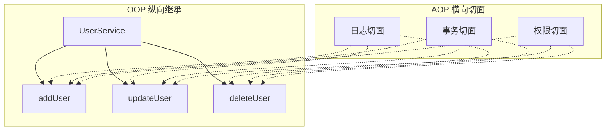
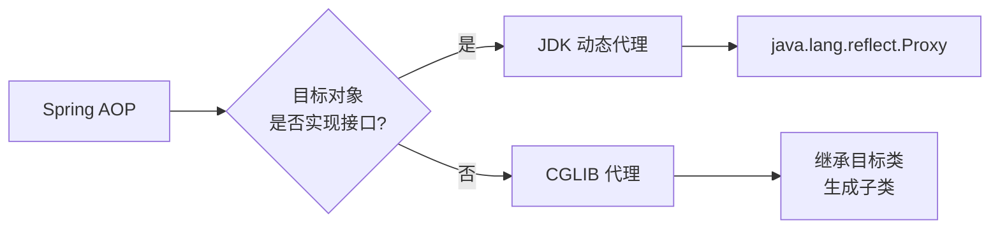
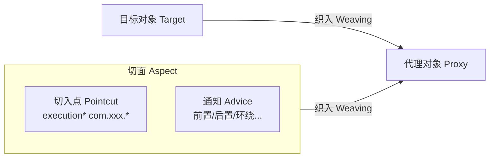
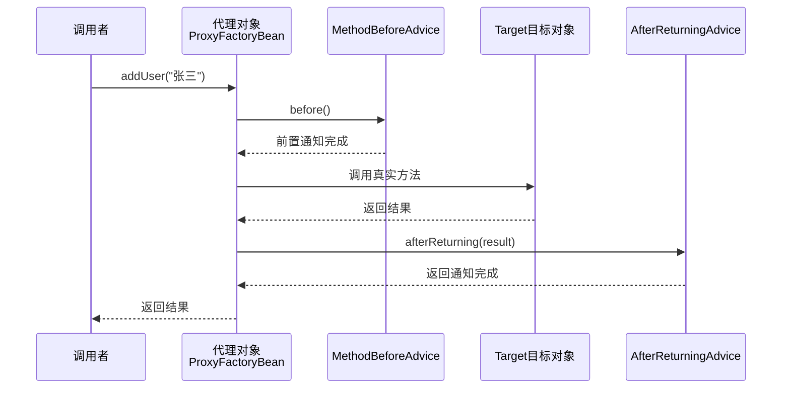
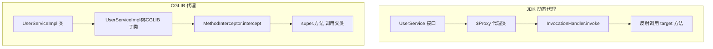
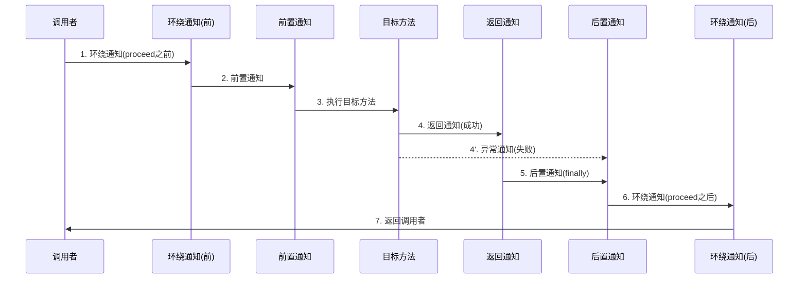
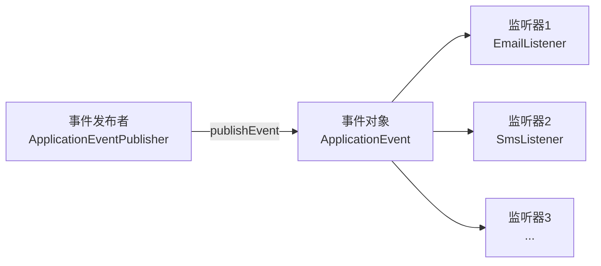
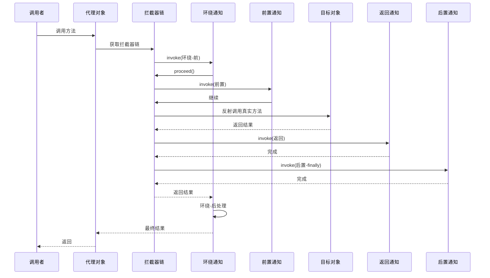

# Spring AOP 面向切面编程 — 完全指南

> **项目**: `Spring-02` | **Spring 版本**: 6.1.6 | **JDK**: 17 | **AspectJ**: 1.9.21

---

## 目录

1. [什么是 AOP](#1-什么是-aop)
2. [AOP 核心术语](#2-aop-核心术语)
3. [三种 AOP 实现方式](#3-三种-aop-实现方式)
   - [3.1 基于 XML 配置](#31-基于-xml-配置)
   - [3.2 基于 Spring API 接口](#32-基于-spring-api-接口)
   - [3.3 基于 @AspectJ 注解](#33-基于-aspectj-注解)
4. [JDK 动态代理原理](#4-jdk-动态代理原理)
5. [Spring 通知类型详解](#5-spring-通知类型详解)
6. [Spring 事件监听器](#6-spring-事件监听器)
7. [AOP 执行流程与原理](#7-aop-执行流程与原理)
8. [总结与最佳实践](#8-总结与最佳实践)
9. [面试题精选（含小红书高频题）](#9-面试题精选)

---

## 1. 什么是 AOP

### 1.1 概念

**AOP（Aspect-Oriented Programming，面向切面编程）** 是 OOP（面向对象编程）的补充。OOP 通过**纵向**继承体系组织代码，而 AOP 通过**横向**抽取机制解决**横切关注点（Cross-cutting Concerns）** 问题。



### 1.2 为什么需要 AOP

在实际项目中，以下需求几乎出现在每个方法中：

| 横切关注点 | 传统做法 | AOP 做法 |
|-----------|----------|----------|
| 日志记录 | 每个方法手动写 `log.info()` | 切面统一拦截 |
| 事务管理 | 手动 `conn.commit()/rollback()` | `@Transactional` |
| 权限校验 | 每个方法开头 `checkPermission()` | `@PreAuthorize` |
| 性能监控 | 手动计时 `System.currentTimeMillis()` | 环绕通知统一计时 |
| 异常处理 | try-catch 到处写 | 异常通知统一处理 |

**AOP 的核心思想：将横切关注点从业务代码中分离出来，形成独立的切面模块。**

### 1.3 AOP 的底层实现

Spring AOP 基于**动态代理**：



> **Spring Boot 2.x+ 默认**：`spring.aop.proxy-target-class=true`，即优先使用 CGLIB。

---

## 2. AOP 核心术语

理解这些术语是掌握 AOP 的前提：

| 术语 | 英文 | 含义 | 类比 |
|------|------|------|------|
| **切面** | Aspect | 横切关注点的模块化，= 通知 + 切入点 | 日志模块 |
| **通知** | Advice | 切面在特定连接点执行的代码 | 具体要做什么 |
| **连接点** | JoinPoint | 程序执行过程中的某个点（方法调用、异常抛出等） | 可以插入的位置 |
| **切入点** | Pointcut | 匹配连接点的表达式，筛选哪些连接点需要增强 | 筛选规则 |
| **目标对象** | Target | 被代理的原始对象 | 被增强的对象 |
| **代理对象** | Proxy | AOP 框架生成的代理，= 目标对象 + 通知 | 增强后的对象 |
| **织入** | Weaving | 将切面应用到目标对象创建代理的过程 | 组装过程 |
| **引介** | Introduction | 动态给类添加新方法/属性 | 扩展新能力 |



---

## 3. 三种 AOP 实现方式

### 3.1 基于 XML 配置

> 📁 文件：`applicationContext-aop.xml` + `aopxml/LoggingAspect.java`

这是 Spring 早期最经典的 AOP 配置方式，灵活但配置冗长。

#### 步骤

**① 定义切面类（纯 POJO，无需注解）**

```java
// src/main/java/com/spring/demo/aopxml/LoggingAspect.java
public class LoggingAspect {

    public void beforeLog(JoinPoint joinPoint) {
        System.out.println("[XML前置通知] 即将执行: " + joinPoint.getSignature().getName());
    }

    public Object aroundLog(ProceedingJoinPoint joinPoint) throws Throwable {
        long start = System.currentTimeMillis();
        Object result = joinPoint.proceed();  // 必须手动调用目标方法
        System.out.println("[XML环绕通知] 耗时: " + (System.currentTimeMillis() - start) + "ms");
        return result;
    }

    public void afterReturningLog(JoinPoint joinPoint, Object result) {
        System.out.println("[XML返回通知] 返回值: " + result);
    }

    public void afterThrowingLog(JoinPoint joinPoint, Exception ex) {
        System.out.println("[XML异常通知] 异常: " + ex.getMessage());
    }

    public void afterLog(JoinPoint joinPoint) {
        System.out.println("[XML后置通知] 方法执行完毕(finally)");
    }
}
```

**② XML 中配置 AOP**

```xml
<!-- applicationContext-aop.xml -->
<beans xmlns:aop="http://www.springframework.org/schema/aop">

    <!-- 目标对象 -->
    <bean id="userService" class="com.spring.demo.service.UserServiceImpl"/>

    <!-- 切面 Bean -->
    <bean id="loggingAspect" class="com.spring.demo.aopxml.LoggingAspect"/>

    <aop:config>
        <!-- 切入点表达式 -->
        <aop:pointcut id="servicePointcut"
                      expression="execution(* com.spring.demo.service.*.*(..))"/>

        <!-- 切面：将通知绑定到切入点 -->
        <aop:aspect ref="loggingAspect">
            <aop:before    method="beforeLog"         pointcut-ref="servicePointcut"/>
            <aop:after     method="afterLog"          pointcut-ref="servicePointcut"/>
            <aop:after-returning method="afterReturningLog"
                                 pointcut-ref="servicePointcut" returning="result"/>
            <aop:after-throwing  method="afterThrowingLog"
                                 pointcut-ref="servicePointcut" throwing="ex"/>
            <aop:around    method="aroundLog"         pointcut-ref="servicePointcut"/>
        </aop:aspect>
    </aop:config>
</beans>
```

**③ 切入点表达式语法**

```
execution(modifiers? return-type declaring-type? method-name(params) throws?)
```

| 示例 | 含义 |
|------|------|
| `execution(* com.demo.service.*.*(..))` | service 包下任意类的任意方法 |
| `execution(public * *(..))` | 所有 public 方法 |
| `execution(* com.demo..*.add*(..))` | com.demo 及子包下所有 add 开头的方法 |
| `execution(* com.demo.service.UserService.*(String, ..))` | 第一个参数为 String 的方法 |

> **通配符**：`*` 匹配任意一个部分，`..` 匹配任意数量参数或任意层级包

---

### 3.2 基于 Spring API 接口

> 📁 目录：`aopapi/` + 配置文件 `applicationContext-api.xml`

直接实现 Spring 提供的 AOP 通知接口，每种通知有对应的接口。

#### 五大通知接口

```java
// 1. 前置通知 — MethodBeforeAdvice
public class LogBeforeAdvice implements MethodBeforeAdvice {
    @Override
    public void before(Method method, Object[] args, Object target) {
        // 目标方法执行前触发
    }
}

// 2. 返回通知 — AfterReturningAdvice
public class LogAfterReturningAdvice implements AfterReturningAdvice {
    @Override
    public void afterReturning(Object returnValue, Method method,
                                Object[] args, Object target) {
        // 目标方法成功返回后触发
    }
}

// 3. 环绕通知 — MethodInterceptor（AOP Alliance 接口）
public class LogAroundInterceptor implements MethodInterceptor {
    @Override
    public Object invoke(MethodInvocation invocation) throws Throwable {
        // 前置增强
        Object result = invocation.proceed();  // 调用目标方法
        // 后置增强
        return result;
    }
}

// 4. 异常通知 — ThrowsAdvice（标记接口，无方法定义）
public class LogThrowsAdvice implements ThrowsAdvice {
    // 签名必须是 afterThrowing(Method, Object[], Object, Exception)
    public void afterThrowing(Method method, Object[] args,
                               Object target, Exception ex) {
        // 目标方法抛出异常时触发
    }
}
```

#### XML 配置（ProxyFactoryBean）

```xml
<!-- 目标对象 -->
<bean id="userServiceTarget" class="com.spring.demo.service.UserServiceImpl"/>

<!-- 通知 Bean -->
<bean id="logBeforeAdvice" class="com.spring.demo.aopapi.LogBeforeAdvice"/>
<bean id="logAfterReturningAdvice" class="com.spring.demo.aopapi.LogAfterReturningAdvice"/>
<bean id="logAroundInterceptor" class="com.spring.demo.aopapi.LogAroundInterceptor"/>
<bean id="logThrowsAdvice" class="com.spring.demo.aopapi.LogThrowsAdvice"/>

<!-- ProxyFactoryBean 创建代理 -->
<bean id="userServiceProxy" class="org.springframework.aop.framework.ProxyFactoryBean">
    <property name="proxyInterfaces" value="com.spring.demo.service.UserService"/>
    <property name="target" ref="userServiceTarget"/>
    <property name="interceptorNames">
        <list>
            <value>logBeforeAdvice</value>
            <value>logAfterReturningAdvice</value>
            <value>logAroundInterceptor</value>
            <value>logThrowsAdvice</value>
        </list>
    </property>
</bean>
```

#### 接口方式的执行流程



---

### 3.3 基于 @AspectJ 注解（⭐ 推荐）

> 📁 文件：`aopannotation/AnnotationLoggingAspect.java` + `config/AopConfig.java`

这是 Spring Boot 时代最主流的方式，简洁、类型安全。

#### 核心注解一览

| 注解 | 作用 | 执行时机 |
|------|------|----------|
| `@Aspect` | 声明该类为切面 | 类级别 |
| `@Pointcut` | 定义可复用的切入点表达式 | 方法级别 |
| `@Before` | 前置通知 | 目标方法执行前 |
| `@After` | 后置通知 | 目标方法执行后（finally） |
| `@AfterReturning` | 返回通知 | 目标方法成功返回后 |
| `@AfterThrowing` | 异常通知 | 目标方法抛出异常后 |
| `@Around` | 环绕通知 | 包围目标方法执行 |

#### 完整示例

```java
@Aspect
@Component
public class AnnotationLoggingAspect {

    /** 定义切入点 — 可复用 */
    @Pointcut("execution(* com.spring.demo.service.*.*(..))")
    public void serviceLayer() {}

    /** 前置通知：记录入参 */
    @Before("serviceLayer()")
    public void beforeLog(JoinPoint joinPoint) {
        String method = joinPoint.getSignature().getName();
        Object[] args = joinPoint.getArgs();
        System.out.printf("[前置] %s 入参: %s%n", method, Arrays.toString(args));
    }

    /** 后置通知：类似 finally */
    @After("serviceLayer()")
    public void afterLog(JoinPoint joinPoint) {
        System.out.printf("[后置] %s 执行完毕%n", joinPoint.getSignature().getName());
    }

    /** 返回通知：获取返回值 */
    @AfterReturning(pointcut = "serviceLayer()", returning = "result")
    public void afterReturningLog(JoinPoint joinPoint, Object result) {
        System.out.printf("[返回] %s 返回值: %s%n",
                joinPoint.getSignature().getName(), result);
    }

    /** 异常通知：捕获异常（不会吞掉异常） */
    @AfterThrowing(pointcut = "serviceLayer()", throwing = "ex")
    public void afterThrowingLog(JoinPoint joinPoint, Exception ex) {
        System.out.printf("[异常] %s 异常: %s%n",
                joinPoint.getSignature().getName(), ex.getMessage());
    }

    /** 环绕通知：最强大，可控制方法是否执行 */
    @Around("serviceLayer()")
    public Object aroundLog(ProceedingJoinPoint joinPoint) throws Throwable {
        long start = System.currentTimeMillis();
        String method = joinPoint.getSignature().getName();

        System.out.printf("[环绕-前] %s 开始执行%n", method);

        Object result;
        try {
            result = joinPoint.proceed();   // ⚠️ 必须手动调用
        } catch (Exception e) {
            System.out.printf("[环绕-异常] %s: %s%n", method, e.getMessage());
            throw e;  // 决定是否继续抛出
        }

        long elapsed = System.currentTimeMillis() - start;
        System.out.printf("[环绕-后] %s 耗时: %dms%n", method, elapsed);

        return result;
    }
}
```

#### 启用 AOP

```java
@Configuration
@ComponentScan(basePackages = "com.spring.demo")
@EnableAspectJAutoProxy(proxyTargetClass = false)  // false=JDK代理, true=CGLIB代理
public class AopConfig {
}
```

#### 三种方式对比

| 维度 | XML 方式 | 接口方式 | 注解方式 |
|------|---------|---------|---------|
| **配置复杂度** | 高（XML 冗长） | 中（XML + Java） | 低（纯注解） |
| **侵入性** | 无（POJO） | 高（强依赖 Spring API） | 低（仅注解依赖） |
| **切入点复用** | ❌ 不支持 | ❌ 不支持 | ✅ `@Pointcut` |
| **通知顺序控制** | ✅ XML 配置顺序 | ✅ 拦截器链顺序 | ✅ `@Order` 注解 |
| **类型安全** | ❌ 字符串匹配 | ✅ 编译检查 | ✅ 编译检查 |
| **Spring Boot 推荐** | ❌ | ❌ | ✅ |

---

## 4. JDK 动态代理原理

> 📁 文件：`jdkproxy/JdkLogInvocationHandler.java`

### 4.1 什么是动态代理

JDK 动态代理是 Java 反射机制的一部分，可以在**运行时**动态创建代理类，无需手动编写代理类。

**核心三要素**：
- `InvocationHandler` — 调用处理器（增强逻辑写在这里）
- `Proxy.newProxyInstance()` — 创建代理对象
- 目标对象必须**实现接口**

### 4.2 手写 JDK 动态代理

```java
public class JdkLogInvocationHandler implements InvocationHandler {

    private final Object target;  // 目标对象

    public JdkLogInvocationHandler(Object target) {
        this.target = target;
    }

    /**
     * 创建代理对象的工厂方法
     */
    @SuppressWarnings("unchecked")
    public static <T> T createProxy(Object target, Class<T> interfaceType) {
        return (T) Proxy.newProxyInstance(
                interfaceType.getClassLoader(),   // ① 类加载器
                new Class<?>[]{interfaceType},    // ② 代理哪些接口
                new JdkLogInvocationHandler(target) // ③ InvocationHandler
        );
    }

    /**
     * 所有代理方法调用都会进入这里
     */
    @Override
    public Object invoke(Object proxy, Method method, Object[] args) throws Throwable {
        // ===== 前置增强 =====
        System.out.println("[JDK代理-前置] 方法: " + method.getName());

        Object result;
        try {
            // ===== 调用目标方法 =====
            result = method.invoke(target, args);

            // ===== 返回增强 =====
            System.out.println("[JDK代理-返回] 返回值: " + result);
        } catch (InvocationTargetException e) {
            // ===== 异常增强 =====
            System.out.println("[JDK代理-异常] " + e.getCause().getMessage());
            throw e.getCause();
        } finally {
            // ===== 后置增强（finally） =====
            System.out.println("[JDK代理-后置] 执行完毕");
        }
        return result;
    }
}
```

### 4.3 JDK 代理 vs CGLIB 代理



| 对比项 | JDK 动态代理 | CGLIB 代理 |
|--------|-------------|------------|
| **原理** | 基于接口，生成 `$Proxy` 类 | 基于继承，生成目标类的子类 |
| **限制** | 必须实现接口 | 不能代理 `final` 类/方法 |
| **性能** | 创建快，调用略慢（反射） | 创建慢（字节码生成），调用快 |
| **Spring 默认** | 有接口时默认使用 | Spring Boot 2.x 默认 |

### 4.4 底层源码关键流程

```
Proxy.newProxyInstance()
  → getProxyClass0()              // 查找或生成代理类
    → ProxyClassFactory.apply()    // 生成字节码
      → ProxyGenerator.generateProxyClass()
  → proxyClass.getConstructor(InvocationHandler.class).newInstance(handler)
  → 返回代理实例
```

---

## 5. Spring 通知类型详解

### 5.1 五种通知执行顺序



**正常执行顺序**：`环绕(前) → 前置 → 目标方法 → 返回 → 后置 → 环绕(后)`

**异常执行顺序**：`环绕(前) → 前置 → 目标方法 → 异常 → 后置 → 环绕(异常处理)`

### 5.2 通知类型总结

| 通知类型 | 注解 | 接口 | 执行时机 | 能否阻止方法执行 | 能否修改返回值 |
|----------|------|------|----------|:---:|:---:|
| **前置通知** | `@Before` | `MethodBeforeAdvice` | 方法执行前 | ❌ | ❌ |
| **后置通知** | `@After` | — | 方法执行后（finally） | ❌ | ❌ |
| **返回通知** | `@AfterReturning` | `AfterReturningAdvice` | 成功返回后 | ❌ | ❌ (只读) |
| **异常通知** | `@AfterThrowing` | `ThrowsAdvice` | 抛出异常后 | ❌ | ❌ |
| **环绕通知** | `@Around` | `MethodInterceptor` | 包围方法执行 | ✅ | ✅ |

### 5.3 多个切面的执行顺序

使用 `@Order` 注解控制：

```java
@Aspect
@Component
@Order(1)  // 值越小，越先执行
public class LoggingAspect { }

@Aspect
@Component
@Order(2)
public class TransactionAspect { }
```

**正常执行**：`Order(1)环绕前 → Order(1)前置 → Order(2)环绕前 → Order(2)前置 → 目标方法 → Order(2)后置 → Order(2)环绕后 → Order(1)后置 → Order(1)环绕后`

> 🔑 记忆口诀：**同心圆模型** — `@Order` 值小的在外层，先进入、后退出。

---

## 6. Spring 事件监听器

> 📁 目录：`listener/`

### 6.1 事件驱动模型

Spring 的事件机制基于**观察者模式**，实现组件间的解耦通信。



### 6.2 自定义事件

```java
// ① 定义事件 — 继承 ApplicationEvent
public class UserRegisterEvent extends ApplicationEvent {
    private final String username;
    private final String email;

    public UserRegisterEvent(Object source, String username, String email) {
        super(source);
        this.username = username;
        this.email = email;
    }
    // getters...
}
```

### 6.3 监听器的两种实现

**方式一：实现 ApplicationListener 接口**

```java
@Component
public class EmailListener implements ApplicationListener<UserRegisterEvent> {
    @Override
    public void onApplicationEvent(UserRegisterEvent event) {
        System.out.printf("[邮件监听器] 发送欢迎邮件给: %s%n", event.getUsername());
    }
}
```

**方式二：@EventListener 注解（⭐ 推荐）**

```java
@Component
public class SmsListener {

    @EventListener
    public void handleUserRegister(UserRegisterEvent event) {
        System.out.printf("[短信监听器] 发送注册短信给: %s%n", event.getUsername());
    }

    // 支持监听 Spring 内置事件
    @EventListener
    public void handleContextRefresh(ContextRefreshedEvent event) {
        System.out.println("[系统监听器] IoC 容器初始化完成！");
    }

    // 支持异步（需配合 @EnableAsync + @Async）
    @Async
    @EventListener
    public void handleAsync(UserRegisterEvent event) {
        // 异步处理，不阻塞主线程
    }
}
```

### 6.4 发布事件

```java
@Component
public class UserRegisterPublisher implements ApplicationEventPublisherAware {

    private ApplicationEventPublisher publisher;

    @Override
    public void setApplicationEventPublisher(ApplicationEventPublisher publisher) {
        this.publisher = publisher;
    }

    public void register(String username, String email) {
        // 执行业务逻辑...
        // 发布事件 → 所有匹配的监听器自动触发
        publisher.publishEvent(new UserRegisterEvent(this, username, email));
    }
}
```

### 6.5 Spring 内置事件

| 事件 | 触发时机 |
|------|----------|
| `ContextRefreshedEvent` | ApplicationContext 初始化或刷新完成 |
| `ContextStartedEvent` | ApplicationContext 启动 |
| `ContextStoppedEvent` | ApplicationContext 停止 |
| `ContextClosedEvent` | ApplicationContext 关闭 |
| `RequestHandledEvent` | Web 请求处理完成 |

---

## 7. AOP 执行流程与原理

### 7.1 Spring AOP 完整链路



### 7.2 核心源码路径

```
@EnableAspectJAutoProxy
  → @Import(AspectJAutoProxyRegistrar)
    → AopConfigUtils.registerAspectJAnnotationAutoProxyCreatorIfNecessary()
      → 注册 AnnotationAwareAspectJAutoProxyCreator（BeanPostProcessor）
        → postProcessAfterInitialization() → wrapIfNecessary()
          → createProxy() → ProxyFactory.getProxy()
            → JdkDynamicAopProxy（JDK） 或 CglibAopProxy（CGLIB）
```

### 7.3 AOP 失效场景（⚠️ 重要）

| 场景 | 原因 | 解决方案 |
|------|------|----------|
| 同类内部调用 | `this.method()` 绕过代理 | 注入自身 / `AopContext.currentProxy()` |
| 方法非 public | CGLIB 也无法代理 private | 改为 public |
| final 方法 | CGLIB 基于继承，final 无法重写 | 去掉 final |
| 未被 Spring 管理 | `new` 创建的对象不在容器中 | 使用 `@Bean` 或 `getBean()` |
| 切点表达式写错 | 没有匹配到目标方法 | 检查 execution 表达式 |

---

## 8. 总结与最佳实践

### 8.1 AOP 知识图谱

```
Spring AOP
├── 核心概念
│   ├── 切面(Aspect) = 切入点 + 通知
│   ├── 通知(Advice): @Before, @After, @Around, @AfterReturning, @AfterThrowing
│   ├── 切入点(Pointcut): execution表达式
│   └── 织入(Weaving): 编译期 / 类加载期 / 运行期(Spring)
├── 实现方式
│   ├── XML 配置: <aop:config> + <aop:aspect>
│   ├── 接口方式: MethodBeforeAdvice, MethodInterceptor 等
│   └── 注解方式: @Aspect + @EnableAspectJAutoProxy ⭐
├── 底层代理
│   ├── JDK 动态代理: Proxy + InvocationHandler(基于接口)
│   └── CGLIB 代理: Enhancer(基于继承)
├── 事件机制
│   ├── ApplicationEvent 自定义事件
│   ├── ApplicationListener / @EventListener
│   └── ApplicationEventPublisher 发布事件
└── 最佳实践
    ├── 优先使用 @AspectJ 注解方式
    ├── 切入点表达式尽量精确，避免拦截过多
    ├── 环绕通知谨慎使用，不要吞掉异常
    └── 注意 AOP 失效场景
```

### 8.2 最佳实践

1. **✅ 优先使用 `@AspectJ` 注解** — 最简洁、最 Spring Boot 友好
2. **✅ 切入点表达式保持精确** — 避免 `execution(* *(..))` 拦截所有方法
3. **✅ 环绕通知慎重使用** — 必须调用 `joinPoint.proceed()`，异常要么处理要么重新抛出
4. **✅ 注意通知执行顺序** — 使用 `@Order` 控制多个切面的先后
5. **✅ 避免 AOP 失效** — 同类调用使用 `AopContext.currentProxy()` 或注入自身
6. **✅ 事件机制解耦** — 用户注册后发邮件、发短信等，用事件监听代替硬编码
7. **❌ 不要吞掉异常** — 异常通知不能阻止异常传播（除非环绕通知中 catch 不抛出）
8. **❌ 不要在通知中执行耗时操作** — 特别是同步的前置/后置通知

---

## 9. 面试题精选

---

### Q1: 什么是 AOP？它解决了什么问题？

**答案**：

AOP（Aspect-Oriented Programming，面向切面编程）是对 OOP 的补充。它通过**横向抽取**机制将散布在多个模块中的**横切关注点**（如日志、事务、权限）模块化。

**解决的问题**：
- **代码冗余**：不需要在每个方法中重复写日志/事务代码
- **维护困难**：横切逻辑集中在切面中，统一修改
- **业务侵入**：业务代码只关注核心逻辑，横切逻辑被剥离

**典型应用场景**：日志记录、性能监控、事务管理、权限校验、缓存处理、异常统一处理。

---

### Q2: Spring AOP 和 AspectJ 有什么区别？

**答案**：

| 对比维度 | Spring AOP | AspectJ |
|----------|-----------|---------|
| **实现机制** | 运行时动态代理 | 编译时/类加载时字节码增强 |
| **织入时机** | 运行时 | 编译期、编译后、类加载期 |
| **性能** | 略低（反射/代理开销） | 高（编译时织入，无运行时开销） |
| **使用复杂度** | 简单，纯 Java 配置 | 需要 AspectJ 编译器或 LTW |
| **功能完整性** | 仅支持方法级连接点 | 支持字段、构造器、静态初始化等 |
| **依赖** | spring-aop + aspectjweaver | aspectjrt + aspectjtools |
| **Spring 集成** | 原生支持 | 需要 `@EnableLoadTimeWeaving` |

**关键**：Spring AOP 不是要替代 AspectJ，而是提供了 80% 场景下够用的 AOP 能力。需要更细粒度控制时选择 AspectJ。

---

### Q3: JDK 动态代理和 CGLIB 代理的区别？Spring 如何选择？

**答案**：

| 维度 | JDK 动态代理 | CGLIB |
|------|-------------|-------|
| **原理** | 反射 + 接口，生成 `$Proxy` 类 | ASM 字节码 + 继承，生成子类 |
| **限制** | 目标必须实现接口 | 不能代理 `final` 类/方法 |
| **性能** | 创建快，调用略慢 | 创建慢，调用快 |
| **依赖** | JDK 内置 | 需引入 cglib |

**Spring 选择策略**：
- 如果 `proxyTargetClass = true` 或目标对象没有实现接口 → CGLIB
- 如果目标实现了接口且 `proxyTargetClass = false` → JDK 动态代理
- **Spring Boot 2.x 默认** `spring.aop.proxy-target-class=true`（CGLIB）

---

### Q4: Spring 的通知类型有哪些？执行顺序是怎样的？

**答案**：

**五种通知**：`@Before`、`@After`、`@AfterReturning`、`@AfterThrowing`、`@Around`

**正常执行顺序**：
```
环绕通知(proceed前) → @Before → 目标方法 → @AfterReturning → @After → 环绕通知(proceed后)
```

**异常执行顺序**：
```
环绕通知(proceed前) → @Before → 目标方法(抛异常) → @AfterThrowing → @After → 环绕通知(catch块)
```

**多个切面**：按 `@Order` 值从小到大执行，类似同心圆——值小的先入后出。

---

### Q5: `@After` 和 `@AfterReturning` 的区别？

**答案**：

| 维度 | `@After` | `@AfterReturning` |
|------|----------|-------------------|
| **语义** | 类似 `finally` | 仅方法成功返回后 |
| **异常时** | ✅ 仍然执行 | ❌ 不执行 |
| **获取返回值** | ❌ 无法获取 | ✅ 可通过 `returning` 获取 |
| **控制执行流** | ❌ | ❌ |

```java
@After("pointcut()")        // finally 语义，一定会执行
@AfterReturning(pointcut = "...", returning = "result")  // 只有成功返回才执行
```

---

### Q6: `@Around` 环绕通知和普通通知的区别？

**答案**：

`@Around` 是最强大的通知类型：

1. **可控制方法是否执行**：可以选择不调用 `joinPoint.proceed()`
2. **可修改参数**：在 `proceed()` 前修改传入参数
3. **可修改返回值**：修改 `proceed()` 的返回值
4. **可吞掉异常**：catch 后不抛出，转为正常返回
5. **可做性能监控**：精确计时，统计调用次数

```java
@Around("pointcut()")
public Object around(ProceedingJoinPoint jp) throws Throwable {
    // ① 修改入参（可选）
    Object[] args = jp.getArgs();
    args[0] = "修改后的参数";

    // ② 条件执行（可选）
    if (shouldProceed) {
        Object result = jp.proceed(args);  // ③ 必须手动调用
        // ④ 修改返回值（可选）
        return "增强后的" + result;
    }
    return "未执行目标方法";
}
```

---

### Q7: Spring AOP 在什么情况下会失效？

**答案**：

1. **同类内部调用**：`this.method()` 不经过代理对象
   ```java
   // ❌ 失效
   public void methodA() { this.methodB(); }  // methodB 的 AOP 不生效
   // ✅ 解决方案
   public void methodA() {
       ((MyService) AopContext.currentProxy()).methodB();
   }
   ```

2. **方法非 public**：JDK 代理只代理接口方法（都是 public），CGLIB 也无法代理 private

3. **final 方法**：CGLIB 基于继承，final 方法无法被重写

4. **未被 Spring 管理**：`new` 手动创建的对象不受 AOP 影响

5. **切入点表达式写错**：检查 `execution` 表达式是否正确匹配

6. **`@Transactional` 自调用**：同类中非事务方法调用事务方法，事务失效（也是 AOP 失效的体现）

---

### Q8: Spring 事件监听机制的原理？

**答案**：

Spring 事件机制基于**观察者模式**（发布-订阅模式）。

**核心组件**：
- `ApplicationEvent`：事件对象
- `ApplicationListener`：监听器接口
- `ApplicationEventMulticaster`：事件广播器（默认 `SimpleApplicationEventMulticaster`）
- `ApplicationEventPublisher`：事件发布者

**执行流程**：
```
publisher.publishEvent(event)
  → ApplicationEventMulticaster.multicastEvent()
    → 遍历所有匹配的 ApplicationListener
      → 同步调用 listener.onApplicationEvent(event)（默认同步）
        → 如果 @Async，则由线程池异步执行
```

> ⚠️ **默认是同步的**！事件发布者会阻塞直到所有监听器执行完毕。异步需要配合 `@EnableAsync` + `@Async`。

---

### Q9: Spring AOP 的底层实现原理？（源码级）

**答案**：

1. **`@EnableAspectJAutoProxy`** → `@Import(AspectJAutoProxyRegistrar)` 
2. 注册 `AnnotationAwareAspectJAutoProxyCreator`（本质是一个 **BeanPostProcessor**）
3. 在 Bean 初始化后（`postProcessAfterInitialization`），检查是否需要代理
4. 如果需要代理 → `wrapIfNecessary()` → `createProxy()`
5. `ProxyFactory.getProxy()` 选择代理方式：
   - 有接口 → `JdkDynamicAopProxy`
   - 无接口 → `CglibAopProxy`
6. 代理对象中维护一个**拦截器链**（Advice → Interceptor 适配）
7. 方法调用时 → `ReflectiveMethodInvocation.proceed()` → 递归调用拦截器链 → 最终反射调用目标方法

---

### Q10: 如何实现一个自定义的 Spring Boot Starter（如日志切面自动配置）？

**答案**：

```java
// 1. 定义切面
@Aspect
public class LogAutoAspect {
    @Around("@annotation(log)")
    public Object around(ProceedingJoinPoint jp, Log log) throws Throwable {
        // 日志逻辑
        return jp.proceed();
    }
}

// 2. 自动配置类
@Configuration
@ConditionalOnClass(Aspect.class)
@EnableAspectJAutoProxy
public class LogAutoConfiguration {
    @Bean
    @ConditionalOnMissingBean
    public LogAutoAspect logAutoAspect() {
        return new LogAutoAspect();
    }
}

// 3. spring.factories (Spring Boot 2.x)
// src/main/resources/META-INF/spring.factories
org.springframework.boot.autoconfigure.EnableAutoConfiguration=\
com.example.LogAutoConfiguration

// 或 Spring Boot 3.x 用
// src/main/resources/META-INF/spring/org.springframework.boot.autoconfigure.AutoConfiguration.imports
```

---

> 📝 **提示**：本文档对应的完整代码在 `Spring-02` 项目中，可直接运行 `App.java` 的 `main()` 方法查看所有 AOP 演示效果。

---

*文档生成日期：2026-07-13 | Spring 6.1.6 + JDK 17*
