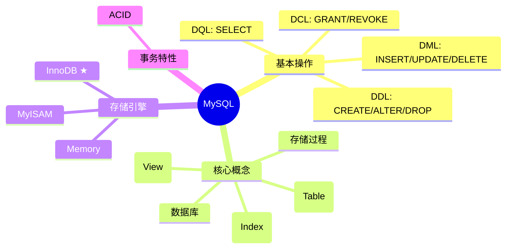
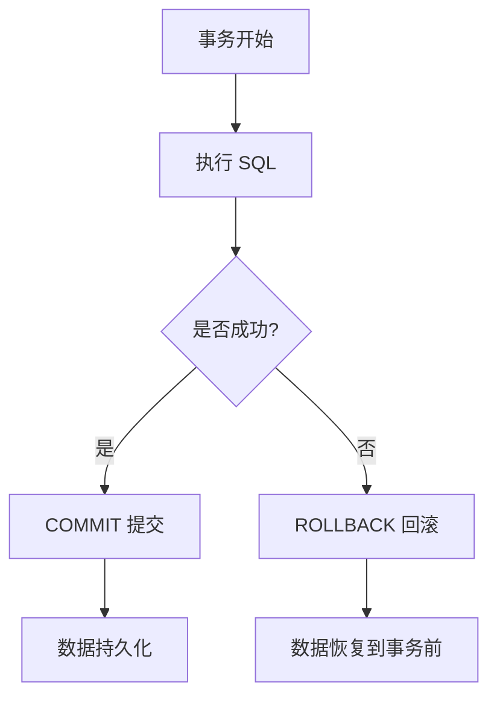
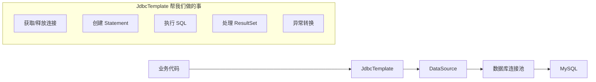
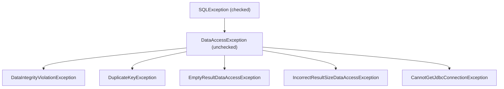
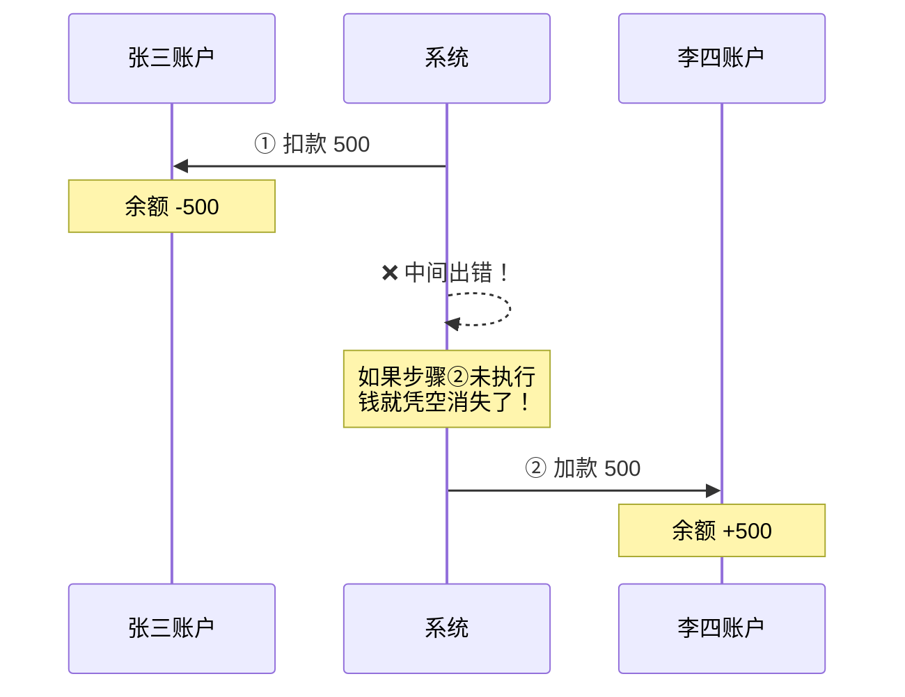
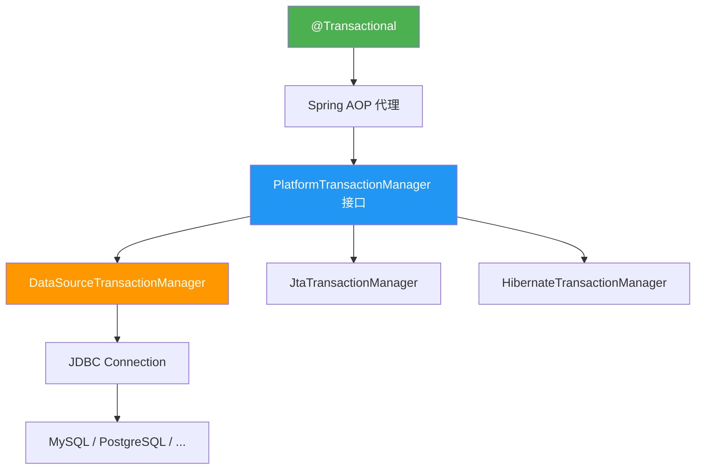
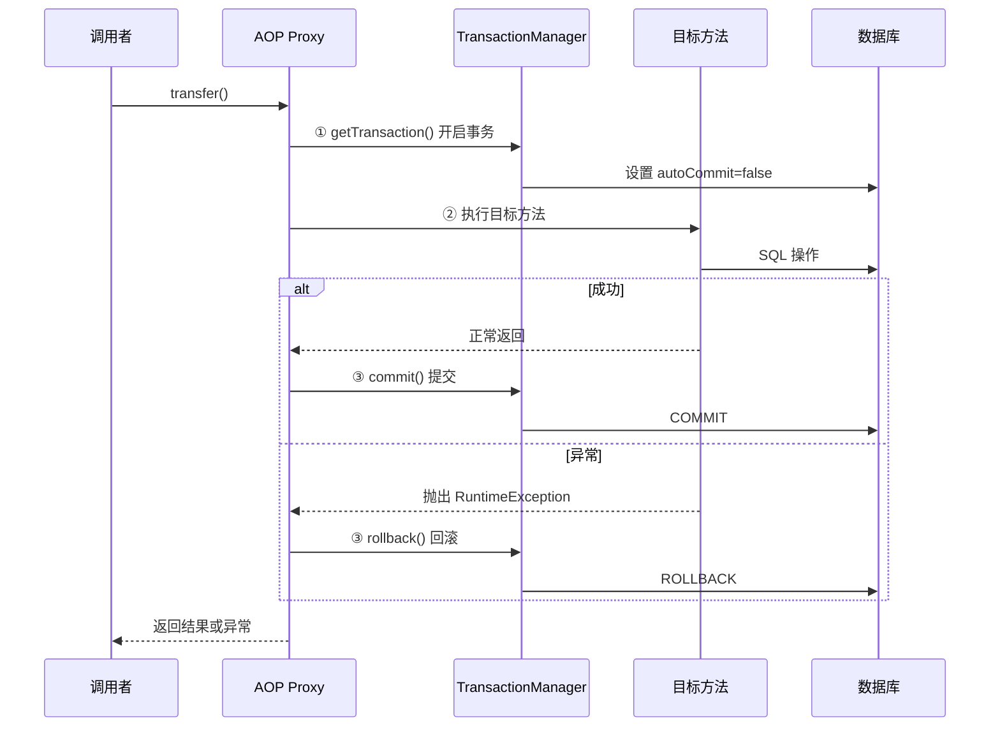
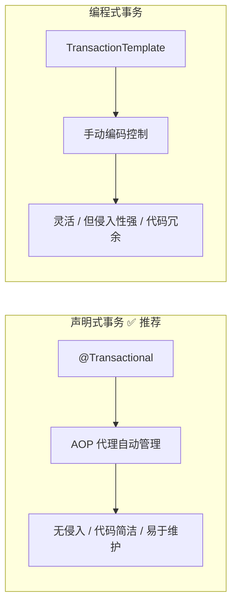
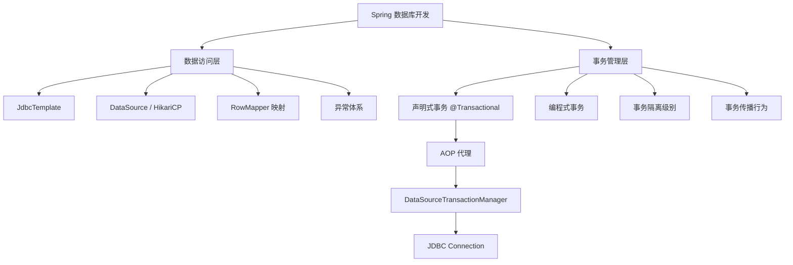

# Spring JDBC 数据库开发与事务管理 — 完全指南

> **项目**: `Spring-03` | **Spring 版本**: 6.1.6 | **JDK**: 17 | **MySQL**: 8.x

---

## 目录

1. [MySQL 基础运用](#1-mysql-基础运用)
2. [Spring 的数据库开发（JDBC）](#2-spring-的数据库开发jdbc)
3. [Spring 事务管理](#3-spring-事务管理)
4. [声明式事务详解](#4-声明式事务详解)
5. [项目代码结构](#5-项目代码结构)
6. [总结](#6-总结)
7. [大厂面试题精选](#7-大厂面试题精选)

---

## 1. MySQL 基础运用

### 1.1 什么是 MySQL？

**MySQL** 是目前最流行的**开源关系型数据库管理系统（RDBMS）**，由 Oracle 公司维护。它使用 **SQL（Structured Query Language）** 作为数据操作语言，具有高性能、高可靠性和易用性等特点。



### 1.2 MySQL 安装与连接

```bash
# Docker 快速启动（推荐开发环境）
docker run -d --name mysql-dev \
  -e MYSQL_ROOT_PASSWORD=123456 \
  -p 3306:3306 \
  mysql:8.0

# 命令行连接
mysql -h localhost -u root -p

# JDBC 连接 URL
jdbc:mysql://localhost:3306/spring_demo?useSSL=false&serverTimezone=Asia/Shanghai
```

### 1.3 基础 SQL 操作

```sql
-- ==================== 数据库操作 ====================
CREATE DATABASE spring_demo CHARACTER SET utf8mb4 COLLATE utf8mb4_unicode_ci;
USE spring_demo;

-- ==================== 表操作 ====================
-- 创建用户表
CREATE TABLE users (
    id       BIGINT AUTO_INCREMENT PRIMARY KEY COMMENT '主键',
    username VARCHAR(50)  NOT NULL COMMENT '用户名',
    email    VARCHAR(100) COMMENT '邮箱',
    age      INT          COMMENT '年龄',
    INDEX idx_username (username)
) ENGINE=InnoDB DEFAULT CHARSET=utf8mb4;

-- 创建账户表（事务演示用）
CREATE TABLE accounts (
    id           BIGINT AUTO_INCREMENT PRIMARY KEY,
    account_name VARCHAR(50)   NOT NULL,
    balance      DECIMAL(10,2) NOT NULL DEFAULT 0.00
) ENGINE=InnoDB DEFAULT CHARSET=utf8mb4;

-- ==================== CRUD 操作 ====================
-- 增 (Create)
INSERT INTO users(username, email, age) VALUES ('张三', 'zhangsan@test.com', 25);
INSERT INTO users(username, email, age) VALUES
    ('李四', 'lisi@test.com', 30),
    ('王五', 'wangwu@test.com', 28);

-- 删 (Delete)
DELETE FROM users WHERE id = 1;

-- 改 (Update)
UPDATE users SET email = 'newemail@test.com', age = 26 WHERE id = 2;

-- 查 (Read)
SELECT * FROM users;
SELECT id, username FROM users WHERE age > 25;
SELECT * FROM users WHERE username LIKE '%张%';
SELECT COUNT(*) FROM users;
SELECT * FROM users ORDER BY age DESC LIMIT 5;
```

### 1.4 InnoDB 存储引擎

MySQL 默认存储引擎 **InnoDB** 的核心特性：

| 特性 | 说明 |
|------|------|
| **事务支持（ACID）** | 提交、回滚、崩溃恢复 |
| **行级锁** | 高并发下性能更好 |
| **外键约束** | 保证数据完整性 |
| **MVCC** | 多版本并发控制，读写不互斥 |
| **聚集索引** | 主键索引存储整行数据 |



### 1.5 事务的 ACID 特性

| 特性 | 含义 | 实现机制 |
|------|------|----------|
| **原子性 (Atomicity)** | 事务是不可分割的最小单元，要么全做，要么全不做 | Undo Log |
| **一致性 (Consistency)** | 事务前后数据必须满足所有约束 | 由其他三个特性共同保证 |
| **隔离性 (Isolation)** | 多个并发事务之间相互隔离 | 锁 + MVCC |
| **持久性 (Durability)** | 事务一旦提交，数据永久保存 | Redo Log |

### 1.6 并发事务问题与隔离级别

```
隔离级别从低到高：
READ UNCOMMITTED → READ COMMITTED → REPEATABLE READ → SERIALIZABLE
      (低)                                                    (高)
```

| 隔离级别 | 脏读 | 不可重复读 | 幻读 |
|----------|:----:|:----------:|:----:|
| READ UNCOMMITTED | ✅ | ✅ | ✅ |
| READ COMMITTED | ❌ | ✅ | ✅ |
| **REPEATABLE READ（MySQL 默认）** | ❌ | ❌ | ✅(部分解决) |
| SERIALIZABLE | ❌ | ❌ | ❌ |

> **MySQL InnoDB 的 REPEATABLE READ** 通过 **Next-Key Lock（间隙锁）** 在很大程度上解决了幻读问题。

---

## 2. Spring 的数据库开发（JDBC）

### 2.1 传统 JDBC 的痛点

在 Spring 出现之前，原生 JDBC 开发极其繁琐：

```java
// 传统 JDBC —— 大量样板代码！
Connection conn = null;
PreparedStatement ps = null;
ResultSet rs = null;
try {
    conn = DriverManager.getConnection(url, user, password);
    ps = conn.prepareStatement("SELECT * FROM users WHERE id = ?");
    ps.setLong(1, id);
    rs = ps.executeQuery();
    while (rs.next()) {
        User user = new User();
        user.setId(rs.getLong("id"));
        user.setUsername(rs.getString("username"));
        // ... 更多字段
    }
} catch (SQLException e) {
    e.printStackTrace();
} finally {
    // 按顺序关闭资源，每步都需判空！
    if (rs != null) try { rs.close(); } catch (SQLException e) {}
    if (ps != null) try { ps.close(); } catch (SQLException e) {}
    if (conn != null) try { conn.close(); } catch (SQLException e) {}
}
```

**痛点**：资源管理复杂、异常处理繁琐、代码高度重复、SQLException 是检查型异常。

### 2.2 Spring JDBC 解决方案：JdbcTemplate

**JdbcTemplate** 是 Spring 对 JDBC 的核心封装，采用**模板方法模式（Template Method Pattern）**：



### 2.3 核心依赖

```xml
<!-- pom.xml -->
<dependency>
    <groupId>org.springframework</groupId>
    <artifactId>spring-jdbc</artifactId>
    <version>6.1.6</version>
</dependency>
<dependency>
    <groupId>com.mysql</groupId>
    <artifactId>mysql-connector-j</artifactId>
    <version>8.3.0</version>
</dependency>
<dependency>
    <groupId>com.zaxxer</groupId>
    <artifactId>HikariCP</artifactId>
    <version>5.1.0</version>
</dependency>
```

### 2.4 数据源配置

```java
@Configuration
public class DataSourceConfig {

    @Bean
    public DataSource dataSource() {
        HikariDataSource ds = new HikariDataSource();
        ds.setDriverClassName("com.mysql.cj.jdbc.Driver");
        ds.setJdbcUrl("jdbc:mysql://localhost:3306/spring_demo?useSSL=false&serverTimezone=Asia/Shanghai");
        ds.setUsername("root");
        ds.setPassword("123456");
        ds.setMaximumPoolSize(10);   // 最大连接数
        ds.setMinimumIdle(2);        // 最小空闲连接
        return ds;
    }

    @Bean
    public JdbcTemplate jdbcTemplate(DataSource dataSource) {
        return new JdbcTemplate(dataSource);
    }
}
```

### 2.5 HikariCP 连接池

为什么使用连接池？

```
不使用连接池（每次新建连接）：
 TCP三次握手 → MySQL认证 → 执行SQL → TCP四次挥手
 └────────────── 耗时 50-100ms ──────────────┘

使用连接池（复用连接）：
 从池中获取 → 执行SQL → 归还到池中
 └─────── 耗时 <1ms ───────┘
```

**HikariCP** 被称为"光速连接池"，是 Spring Boot 2.x+ 的默认连接池，优点：
- 极致的性能（字节码级别的优化）
- 极简的 API
- 可靠的连接验证

### 2.6 JdbcTemplate 核心方法

| 方法 | 用途 | 返回值 |
|------|------|--------|
| `update(sql, args...)` | INSERT / UPDATE / DELETE | `int`（影响行数） |
| `batchUpdate(sql, batchArgs)` | 批量操作 | `int[]` |
| `queryForObject(sql, RowMapper, args)` | 查询单行 | `T` |
| `query(sql, RowMapper, args)` | 查询多行 | `List<T>` |
| `queryForList(sql, args)` | 查询多行（返回 Map） | `List<Map<String,Object>>` |
| `execute(sql)` | 执行 DDL | `void` |

### 2.7 DAO 示例

```java
@Repository
public class UserDao {

    private final JdbcTemplate jdbcTemplate;

    // 构造器注入
    public UserDao(JdbcTemplate jdbcTemplate) {
        this.jdbcTemplate = jdbcTemplate;
    }

    // ---------- 增 ----------
    public int insert(User user) {
        String sql = "INSERT INTO users(username, email, age) VALUES (?, ?, ?)";
        return jdbcTemplate.update(sql, user.getUsername(), user.getEmail(), user.getAge());
    }

    // ---------- 删 ----------
    public int deleteById(Long id) {
        return jdbcTemplate.update("DELETE FROM users WHERE id = ?", id);
    }

    // ---------- 改 ----------
    public int update(User user) {
        String sql = "UPDATE users SET username=?, email=?, age=? WHERE id=?";
        return jdbcTemplate.update(sql, user.getUsername(), user.getEmail(),
                user.getAge(), user.getId());
    }

    // ---------- 查（单条） ----------
    public User findById(Long id) {
        String sql = "SELECT id, username, email, age FROM users WHERE id = ?";
        return jdbcTemplate.queryForObject(sql, new BeanPropertyRowMapper<>(User.class), id);
    }

    // ---------- 查（多条） ----------
    public List<User> findAll() {
        String sql = "SELECT id, username, email, age FROM users";
        return jdbcTemplate.query(sql, new BeanPropertyRowMapper<>(User.class));
    }

    // ---------- 聚合查询 ----------
    public int count() {
        String sql = "SELECT COUNT(*) FROM users";
        Integer count = jdbcTemplate.queryForObject(sql, Integer.class);
        return count != null ? count : 0;
    }
}
```

### 2.8 BeanPropertyRowMapper vs 自定义 RowMapper

| 方式 | 优点 | 缺点 |
|------|------|------|
| `BeanPropertyRowMapper` | 零配置、代码简洁 | 要求列名与属性名完全一致（不区分大小写） |
| 自定义 `RowMapper` | 灵活可控、支持复杂映射 | 需要手写映射代码 |

```java
// 方式一：BeanPropertyRowMapper — 列名自动映射
User user = jdbcTemplate.queryForObject(sql,
        new BeanPropertyRowMapper<>(User.class), id);

// 方式二：Lambda RowMapper — 完全自定义
User user = jdbcTemplate.queryForObject(sql, (rs, rowNum) -> {
    User u = new User();
    u.setId(rs.getLong("id"));
    u.setUsername(rs.getString("username"));
    u.setEmail(rs.getString("email"));
    u.setAge(rs.getInt("age"));
    return u;
}, id);
```

### 2.9 Spring JDBC 异常体系

Spring 将 JDBC 的检查型异常 `SQLException` 转换为**非检查型异常 `DataAccessException`**：



> **好处**：业务代码不再被迫 `try-catch` SQLException，异常处理更优雅。

---

## 3. Spring 事务管理

### 3.1 为什么需要事务？

考虑一个经典的**转账场景**：张三给李四转账 500 元。



**没有事务时**：步骤①成功但步骤②失败，张三的 500 元凭空消失——这就是数据不一致。

**有事务时**：任一步失败，所有已执行操作全部回滚，数据保持一致。

### 3.2 事务管理的两种方式

Spring 提供两种事务管理方式：

| 方式 | 说明 | 侵入性 |
|------|------|:------:|
| **编程式事务** | 通过 `TransactionTemplate` 或 `PlatformTransactionManager` 手动编码 | 高 |
| **声明式事务** | 通过 `@Transactional` 注解或 XML 配置 | **低** ✅ |

```java
// 编程式事务（不推荐）
transactionTemplate.execute(status -> {
    accountDao.outMoney("张三", amount);
    accountDao.inMoney("李四", amount);
    return null;
});

// 声明式事务（推荐！）
@Transactional
public void transfer(String from, String to, BigDecimal amount) {
    accountDao.outMoney(from, amount);
    accountDao.inMoney(to, amount);
}
```

### 3.3 事务管理器架构



### 3.4 核心配置

```java
// ① 注册事务管理器 Bean
@Bean
public DataSourceTransactionManager transactionManager(DataSource dataSource) {
    return new DataSourceTransactionManager(dataSource);
}

// ② 开启声明式事务
@Configuration
@EnableTransactionManagement  // <-- 关键！
public class TransactionConfig {
}
```

等价 XML 配置：

```xml
<!-- 事务管理器 -->
<bean id="transactionManager"
      class="org.springframework.jdbc.datasource.DataSourceTransactionManager">
    <property name="dataSource" ref="dataSource"/>
</bean>

<!-- 开启注解驱动事务 -->
<tx:annotation-driven transaction-manager="transactionManager"/>
```

### 3.5 Spring 事务底层原理



---

## 4. 声明式事务详解

### 4.1 @Transactional 注解属性一览

```java
@Transactional(
    propagation  = Propagation.REQUIRED,      // 传播行为
    isolation    = Isolation.READ_COMMITTED,   // 隔离级别
    timeout      = 5,                          // 超时秒数
    readOnly     = false,                      // 是否只读
    rollbackFor  = Exception.class,            // 触发回滚的异常
    noRollbackFor = {}                          // 不回滚的异常
)
```

### 4.2 事务传播行为（Propagation）

传播行为规定了**事务方法被另一个事务方法调用时，事务如何传播**。

| 传播行为 | 含义 |
|----------|------|
| **REQUIRED（默认）** | 有事务则加入，无则新建 |
| **REQUIRES_NEW** | 总是新建事务，挂起当前事务 |
| **SUPPORTS** | 有事务则加入，无则非事务运行 |
| **NOT_SUPPORTED** | 总是非事务运行，挂起当前事务 |
| **MANDATORY** | 必须在事务中运行，否则抛异常 |
| **NEVER** | 必须非事务运行，否则抛异常 |
| **NESTED** | 嵌套事务（需要 SavePoint 支持） |

```java
// 示例：REQUIRES_NEW 的典型场景
@Service
public class OrderService {

    @Transactional
    public void createOrder(Order order) {
        orderDao.insert(order);           // 当前事务
        logService.recordLog("创建订单");  // REQUIRES_NEW → 独立事务！
        // 即使 createOrder 回滚，日志也已提交
    }
}
```

### 4.3 事务隔离级别（Isolation）

```java
Isolation.DEFAULT            // 使用数据库默认级别（MySQL: REPEATABLE_READ）
Isolation.READ_UNCOMMITTED   // 读未提交
Isolation.READ_COMMITTED     // 读已提交（推荐大多数场景）
Isolation.REPEATABLE_READ    // 可重复读
Isolation.SERIALIZABLE       // 串行化
```

### 4.4 rollbackFor — 回滚策略

```java
// 默认：仅 RuntimeException 和 Error 回滚
@Transactional
public void method1() { }

// 所有异常都回滚（包括 checked exception）
@Transactional(rollbackFor = Exception.class)
public void method2() { }

// 指定多种异常
@Transactional(rollbackFor = {SQLException.class, IOException.class})
public void method3() { }

// 某个异常不回滚
@Transactional(noRollbackFor = IllegalArgumentException.class)
public void method4() { }
```

### 4.5 readOnly 优化

```java
// 只读事务——提示底层数据库可做优化
@Transactional(readOnly = true)
public Account getAccount(String name) {
    return accountDao.findByAccountName(name);
}
```

> MySQL InnoDB 对只读事务会跳过事务 ID 分配和回滚段管理，减少锁竞争。

### 4.6 @Transactional 失效场景（⚠️ 重要）

| 场景 | 原因 | 解决 |
|------|------|------|
| **同类方法调用** | 绕过了 AOP 代理 | 将方法移到另一个 Bean |
| **非 public 方法** | Spring AOP 只代理 public 方法 | 改为 public |
| **异常被 catch** | 事务管理器感知不到异常 | 手动 `throw` 或 `TransactionAspectSupport.currentTransactionStatus().setRollbackOnly()` |
| **非 Spring Bean** | 对象不是由 Spring 容器管理 | 确保通过 `@Service`/`@Component` 注入 |
| **数据库不支持事务** | MyISAM 引擎 | 改用 InnoDB |

```java
// ❌ 典型失效案例：同类方法调用
@Service
public class UserService {
    @Transactional
    public void outer() {
        this.inner();  // 直接调用，绕过代理！
    }

    @Transactional(propagation = Propagation.REQUIRES_NEW)
    public void inner() {
        // 此处的 REQUIRES_NEW 不会生效！
    }
}

// ✅ 正确做法：注入自身或拆分到另一个 Service
@Service
public class UserService {
    @Autowired
    private UserService self;  // 注入代理对象

    @Transactional
    public void outer() {
        self.inner();  // 通过代理调用
    }
}
```

### 4.7 声明式事务 vs 编程式事务



---

## 5. 项目代码结构

```
Spring-03/
├── pom.xml                                  # Maven 依赖配置
├── Spring-JDBC-事务管理-指南.md               # 本文档
└── src/
    └── main/
        ├── java/
        │   └── com/spring/demo/
        │       ├── App.java                 # 主程序入口
        │       ├── config/
        │       │   ├── DataSourceConfig.java    # 数据源 & JdbcTemplate 配置
        │       │   └── TransactionConfig.java   # 事务管理配置
        │       ├── dao/
        │       │   ├── UserDao.java             # 用户 CRUD（JdbcTemplate）
        │       │   └── AccountDao.java          # 账户操作（事务演示）
        │       ├── model/
        │       │   ├── User.java                # 用户实体
        │       │   └── Account.java             # 账户实体
        │       └── service/
        │           ├── UserService.java         # 用户业务逻辑
        │           └── AccountService.java      # 转账业务（@Transactional）
        └── resources/
            └── applicationContext-jdbc.xml       # XML 配置（备选方案）
```

### 5.1 运行前准备

```sql
-- 1. 创建数据库
CREATE DATABASE spring_demo CHARACTER SET utf8mb4 COLLATE utf8mb4_unicode_ci;

-- 2. 创建 users 表
USE spring_demo;
CREATE TABLE users (
    id       BIGINT AUTO_INCREMENT PRIMARY KEY,
    username VARCHAR(50)  NOT NULL,
    email    VARCHAR(100),
    age      INT
) ENGINE=InnoDB DEFAULT CHARSET=utf8mb4;

-- 3. accounts 表由 AccountDao.initTable() 自动创建
```

### 5.2 运行演示

```bash
# 编译运行
cd Spring-03
mvn clean compile exec:java -Dexec.mainClass="com.spring.demo.App"
```

---

## 6. 总结

### 6.1 知识图谱



### 6.2 最佳实践

| 原则 | 说明 |
|------|------|
| **优先声明式事务** | `@Transactional` 注解，无侵入，代码简洁 |
| **事务加在 Service 层** | 不在 DAO/Controller 层加事务 |
| **明确 rollbackFor** | 根据业务需求显式声明回滚异常 |
| **避免长事务** | 将非数据库操作（RPC、文件IO）移出事务范围 |
| **只读事务标记 readOnly** | 纯查询操作加 `@Transactional(readOnly=true)` |
| **SELECT ... FOR UPDATE** | 悲观锁场景，在事务中加锁 |
| **使用连接池** | HikariCP / Druid，不要用 DriverManagerDataSource |
| **数据库引擎用 InnoDB** | MyISAM 不支持事务 |

### 6.3 Spring JDBC vs MyBatis vs JPA/Hibernate

| 维度 | Spring JDBC | MyBatis | JPA/Hibernate |
|------|:-----------:|:-------:|:-------------:|
| SQL 控制力 | ⭐⭐⭐ 完全控制 | ⭐⭐⭐ XML/注解 | ⭐ 自动生成 |
| 开发效率 | ⭐ 手写 SQL | ⭐⭐ | ⭐⭐⭐ |
| 学习曲线 | 平缓 | 适中 | 陡峭 |
| ORM 映射 | 手动 | 半自动 | 全自动 |
| 适合场景 | 简单项目 / 复杂SQL | 中等复杂项目 | 标准 CRUD 为主 |
| Spring Boot 集成 | spring-jdbc | mybatis-spring-boot-starter | spring-data-jpa |

---

## 7. 大厂面试题精选

### 7.1 Spring 事务相关

**Q1: @Transactional 的实现原理是什么？**

> Spring 通过 **AOP 代理** 实现声明式事务。在 `@EnableTransactionManagement` 和 `@Transactional` 标注后，Spring 为标注了 `@Transactional` 的 Bean 创建一个代理对象。调用方法时，代理对象会先通过 `PlatformTransactionManager` 开启事务，然后执行目标方法，最后根据执行结果提交或回滚。底层依赖 `TransactionInterceptor` 这个 AOP 通知。

**Q2: 事务传播行为 REQUIRED 和 REQUIRES_NEW 的区别？**

> - **REQUIRED**（默认）：当前有事务则加入，没有则新建。内外方法共享同一事务——任一失败则全部回滚。
> - **REQUIRES_NEW**：总是新建事务，将当前事务挂起。新事务独立提交或回滚，不影响外部事务。

**Q3: 为什么 @Transactional 有时会失效？**

> 常见原因：
> 1. **同类方法调用**——`this.method()` 绕过代理
> 2. **非 public 方法**——AOP 只代理 public 方法
> 3. **异常被 try-catch 吞掉**——事务管理器感知不到异常
> 4. **数据库引擎不支持事务**（如 MyISAM）
> 5. **未开启事务管理**——缺少 `@EnableTransactionManagement`

### 7.2 数据库相关

**Q4: MySQL 默认隔离级别是什么？为什么？**

> MySQL InnoDB 默认是 **REPEATABLE READ**。原因：MySQL 在 RR 级别下通过 **Next-Key Lock（间隙锁）** 解决了幻读问题，同时比 SERIALIZABLE 拥有更好的并发性能。这与 SQL 标准（RR 存在幻读）不同。Oracle/PostgreSQL 默认是 READ COMMITTED。

**Q5: 大表如何分页优化？**

> 传统 `LIMIT offset, size` 在大偏移量时性能极差。优化方案：
> - **延迟关联**：`SELECT * FROM t JOIN (SELECT id FROM t LIMIT 100000, 10) tmp ON t.id = tmp.id`
> - **记录上次 ID**：`WHERE id > lastId ORDER BY id LIMIT 10`
> - **Elasticsearch**：搜索场景用 ES 代替 MySQL 分页

**Q6: 连接池的作用？常用连接池有哪些？**

> 连接池**复用数据库连接**，避免频繁创建/销毁的 TCP 握手开销。通过预先创建一批连接（最小空闲连接），请求来临时直接分配，用完归还。
>
> 常用：**HikariCP**（Spring Boot 默认，性能最强）、Druid（阿里，监控功能丰富）、DBCP2、C3P0。

### 7.3 JdbcTemplate 相关

**Q7: JdbcTemplate vs 原生 JDBC 的优势？**

> | 维度 | 原生 JDBC | JdbcTemplate |
> |------|-----------|--------------|
> | 资源管理 | 手动 try-catch-finally | 自动管理 |
> | 异常处理 | SQLException (checked) | DataAccessException (unchecked) |
> | 代码量 | 大量样板代码 | 1-2 行 |
> | 连接管理 | 手动获取释放 | 连接池自动管理 |

**Q8: BeanPropertyRowMapper 的映射规则？**

> 通过**反射**将 ResultSet 的列名与 JavaBean 的属性名匹配：
> - 列名 `user_name` → 属性 `username`（忽略下划线）
> - 列名 `USERNAME` → 属性 `username`（忽略大小写）
> - 类型自动转换（基本类型包装类）
> - 不匹配的列/属性会被忽略

---

> **下一站预告**: Spring-04 将进入 **Spring MVC** 的世界——DispatcherServlet、RESTful API、拦截器、异常处理……
