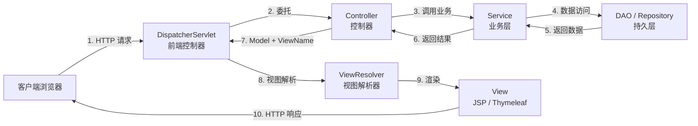
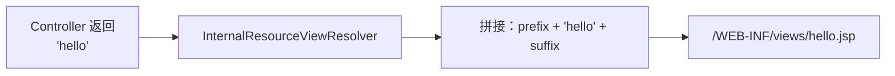
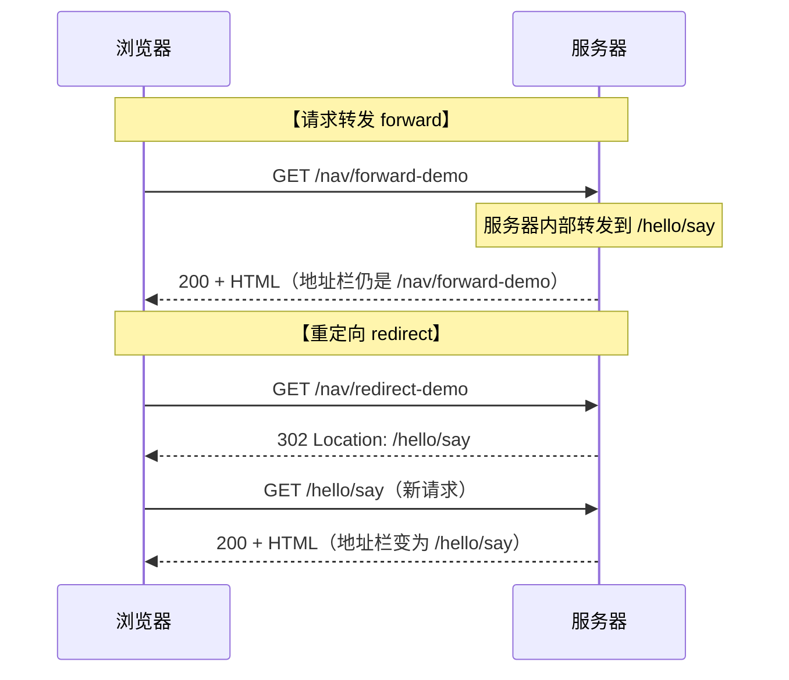

# Spring MVC 注解驱动开发完全指南

> **配套项目**：`SpringMVC/` — Spring 6.1.6 + Java 17 + Jakarta Servlet 6.0 + Tomcat 10.1 纯注解开发

---

## 目录

1. [MVC 理论基础](#1-mvc-理论基础)
2. [MVC 的注解开发](#2-mvc-的注解开发)
3. [Controller 控制层详解](#3-controller-控制层详解)
   - [3.1 配置视图解析器](#31-配置视图解析器)
   - [3.2 @RequestMapping 详解](#32-requestmapping-详解)
   - [3.3 @RequestParam / @RequestHeader / @CookieValue / @SessionAttribute 详解](#33-requestparam--requestheader--cookievalue--sessionattribute-详解)
4. [重定向和请求转发](#4-重定向和请求转发)
5. [总结](#5-总结)
6. [面试题精选（7 道）](#6-面试题精选7-道)

---

## 1. MVC 理论基础

### 1.1 什么是 MVC？

**MVC** 是 Model-View-Controller 的缩写，是一种将应用程序分为三个核心组件的架构模式：



| 组件 | 职责 | Spring MVC 中的体现 |
|------|------|---------------------|
| **Model**（模型） | 承载业务数据 | `Model`、`ModelMap`、`ModelAndView` |
| **View**（视图） | 展示数据给用户 | JSP、Thymeleaf、FreeMarker |
| **Controller**（控制器） | 接收请求、调用业务、选择视图 | `@Controller` 注解的类 |

### 1.2 Spring MVC 请求处理流程

Spring MVC 的核心是 **DispatcherServlet（前端控制器）**，它拦截所有请求并分发给对应的 Controller。完整流程共 10 步：

1. **用户发送请求** → 到达 `DispatcherServlet`
2. **DispatcherServlet** 调用 `HandlerMapping` 查找处理该请求的 Controller 方法
3. **HandlerMapping** 返回一个执行链（`HandlerExecutionChain`，包含拦截器）
4. **DispatcherServlet** 调用 `HandlerAdapter` 执行具体的 Controller 方法
5. **HandlerAdapter** 执行 Controller 方法（完成参数绑定、类型转换、数据校验）
6. **Controller** 返回 `ModelAndView`（或逻辑视图名 + Model）
7. **DispatcherServlet** 调用 `ViewResolver` 将逻辑视图名解析为物理视图路径
8. **ViewResolver** 返回具体的 `View` 对象（如 JSP 文件）
9. **View** 渲染 Model 数据，生成 HTML
10. **HTML 响应**返回给客户端

### 1.3 为什么使用 MVC？

- **关注点分离**：数据、展示、控制逻辑各司其职
- **高内聚低耦合**：修改视图不影响业务逻辑
- **可测试性**：Controller 可单独进行单元测试
- **团队协作**：前端（View）和后端（Controller/Model）可并行开发

---

## 2. MVC 的注解开发

Spring MVC 从 2.5 开始支持注解，到 3.0+ 完全支持纯注解配置（零 XML）。本教程只讲注解开发。

### 2.1 核心注解一览

| 注解 | 作用 | 标注位置 |
|------|------|----------|
| `@Controller` | 声明控制器，被组件扫描发现 | 类 |
| `@RestController` | `@Controller` + `@ResponseBody`，RESTful 接口专用 | 类 |
| `@RequestMapping` | URL 映射（类 + 方法级别） | 类 / 方法 |
| `@GetMapping` | GET 请求快捷映射 | 方法 |
| `@PostMapping` | POST 请求快捷映射 | 方法 |
| `@PutMapping` | PUT 请求快捷映射 | 方法 |
| `@DeleteMapping` | DELETE 请求快捷映射 | 方法 |
| `@PatchMapping` | PATCH 请求快捷映射 | 方法 |
| `@ResponseBody` | 返回值直接写入响应体（不经过视图解析器） | 方法 / 类 |
| `@RequestParam` | 绑定 URL 参数 / 表单数据 | 参数 |
| `@RequestHeader` | 绑定请求头 | 参数 |
| `@CookieValue` | 绑定 Cookie 值 | 参数 |
| `@SessionAttribute` | 绑定 Session 属性 | 参数 |
| `@PathVariable` | 绑定 URL 路径变量 | 参数 |
| `@ModelAttribute` | 绑定表单数据到对象 / 暴露全局数据 | 参数 / 方法 |
| `@ExceptionHandler` | 声明异常处理方法 | 方法 |
| `@ControllerAdvice` | 全局异常处理 / 全局数据绑定 | 类 |
| `@CrossOrigin` | 跨域配置 | 类 / 方法 |

### 2.2 项目结构（零 XML）

```
SpringMVC/
├── pom.xml                              ← Maven 依赖（只有这一个 XML！）
└── src/main/
    ├── java/com/spring/demo/
    │   ├── config/
    │   │   ├── AppInitializer.java      ← 替代 web.xml（实现 WebApplicationInitializer）
    │   │   └── WebConfig.java           ← 替代 spring-mvc.xml（@Configuration + @EnableWebMvc）
    │   └── controller/
    │       ├── HelloController.java     ← @RequestMapping 基础演示
    │       ├── ParamController.java     ← 参数绑定演示
    │       └── RedirectController.java  ← 转发/重定向演示
    └── webapp/WEB-INF/views/
        ├── hello.jsp
        ├── param-result.jsp
        ├── param-form.jsp
        ├── nav-index.jsp
        └── target.jsp
```

### 2.3 替代 web.xml — AppInitializer

```java
public class AppInitializer implements WebApplicationInitializer {
    @Override
    public void onStartup(ServletContext servletContext) {
        AnnotationConfigWebApplicationContext context = new AnnotationConfigWebApplicationContext();
        context.register(WebConfig.class);

        DispatcherServlet dispatcherServlet = new DispatcherServlet(context);
        ServletRegistration.Dynamic registration = servletContext.addServlet("dispatcher", dispatcherServlet);
        registration.setLoadOnStartup(1);
        registration.addMapping("/");
    }
}
```

**关键点**：
- `WebApplicationInitializer` 是 Servlet 3.0+ 的 SPI 接口，容器启动时自动发现并调用
- 完全替代 `web.xml` 中的 `<servlet>` 和 `<servlet-mapping>` 配置

### 2.4 替代 spring-mvc.xml — WebConfig

```java
@Configuration
@EnableWebMvc              // 等价于 <mvc:annotation-driven/>
@ComponentScan("com.spring.demo.controller")
public class WebConfig implements WebMvcConfigurer {

    @Bean
    public InternalResourceViewResolver viewResolver() {
        InternalResourceViewResolver resolver = new InternalResourceViewResolver();
        resolver.setPrefix("/WEB-INF/views/");
        resolver.setSuffix(".jsp");
        return resolver;
    }

    @Override
    public void addResourceHandlers(ResourceHandlerRegistry registry) {
        registry.addResourceHandler("/static/**").addResourceLocations("/static/");
    }
}
```

**关键注解解析**：
- `@Configuration`：声明为 Spring 配置类
- `@EnableWebMvc`：启用 MVC 注解驱动（注册 `RequestMappingHandlerMapping` 和 `RequestMappingHandlerAdapter`）
- `@ComponentScan`：扫描 `@Controller` 所在的包
- `WebMvcConfigurer`：实现该接口可自定义拦截器、视图解析器、静态资源、跨域等

### 2.5 如何配置 Tomcat 服务器

本教程提供 **三种方式** 部署到 Tomcat：

#### 方式一：IntelliJ IDEA 直接配置（推荐开发时使用）

1. **下载 Tomcat 10.1.x**（[tomcat.apache.org](https://tomcat.apache.org/download-10.cgi)），解压到本地
2. **IntelliJ IDEA** → `Run` → `Edit Configurations` → `+` → `Tomcat Server` → `Local`
3. **Server 标签**：`Application Server` 选择刚解压的 Tomcat 目录
4. **Deployment 标签**：`+` → `Artifact` → 选择 `spring-mvc:war exploded`
5. 点击运行，浏览器访问 `http://localhost:8080/spring-mvc/hello/say`

#### 方式二：Maven Cargo 插件（无需手动安装 Tomcat）

```bash
# 在 SpringMVC 目录下执行，Cargo 会自动下载 Tomcat 10 并部署运行
mvn clean package cargo:run
```

`pom.xml` 中已内置 `cargo-maven3-plugin` 配置，端口默认 8080。

#### 方式三：手动部署 WAR 包

```bash
mvn clean package                                    # 打包为 target/spring-mvc.war
cp target/spring-mvc.war $TOMCAT_HOME/webapps/       # 复制到 Tomcat 的 webapps
$TOMCAT_HOME/bin/startup.sh                          # 启动 Tomcat
```

---

## 3. Controller 控制层详解

### 3.1 配置视图解析器

视图解析器（`ViewResolver`）负责将 Controller 返回的**逻辑视图名**转换为**物理视图路径**。

#### 工作原理



#### 配置代码

```java
@Bean
public InternalResourceViewResolver viewResolver() {
    InternalResourceViewResolver resolver = new InternalResourceViewResolver();
    resolver.setPrefix("/WEB-INF/views/");   // 前缀（JSP 目录）
    resolver.setSuffix(".jsp");              // 后缀（文件扩展名）
    return resolver;
}
```

#### 为什么 JSP 放在 WEB-INF 下？

`WEB-INF` 目录受 Servlet 容器保护，**客户端无法直接访问**，只能通过 Controller 转发进入。这保证了：

- 安全性：用户不能绕过 Controller 直接访问 JSP
- 强制走 MVC 流程：所有请求必须经过控制器

#### 其他常见视图解析器

| 视图解析器 | 视图技术 | 说明 |
|-----------|----------|------|
| `InternalResourceViewResolver` | JSP | 最传统，Servlet 转发 |
| `ThymeleafViewResolver` | Thymeleaf | Spring Boot 默认推荐 |
| `FreeMarkerViewResolver` | FreeMarker | 模板引擎 |
| `BeanNameViewResolver` | 自定义 View Bean | 通过 Bean 名称匹配 |
| `XmlViewResolver` | XML 配置的 View | 已过时，不推荐 |

---

### 3.2 @RequestMapping 详解

`@RequestMapping` 是 Spring MVC 中最核心的注解，用于将 HTTP 请求映射到 Controller 方法。

#### 3.2.1 标注位置

```java
@Controller
@RequestMapping("/hello")          // ← 类级别：当前 Controller 的公共前缀
public class HelloController {

    @RequestMapping("/say")        // ← 方法级别：URL = /hello/say
    public String sayHello() { }
}
```

#### 3.2.2 快捷注解（推荐使用）

| 快捷注解 | 等价于 |
|----------|--------|
| `@GetMapping("/path")` | `@RequestMapping(value = "/path", method = RequestMethod.GET)` |
| `@PostMapping("/path")` | `@RequestMapping(value = "/path", method = RequestMethod.POST)` |
| `@PutMapping("/path")` | `@RequestMapping(value = "/path", method = RequestMethod.PUT)` |
| `@DeleteMapping("/path")` | `@RequestMapping(value = "/path", method = RequestMethod.DELETE)` |

#### 3.2.3 八大属性详解

```java
@RequestMapping(
    value       = "/demo",                          // ① URL 路径（可数组：{"/a", "/b"}）
    method      = RequestMethod.GET,                // ② HTTP 方法（默认接受所有方法）
    params      = "type=vip",                       // ③ 必须携带指定请求参数
    headers     = "X-Requested-By=SpringMVC",       // ④ 必须携带指定请求头
    consumes    = "application/json",               // ⑤ Content-Type 限制
    produces    = "application/json;charset=UTF-8", // ⑥ Accept 限制
    name        = "demoHandler",                    // ⑦ 映射名称（调试用，极少使用）
    path        = "/demo"                           // ⑧ value 的别名
)
```

##### 属性 ① value / path：URL 映射

```java
// 一个方法映射多个 URL
@RequestMapping({"/user", "/account"})

// Ant 风格通配符
// ?  匹配任意单字符： /user/?   → /user/1, /user/a
// *  匹配零个或多个字符： /user/*  → /user/123, /user/abc
// ** 匹配多层路径： /user/** → /user/a/b/c
@RequestMapping("/user/**")

// RESTful 风格路径变量
@GetMapping("/user/{id}")
public String getUser(@PathVariable("id") Long id) { }
```

##### 属性 ② method：HTTP 方法限制

```java
@RequestMapping(value = "/save", method = RequestMethod.POST)   // 仅限 POST
@RequestMapping(value = "/save", method = {RequestMethod.PUT, RequestMethod.PATCH})
```

> **原则**：尽量使用 `@GetMapping` / `@PostMapping` 等快捷注解，更简洁、语义更明确。

##### 属性 ③ params：请求参数限制

```java
@RequestMapping(value = "/list", params = "page")         // 必须包含 page 参数
@RequestMapping(value = "/list", params = "!page")         // 必须不包含 page 参数
@RequestMapping(value = "/list", params = "type=vip")      // type 必须等于 vip
@RequestMapping(value = "/list", params = "type!=admin")   // type 不能等于 admin
```

##### 属性 ④ headers：请求头限制

```java
@RequestMapping(value = "/ajax", headers = "X-Requested-With=XMLHttpRequest")
@RequestMapping(value = "/json", headers = "Content-Type=application/json")
```

##### 属性 ⑥ produces：响应类型（Accept 头匹配）

```java
// 仅当客户端 Accept 头包含 application/json 时才匹配
@RequestMapping(value = "/data", produces = "application/json;charset=UTF-8")
@ResponseBody
public Map<String, Object> getData() { }
```

##### 属性 ⑤ consumes：请求体类型（Content-Type 头匹配）

```java
// 仅当 Content-Type 为 application/json 时才匹配
@PostMapping(value = "/save", consumes = "application/json")
@ResponseBody
public String save(@RequestBody User user) { }
```

#### 3.2.4 Ant 风格路径匹配

| 通配符 | 含义 | 示例 | 匹配的 URL |
|--------|------|------|------------|
| `?` | 匹配任意**单**字符 | `/user/?` | `/user/1`, `/user/a` |
| `*` | 匹配零个或多个字符（单层） | `/user/*` | `/user/123`, `/user/abc` |
| `**` | 匹配多层路径 | `/user/**` | `/user/a`, `/user/a/b/c` |

---

### 3.3 @RequestParam / @RequestHeader / @CookieValue / @SessionAttribute 详解

这四种注解统一用于从 HTTP 请求的不同位置**提取数据**并绑定到 Controller 方法参数。

```mermaid
graph TB
    subgraph HTTP请求
        A["URL 查询参数<br/>?name=张三&age=25"]
        B["请求头<br/>User-Agent / Accept-Language"]
        C["Cookie<br/>JSESSIONID / theme"]
        D["请求体<br/>form-data / JSON"]
    end

    subgraph Session域
        E["HttpSession<br/>currentUser / cart"]
    end

    A -->|@RequestParam| F[Controller 方法参数]
    B -->|@RequestHeader| F
    C -->|@CookieValue| F
    D -->|@RequestBody| F
    E -->|@SessionAttribute| F
```

#### 3.3.1 @RequestParam — URL 参数 & 表单数据

从 URL 查询字符串或 POST 表单中提取参数值。

```java
@GetMapping("/user")
public String getUser(
    @RequestParam("name") String username,   // name → username（可重命名）
    @RequestParam("age") int age             // 自动类型转换 String → int
) { }
```

**访问方式**：`/user?name=张三&age=25` 或 POST 表单 `<input name="name">`

**核心属性**：

| 属性 | 类型 | 说明 |
|------|------|------|
| `value` / `name` | String | 请求参数名（必填） |
| `required` | boolean | 是否必传，默认 `true`（缺失抛 400） |
| `defaultValue` | String | 默认值（设置后 `required` 自动为 false） |

```java
// 分页参数：不传则使用默认值
@GetMapping("/list")
public String list(
    @RequestParam(value = "page", required = false, defaultValue = "1") int page,
    @RequestParam(value = "size", required = false, defaultValue = "10") int size
) { }
```

**高级用法**：

```java
// ① 绑定数组（复选框多选）
@GetMapping("/hobbies")
public String hobbies(@RequestParam("hobby") String[] hobbies) { }
// 访问：/hobbies?hobby=篮球&hobby=游泳&hobby=编程

// ② 绑定 Map（接收所有参数）
@GetMapping("/search")
public String search(@RequestParam Map<String, String> allParams) { }
// 访问：/search?name=张三&age=25&city=北京
// allParams = {name: 张三, age: 25, city: 北京}
```

#### 3.3.2 @RequestHeader — 请求头

提取 HTTP 请求头中的值。

```java
@GetMapping("/header")
public String header(
    @RequestHeader("User-Agent") String userAgent,
    @RequestHeader(value = "Accept-Language", defaultValue = "zh-CN") String lang
) { }
```

**常用请求头**：

| 请求头 | 说明 |
|--------|------|
| `User-Agent` | 浏览器/客户端标识 |
| `Accept-Language` | 客户端语言偏好 |
| `Authorization` | 认证令牌（Bearer Token） |
| `Content-Type` | 请求体数据类型 |
| `Referer` | 来源页面 URL |
| `X-Forwarded-For` | 客户端真实 IP（代理后） |

#### 3.3.3 @CookieValue — Cookie 值

提取浏览器 Cookie 中的值。

```java
@GetMapping("/theme")
public String theme(@CookieValue(value = "theme", defaultValue = "light") String theme) { }
```

**写 Cookie（使用 HttpServletResponse）**：

```java
@GetMapping("/set-theme")
@ResponseBody
public String setTheme(HttpServletResponse response) {
    Cookie cookie = new Cookie("theme", "dark-mode");
    cookie.setMaxAge(60 * 60);      // 过期时间（秒），-1 为会话级
    cookie.setPath("/");             // Cookie 生效路径
    cookie.setHttpOnly(true);        // 防 XSS：JS 不可读取
    // cookie.setSecure(true);       // HTTPS 才发送
    response.addCookie(cookie);
    return "Cookie 已设置";
}
```

#### 3.3.4 @SessionAttribute — Session 属性

从 `HttpSession` 中提取已存入的属性。**注意：它只读不写！**

```java
// 写：使用 HttpSession
@GetMapping("/login")
public String login(@RequestParam String username, HttpSession session) {
    session.setAttribute("currentUser", username);   // 写入 Session
    return "redirect:/dashboard";
}

// 读：使用 @SessionAttribute
@GetMapping("/dashboard")
public String dashboard(@SessionAttribute("currentUser") String currentUser) {
    // currentUser 直接从 Session 中提取
}
```

#### 3.3.5 四者对比总结

| 注解 | 数据来源 | 是否必传 | 典型场景 |
|------|----------|----------|----------|
| `@RequestParam` | URL `?` 参数 / POST 表单 | 默认必传 | 分页、搜索、表单提交 |
| `@RequestHeader` | HTTP 请求头 | 默认必传 | 获取 Token、User-Agent |
| `@CookieValue` | Cookie | 默认必传 | 记住我、主题偏好 |
| `@SessionAttribute` | HttpSession | 默认必传 | 登录用户信息、购物车 |

---

## 4. 重定向和请求转发

### 4.1 核心区别



| 对比维度 | 请求转发 (forward) | 重定向 (redirect) |
|----------|--------------------|--------------------|
| **浏览器地址栏** | 不变 | 变为目标 URL |
| **HTTP 请求次数** | **1 次** | **2 次**（302 → 新请求） |
| **HTTP 状态码** | 200（原始响应） | 302（首次）+ 200（第二次） |
| **request 域数据** | ✅ **保留**（同一 request） | ❌ **丢失**（两次不同 request） |
| **request 域数据补救** | 不需要 | `RedirectAttributes.addFlashAttribute()` |
| **Session 数据** | ✅ 保留 | ✅ 保留 |
| **速度** | **快**（纯服务器内部） | **慢**（需要客户端重新请求） |
| **能否跨域** | ❌ 不能 | ✅ 可以 |
| **能否跨应用** | ❌ 不能 | ✅ 可以 |
| **适用场景** | 同一应用内部跳转 | 跨应用跳转、PRG 模式 |

### 4.2 请求转发（forward）

#### 方式：返回字符串 "forward:路径"

```java
@GetMapping("/forward-demo")
public String forwardDemo(Model model) {
    model.addAttribute("msg", "这条数据转发后仍然存在");  // request 域共享
    return "forward:/hello/say";   // 不走视图解析器，直接转发
}
```

**关键点**：
- `forward:` 前缀告诉 Spring MVC 不走视图解析器，而是做 `RequestDispatcher.forward()`
- 浏览器地址栏**不会改变**
- `Model` 中的数据**不会丢失**（同一个 request）
- 只能转发到**同一应用内**的其他 Controller

### 4.3 重定向（redirect）

#### 方式一：返回字符串 "redirect:路径"

```java
@GetMapping("/redirect-demo")
public String redirectDemo() {
    return "redirect:/hello/say";   // 浏览器收到 302 + Location 头
}
```

#### 方式二：使用 RedirectView

```java
@GetMapping("/redirect-view")
public RedirectView redirectView() {
    RedirectView rv = new RedirectView("/hello/say");
    rv.setContextRelative(true);    // 相对于应用上下文
    return rv;
}
```

**关键点**：
- `redirect:` 前缀让 Spring MVC 返回 302 响应
- 浏览器地址栏**会改变**为目标 URL
- **普通 Model 数据会丢失**（两次不同的 request）
- 需要传递数据时使用 `RedirectAttributes`

### 4.4 重定向时传递数据

#### addAttribute() → URL 参数拼接（明文）

```java
@GetMapping("/redirect-attr")
public String redirectAttr(RedirectAttributes ra) {
    ra.addAttribute("status", "success");   // → /target?status=success
    ra.addAttribute("id", 123);             // → /target?status=success&id=123
    return "redirect:/target";
}
```

适用于非敏感数据，如分页参数、筛选条件等。

#### addFlashAttribute() → Flash 属性（隐含传递）

```java
@GetMapping("/redirect-flash")
public String redirectFlash(RedirectAttributes ra) {
    ra.addFlashAttribute("msg", "操作成功！");  // 存入 Session 的 FlashMap
    return "redirect:/target";
}
```

**Flash 属性原理**：
1. `addFlashAttribute()` 将数据存入 Session 中的 `FlashMap`
2. 重定向后的请求自动从 FlashMap 取出数据放入 Model
3. **取出后立即销毁**（刷新页面即消失，不会重复提交）
4. 适合"操作成功/失败"等一次性提示消息

### 4.5 PRG 模式（Post-Redirect-Get）

**场景**：防止表单重复提交

```java
@PostMapping("/submit")
public String submit(Form form, RedirectAttributes ra) {
    service.save(form);
    ra.addFlashAttribute("msg", "提交成功！");   // Flash 消息
    return "redirect:/success";                  // 重定向到 GET 页面
}
```

用户刷新页面只会重新发起 GET `/success`，不会重复 POST `/submit`。

---

## 5. 总结

### 5.1 核心知识点回顾

| 知识点 | 一句话总结 |
|--------|-----------|
| **MVC 架构** | Model 承载数据、View 展示数据、Controller 协调两者 |
| **前端控制器** | `DispatcherServlet` 拦截所有请求，委派给 HandlerMapping 和 HandlerAdapter |
| **纯注解开发** | `WebApplicationInitializer` 替代 web.xml，`@Configuration` + `@EnableWebMvc` 替代 spring-mvc.xml |
| **视图解析器** | `prefix + 视图名 + suffix` = 物理路径，JSP 放 `WEB-INF/` 下保证安全 |
| **@RequestMapping** | 8 大属性（value/method/params/headers/consumes/produces），Ant 风格路径匹配 |
| **快捷映射注解** | `@GetMapping` / `@PostMapping` / `@PutMapping` / `@DeleteMapping` — 更语义化 |
| **参数绑定四剑客** | `@RequestParam`（URL/表单）、`@RequestHeader`（请求头）、`@CookieValue`（Cookie）、`@SessionAttribute`（Session） |
| **请求转发** | 1 次请求，地址栏不变，request 域共享，快 |
| **重定向** | 2 次请求（302 + 新请求），地址栏改变，普通数据丢失，需 Flash 属性补救 |
| **PRG 模式** | POST 成功后 redirect 到 GET 页面，防重复提交 |

### 5.2 最佳实践

1. **优先使用快捷映射注解**（`@GetMapping` 而不是 `@RequestMapping(method = GET)`）
2. **路径变量优先于查询参数**（RESTful：`/user/{id}` 优于 `/user?id=123`）
3. **JSP 放在 WEB-INF 下**，永远不暴露给用户
4. **POST 请求成功后做重定向**（PRG 模式），防止刷新重复提交
5. **敏感数据不要用 addAttribute 拼接在 URL 上**，用 Flash 属性
6. **@SessionAttribute 只读不写**，写入必须用 `HttpSession.setAttribute()`
7. **静态资源单独配置**，不要让 DispatcherServlet 处理

---

## 6. 面试题精选（7 道）

### Q1：Spring MVC 的请求处理流程是怎样的？

**参考回答**：

1. 用户请求到达 `DispatcherServlet`（前端控制器）
2. `DispatcherServlet` 调用 `HandlerMapping` 查找匹配的 Controller 方法
3. `HandlerMapping` 返回 `HandlerExecutionChain`（包含拦截器链）
4. `DispatcherServlet` 通过 `HandlerAdapter` 执行具体 Controller 方法
5. `HandlerAdapter` 完成参数绑定、类型转换、数据校验后调用 Controller
6. Controller 返回 `ModelAndView`（或逻辑视图名）
7. `DispatcherServlet` 调用 `ViewResolver` 解析为具体 View
8. View 渲染 Model 数据生成 HTML 响应

> **记忆口诀**：请求 → DS → HM → HA → Controller → ViewResolver → View → 响应

---

### Q2：@RequestMapping 和 @GetMapping 有什么区别？

**参考回答**：

- `@RequestMapping` 是通用映射注解，可标注在**类**（公共前缀）和**方法**上，默认接受所有 HTTP 方法
- `@GetMapping` 是 `@RequestMapping(method = RequestMethod.GET)` 的快捷写法，只能标注在**方法**上，仅接受 GET 请求
- 同理还有 `@PostMapping`、`@PutMapping`、`@DeleteMapping`、`@PatchMapping`

**开发中优先使用快捷注解**，代码更简洁且语义更明确。`@RequestMapping` 主要在需要同时支持多种请求方法或需要 `params`/`headers` 等高级属性时使用。

---

### Q3：@RequestParam、@RequestHeader、@CookieValue、@SessionAttribute 各用于什么场景？

**参考回答**：

| 注解 | 数据来源 | 典型场景 |
|------|----------|----------|
| `@RequestParam` | URL `?` 参数 / POST 表单 | 分页参数 `?page=1&size=10`、搜索关键词、表单字段 |
| `@RequestHeader` | HTTP 请求头 | 获取 `Authorization` Token、`User-Agent` 判断设备类型 |
| `@CookieValue` | 浏览器 Cookie | 记住我功能、用户主题偏好、跟踪标识 |
| `@SessionAttribute` | 服务器 HttpSession | 已登录用户信息、购物车数据、验证码 |

**关键区分**：
- `@RequestParam` 是客户端每次请求都携带的
- `@RequestHeader` 是 HTTP 协议层面的元数据
- `@CookieValue` 是浏览器本地存储，会自动随请求发送
- `@SessionAttribute` 是服务器端会话数据，仅能读取，写入必须用 `HttpSession.setAttribute()`

---

### Q4：请求转发（forward）和重定向（redirect）有什么区别？各适用于什么场景？

**参考回答**：

| 维度 | forward | redirect |
|------|---------|----------|
| 请求次数 | 1 次（服务器内部） | 2 次（302 + 新请求） |
| 地址栏 | 不变 | 变为目标 URL |
| request 域数据 | ✅ 保留 | ❌ 丢失 |
| 速度 | 快 | 慢 |
| 跨域/跨应用 | ❌ 不能 | ✅ 能 |

**场景选择**：
- **forward**：同一应用内部跳转，需要共享 request 数据
- **redirect**：表单提交后（PRG 防重复提交）、跨应用跳转、需要改变 URL

**Spring MVC 实现**：
- forward：`return "forward:/path";`
- redirect：`return "redirect:/path";`

---

### Q5：Spring MVC 中如何实现纯注解配置（零 XML）？

**参考回答**：

1. **替代 web.xml**：实现 `WebApplicationInitializer` 接口，在 `onStartup()` 方法中注册 `DispatcherServlet`
2. **替代 spring-mvc.xml**：创建 `@Configuration` 类 + `@EnableWebMvc` + `@ComponentScan`
3. **视图解析器**：`@Bean` 方法返回 `InternalResourceViewResolver`，设置 prefix/suffix
4. **静态资源**：实现 `WebMvcConfigurer` 接口，重写 `addResourceHandlers()`
5. **拦截器、跨域等**：同样通过 `WebMvcConfigurer` 的对应方法配置

**原理**：Servlet 3.0+ 容器启动时会扫描 classpath 下所有 `WebApplicationInitializer` 实现类（SPI 机制），自动调用其 `onStartup()`。

---

### Q6：RedirectAttributes 的 addAttribute() 和 addFlashAttribute() 有什么区别？

**参考回答**：

- **`addAttribute()`**：数据拼接到重定向 URL 的 `?` 后面，**明码可见**。适合非敏感数据（如分页页码、分类 ID）
  ```
  /target?status=success&id=123
  ```

- **`addFlashAttribute()`**：数据存入 Session 中的 FlashMap，**不暴露在 URL**。重定向后自动取出放入 Model，取出后**立即销毁**（刷新即消失）。适合一次性提示消息（"操作成功"、"保存失败"）

**原理**：FlashMap 由 `SessionFlashMapManager` 管理，数据在 Session 中只存活到下一个请求。

---

### Q7：Spring MVC 拦截器（Interceptor）和过滤器（Filter）有什么区别？

**参考回答**：

| 维度 | 拦截器 (Interceptor) | 过滤器 (Filter) |
|------|---------------------|-----------------|
| **规范** | Spring 框架提供 | Servlet 规范（Jakarta EE） |
| **容器** | Spring MVC 容器 | Servlet 容器（Tomcat） |
| **拦截范围** | 只拦截进入 DispatcherServlet 的请求 | 拦截所有进入容器的请求 |
| **粒度** | 可精确到 Controller 方法 | 只能按 URL 模式 |
| **能否获取 Spring Bean** | ✅ 可以 | ❌ 不能（除非特殊处理） |
| **能否获取目标方法** | ✅ 可以（HandlerMethod） | ❌ 不能 |
| **执行顺序** | Filter → DispatcherServlet → Interceptor → Controller | |

**实现方式**：

```java
// 拦截器
@Component
public class LogInterceptor implements HandlerInterceptor {
    @Override
    public boolean preHandle(request, response, handler) {
        System.out.println("请求前：" + ((HandlerMethod) handler).getMethod().getName());
        return true;   // true=放行  false=拦截
    }
}

// 注册拦截器（在 WebConfig 中）
@Override
public void addInterceptors(InterceptorRegistry registry) {
    registry.addInterceptor(new LogInterceptor())
            .addPathPatterns("/**")           // 拦截所有
            .excludePathPatterns("/static/**"); // 排除静态资源
}
```

---

> **本文档配套完整可运行项目位于 `SpringMVC/` 目录，使用 Maven + Tomcat 10 可直接运行。**
