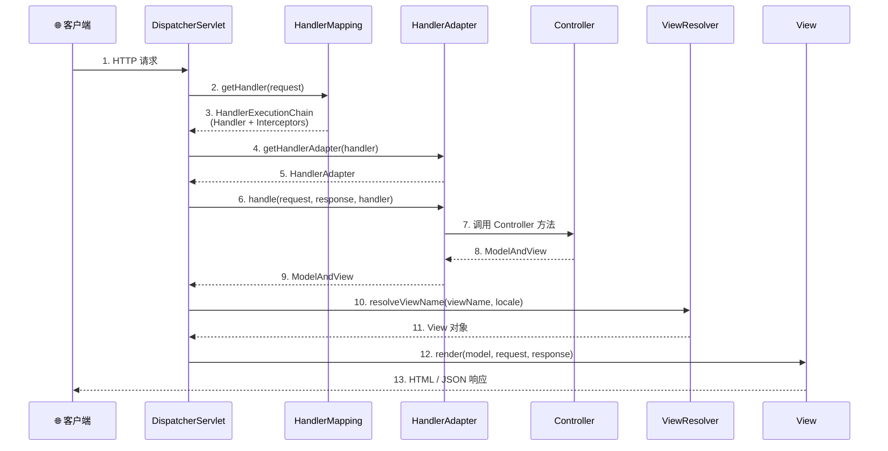
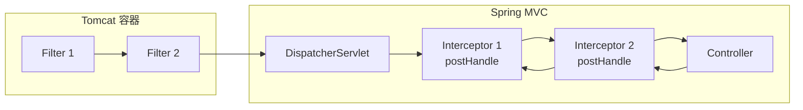
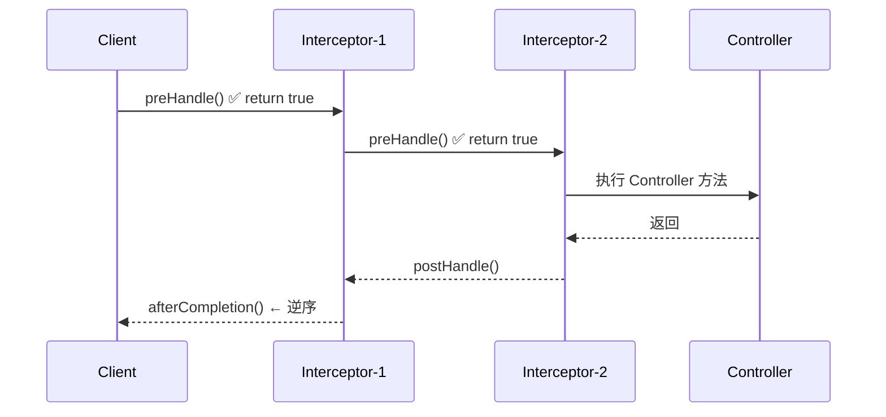
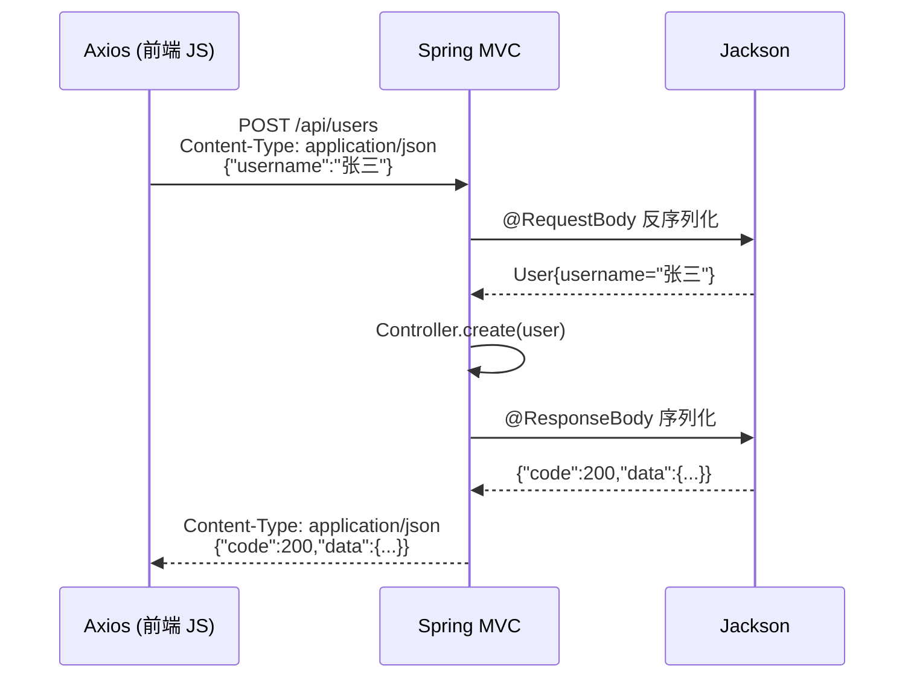
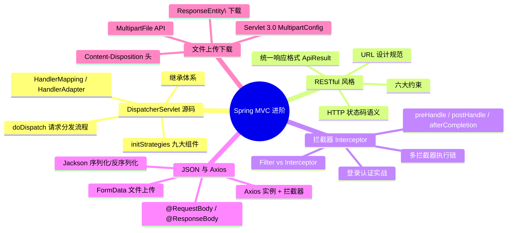

# Spring MVC 进阶完全指南

> **配套项目**：`SpringMVCⅡ/` — Spring 6.1.6 + Java 17 + RESTful + 拦截器 + JSON + 文件上传下载 + Axios 前后端交互
>
> **前置知识**：已完成 [Spring-入门指南](../Spring-01/Spring-入门指南.md)、[Spring-AOP-指南](../Spring-02/Spring-AOP-指南.md)、[Spring-MVC-指南](../SpringMVC/Spring-MVC-指南.md)

---

## 目录

1. [DispatcherServlet 源码分析](#1-dispatcherservlet-源码分析)
2. [RESTful 编程风格](#2-restful-编程风格)
3. [拦截器 Interceptor](#3-拦截器-interceptor)
4. [JSON 数据格式与 Axios 请求](#4-json-数据格式与-axios-请求)
5. [文件上传与下载](#5-文件上传与下载)
6. [总结](#6-总结)
7. [面试题精选（15 道）](#7-面试题精选15-道)

---

## 1. DispatcherServlet 源码分析

### 1.1 什么是 DispatcherServlet？

`DispatcherServlet` 是 Spring MVC 的**核心中枢**，它实现了经典的**前端控制器（Front Controller）设计模式**——所有 HTTP 请求首先到达 `DispatcherServlet`，由它统一分发到各个 `Controller`。



### 1.2 DispatcherServlet 继承体系

```
Servlet (javax.servlet)
  └── GenericServlet
        └── HttpServlet
              └── HttpServletBean              ← 将 init-param 注入 Bean 属性
                    └── FrameworkServlet        ← 初始化 Spring WebApplicationContext
                          └── DispatcherServlet ← 核心：请求分发
```

### 1.3 DispatcherServlet 核心初始化 — `initStrategies()`

当 `DispatcherServlet` 初始化时，会调用 `initStrategies()` 方法初始化**九大策略组件**：

```java
// 源码位置：org.springframework.web.servlet.DispatcherServlet
protected void initStrategies(ApplicationContext context) {
    initMultipartResolver(context);        // ① 文件上传解析器
    initLocaleResolver(context);           // ② 国际化解析器
    initThemeResolver(context);            // ③ 主题解析器
    initHandlerMappings(context);          // ④ 处理器映射器 ⭐
    initHandlerAdapters(context);          // ⑤ 处理器适配器 ⭐
    initHandlerExceptionResolvers(context);// ⑥ 异常解析器
    initRequestToViewNameTranslator(context);// ⑦ 请求到视图名转换
    initViewResolvers(context);            // ⑧ 视图解析器 ⭐
    initFlashMapManager(context);          // ⑨ Flash 属性管理器
}
```

**九大组件说明表**：

| 组件 | 接口 | 默认实现 | 作用 |
|------|------|----------|------|
| **MultipartResolver** | `MultipartResolver` | 无（需手动配置） | 解析文件上传请求 |
| **LocaleResolver** | `LocaleResolver` | `AcceptHeaderLocaleResolver` | 国际化语言选择 |
| **ThemeResolver** | `ThemeResolver` | `FixedThemeResolver` | 主题样式选择 |
| **HandlerMapping** | `HandlerMapping` | `RequestMappingHandlerMapping` | 根据 URL 找到 Handler |
| **HandlerAdapter** | `HandlerAdapter` | `RequestMappingHandlerAdapter` | 执行 Handler 方法 |
| **HandlerExceptionResolver** | `HandlerExceptionResolver` | `DefaultHandlerExceptionResolver` | 异常处理 |
| **RequestToViewNameTranslator** | `RequestToViewNameTranslator` | `DefaultRequestToViewNameTranslator` | 无视图名时自动推断 |
| **ViewResolver** | `ViewResolver` | `InternalResourceViewResolver` | 逻辑视图名 → 物理视图 |
| **FlashMapManager** | `FlashMapManager` | `SessionFlashMapManager` | 重定向传参 |

### 1.4 请求处理核心流程 — `doDispatch()` 源码走读

`DispatcherServlet.doDispatch()` 是请求处理的**真正入口**，下面是精简后的核心逻辑：

```java
// 源码位置：DispatcherServlet.doDispatch()（Spring 6.1.x）
protected void doDispatch(HttpServletRequest request, HttpServletResponse response) 
        throws Exception {
    
    HttpServletRequest processedRequest = request;
    HandlerExecutionChain mappedHandler = null;
    boolean multipartRequestParsed = false;

    try {
        // ========== 阶段 1：检查是否是文件上传请求 ==========
        processedRequest = checkMultipart(request);
        multipartRequestParsed = (processedRequest != request);

        // ========== 阶段 2：根据请求找到 Handler ==========
        // 遍历所有 HandlerMapping，找到第一个匹配的 Handler 并返回
        // 返回值 HandlerExecutionChain 包含：Handler + 拦截器列表
        mappedHandler = getHandler(processedRequest);
        if (mappedHandler == null) {
            noHandlerFound(processedRequest, response);  // 404
            return;
        }

        // ========== 阶段 3：找到能执行该 Handler 的适配器 ==========
        // 遍历所有 HandlerAdapter，通过 supports() 判断是否匹配
        HandlerAdapter ha = getHandlerAdapter(mappedHandler.getHandler());

        // ========== 阶段 4：执行拦截器的 preHandle ==========
        // 如果任意 preHandle 返回 false，直接返回（拦截）
        if (!mappedHandler.applyPreHandle(processedRequest, response)) {
            return;
        }

        // ========== 阶段 5：由适配器真正执行 Handler 方法 ==========
        // HandlerAdapter.handle() 内部完成：
        //   1. 参数解析（@RequestParam, @RequestBody, @PathVariable...）
        //   2. 调用 Controller 方法（反射 invoke）
        //   3. 返回值处理（@ResponseBody → JSON 序列化）
        ModelAndView mv = ha.handle(processedRequest, response, mappedHandler.getHandler());

        // ========== 阶段 6：执行拦截器的 postHandle ==========
        mappedHandler.applyPostHandle(processedRequest, response, mv);

        // ========== 阶段 7：处理视图渲染 ==========
        processDispatchResult(processedRequest, response, mappedHandler, mv, dispatchException);
    
    } catch (Exception ex) {
        // ========== 异常处理：触发拦截器的 afterCompletion ==========
        triggerAfterCompletion(processedRequest, response, mappedHandler, ex);
    }
}
```

**`doDispatch()` 执行的 7 个关键步骤总结**：

| 步骤 | 方法 | 说明 |
|------|------|------|
| 1 | `checkMultipart()` | 检查并包装文件上传请求（MultipartHttpServletRequest） |
| 2 | `getHandler()` | 遍历 HandlerMapping，返回 HandlerExecutionChain（Handler + 拦截器） |
| 3 | `getHandlerAdapter()` | 找到支持该 Handler 的 HandlerAdapter |
| 4 | `applyPreHandle()` | **依次执行所有拦截器的 preHandle()** |
| 5 | `ha.handle()` | 真正调用 Controller 方法（参数解析 → 反射调用 → 返回值处理） |
| 6 | `applyPostHandle()` | **逆序执行所有拦截器的 postHandle()** |
| 7 | `processDispatchResult()` | 视图渲染 或 @ResponseBody 序列化 |

### 1.5 HandlerMapping — 如何找到 Controller？

`RequestMappingHandlerMapping` 是 @EnableWebMvc 启用的默认 HandlerMapping，它在容器启动时扫描所有 `@Controller` 和 `@RequestMapping` 注解，建立 URL ↔ Handler 的映射表。

**核心数据结构**：

```java
// MappingRegistry 内部维护的映射关系
Map<T, HandlerMethod> mappingLookup;
// 示例：
//   "/api/users/{id}"  → UserController.getById() 方法
//   "/api/users"       → UserController.list()     方法
//   "/files/upload"    → FileController.upload()  方法
```

**映射匹配的优先级**（从高到低）：
1. 精确匹配（`/api/users`）
2. 路径变量匹配（`/api/users/{id}`）
3. 通配符匹配（`/api/**`）

### 1.6 HandlerAdapter — 如何执行 Controller 方法？

`RequestMappingHandlerAdapter` 负责实际执行匹配到的 Handler。其核心是**参数解析器**（`HandlerMethodArgumentResolver`）和**返回值处理器**（`HandlerMethodReturnValueHandler`）。

**常见的参数解析器**：

| 注解 | 解析器 | 数据来源 |
|------|--------|----------|
| `@RequestParam` | `RequestParamMethodArgumentResolver` | URL 查询参数 / 表单 |
| `@PathVariable` | `PathVariableMethodArgumentResolver` | URL 路径 |
| `@RequestBody` | `RequestResponseBodyMethodProcessor` | 请求体 JSON |
| `@RequestHeader` | `RequestHeaderMethodArgumentResolver` | 请求头 |
| `@ModelAttribute` | `ModelAttributeMethodProcessor` | 表单 / 查询参数 |
| `MultipartFile` | `RequestPartMethodArgumentResolver` | 文件上传 part |

---

## 2. RESTful 编程风格

### 2.1 REST 是什么？

**REST**（Representational State Transfer）是 Roy Fielding 于 2000 年博士论文中提出的一种**软件架构风格**，不是标准，而是一组**设计约束**。

### 2.2 RESTful 六大核心约束

| 约束 | 说明 | 示例 |
|------|------|------|
| **客户端-服务器** | 前后端分离，各自独立演化 | Vue/React 前端 + Spring Boot 后端 |
| **无状态** | 每次请求包含所有信息，服务器不保存客户端状态 | Token 放在 Header 中而非 Session |
| **可缓存** | 响应标记是否可缓存，减少交互 | `Cache-Control: max-age=3600` |
| **统一接口** | URL 标识资源，HTTP 方法表示操作 | `GET /users/1`, `DELETE /users/1` |
| **分层系统** | 中间层透明代理（网关、负载均衡） | Nginx → Tomcat → MySQL |
| **按需代码**（可选） | 服务器可向客户端发送可执行代码 | JavaScript 下载执行 |

### 2.3 RESTful URL 设计规范

> **核心原则**：URL 表示**资源（名词）**，HTTP 方法表示**操作（动词）**。

#### 正确示例 ✅

```
GET     /api/users          # 查询所有用户
GET     /api/users/1        # 查询 ID=1 的用户
POST    /api/users          # 新增用户
PUT     /api/users/1        # 全量更新 ID=1 的用户
PATCH   /api/users/1        # 局部更新 ID=1 的用户
DELETE  /api/users/1        # 删除 ID=1 的用户

GET     /api/users/1/orders # 查询用户1的所有订单（关联资源）
```

#### 错误示例 ❌

```
GET  /api/getUsers          # URL 中不应包含动词
POST /api/user/create       # 动词应由 HTTP 方法表示
GET  /api/user?id=1&action=delete  # 动作不应放在参数中
```

### 2.4 RESTful 最佳实践

| 实践 | 说明 | 示例 |
|------|------|------|
| **复数名词** | 资源名用复数 | `/api/users` 而非 `/api/user` |
| **层级关系** | 用 `/` 表示资源层级 | `/users/1/orders/5` |
| **过滤排序** | 用查询参数 | `?page=1&size=20&sort=age,desc` |
| **版本控制** | URL 路径或 Header | `/api/v1/users` 或 `Accept: version=1` |
| **HATEOAS** | 响应中包含链接 | `{"_links": {"self": "/api/users/1"}}` |

### 2.5 统一响应格式

> **最佳实践**：无论成功或失败，所有接口返回统一的 JSON 结构。

```json
// 成功响应
{
  "code": 200,
  "message": "操作成功",
  "data": { "id": 1, "username": "张三", "email": "zhangsan@example.com" },
  "timestamp": "2026-07-16T10:30:00"
}

// 失败响应
{
  "code": 400,
  "message": "缺少必需参数: username",
  "data": null,
  "timestamp": "2026-07-16T10:30:01"
}
```

实现方式：

```java
// 项目中的 ApiResult.java — 泛型统一响应类
public class ApiResult<T> {
    private int code;
    private String message;
    private T data;
    private LocalDateTime timestamp;

    public static <T> ApiResult<T> success(T data) { /* ... */ }
    public static <T> ApiResult<T> error(int code, String message) { /* ... */ }
}

// Controller 中使用
@GetMapping("/{id}")
public ApiResult<User> getById(@PathVariable Long id) {
    return ApiResult.success(user);
}
```

### 2.6 HTTP 状态码速查表

| 状态码 | 含义 | 使用场景 |
|--------|------|----------|
| **200** | OK | GET/PUT/PATCH 成功 |
| **201** | Created | POST 创建资源成功 |
| **204** | No Content | DELETE 成功（无响应体） |
| **400** | Bad Request | 参数校验失败 |
| **401** | Unauthorized | 未认证（未登录） |
| **403** | Forbidden | 已认证但无权限 |
| **404** | Not Found | 资源不存在 |
| **409** | Conflict | 资源冲突（重复创建） |
| **413** | Payload Too Large | 上传文件过大 |
| **500** | Internal Server Error | 服务器内部错误 |

---

## 3. 拦截器 Interceptor

### 3.1 拦截器 vs 过滤器

拦截器（Interceptor）和过滤器（Filter）都是 AOP 思想的体现，用于在请求处理前后织入横切逻辑。它们的核心区别在于**作用的层面**不同。



| 对比维度 | Filter（过滤器） | Interceptor（拦截器） |
|----------|-----------------|----------------------|
| **归属** | Jakarta Servlet 规范 | Spring MVC 框架 |
| **容器** | Servlet 容器管理 | Spring IoC 容器管理 |
| **范围** | 所有请求（包括静态资源） | 仅进入 DispatcherServlet 的请求 |
| **Bean 访问** | ❌ 不能直接注入 Spring Bean | ✅ 可注入任意 Spring Bean |
| **细粒度** | 只能按 URL 模式匹配 | 可按 URL 精确匹配/排除 |
| **生命周期方法** | `init()` / `doFilter()` / `destroy()` | `preHandle()` / `postHandle()` / `afterCompletion()` |
| **适用场景** | 编码设置、跨域、安全头 | 登录校验、权限控制、日志记录 |

### 3.2 HandlerInterceptor 接口详解

```java
public interface HandlerInterceptor {

    /**
     * preHandle：Controller 方法执行前调用
     * @return true=放行  false=拦截（请求到此终止）
     */
    default boolean preHandle(HttpServletRequest request,
                              HttpServletResponse response,
                              Object handler) throws Exception {
        return true;
    }

    /**
     * postHandle：Controller 方法执行后、视图渲染前调用
     * 可以修改 ModelAndView
     * @RestController 下此方法不会获得 ModelAndView（为 null）
     */
    default void postHandle(HttpServletRequest request,
                            HttpServletResponse response,
                            Object handler,
                            @Nullable ModelAndView modelAndView) throws Exception {
    }

    /**
     * afterCompletion：整个请求完成后调用（视图已渲染，或异常后）
     * 适合做资源清理、耗时统计
     * ex 不为 null 表示发生了异常
     */
    default void afterCompletion(HttpServletRequest request,
                                 HttpServletResponse response,
                                 Object handler,
                                 @Nullable Exception ex) throws Exception {
    }
}
```

### 3.3 拦截器执行流程



**关键规则**：
- `preHandle`：按拦截器注册顺序**正序**执行
- `postHandle` 和 `afterCompletion`：**逆序**执行
- 任意 `preHandle` 返回 `false`，后续全部跳过，已执行的拦截器的 `afterCompletion` 仍会触发

### 3.4 拦截器实战代码

**登录拦截器示例**（项目中 `LoginInterceptor.java`）：

```java
public class LoginInterceptor implements HandlerInterceptor {

    @Override
    public boolean preHandle(HttpServletRequest request,
                             HttpServletResponse response,
                             Object handler) throws Exception {
        String token = request.getHeader("Authorization");

        if (token == null || token.isEmpty()) {
            response.setStatus(401);
            response.setContentType("application/json;charset=UTF-8");
            response.getWriter().write("{\"code\":401,\"message\":\"未登录\"}");
            return false;  // 拦截
        }

        // 校验 Token 并将用户信息存入 Request
        request.setAttribute("currentUser", parseToken(token));
        return true;  // 放行
    }
}
```

**注册拦截器**：

```java
@Configuration
@EnableWebMvc
public class WebConfig implements WebMvcConfigurer {

    @Override
    public void addInterceptors(InterceptorRegistry registry) {
        registry.addInterceptor(new LoginInterceptor())
                .addPathPatterns("/api/**")          // 拦截 /api/ 下所有
                .excludePathPatterns("/api/users/login")  // 排除登录接口
                .order(1);                           // 执行顺序

        registry.addInterceptor(new LoggingInterceptor())
                .addPathPatterns("/**")
                .order(0);  // 先执行日志，后执行登录校验
    }
}
```

### 3.5 多个拦截器的执行链

假设注册了 3 个拦截器，order 分别为 0、1、2（数字越小越先执行）：

```
请求进入 →
  Interceptor-0.preHandle()   ← 正序第 1
  Interceptor-1.preHandle()   ← 正序第 2
  Interceptor-2.preHandle()   ← 正序第 3
  Controller.method()
  Interceptor-2.postHandle()  ← 逆序第 1
  Interceptor-1.postHandle()  ← 逆序第 2
  Interceptor-0.postHandle()  ← 逆序第 3
  (视图渲染)
  Interceptor-2.afterCompletion() ← 逆序第 1
  Interceptor-1.afterCompletion() ← 逆序第 2
  Interceptor-0.afterCompletion() ← 逆序第 3
→ 响应返回
```

---

## 4. JSON 数据格式与 Axios 请求

### 4.1 JSON 基础

**JSON**（JavaScript Object Notation）是目前 RESTful API **最主流的数据交换格式**，已完全取代 XML。

**JSON 数据类型**：

```json
{
  "string": "Hello",           // 字符串（必须双引号）
  "number": 25,                // 数字
  "boolean": true,             // 布尔
  "nullValue": null,           // null
  "array": [1, 2, 3],         // 数组
  "object": { "key": "val" }, // 嵌套对象
  "date": "2026-07-16T10:30:00"  // 日期（ISO-8601 字符串）
}
```

### 4.2 Spring MVC 中 Jackson 的 JSON 处理

Spring MVC 默认使用 **Jackson** 作为 JSON 序列化/反序列化库。

#### @ResponseBody 返回 JSON

```java
@RestController  // = @Controller + @ResponseBody
public class UserController {

    @GetMapping("/{id}")
    public ApiResult<User> getById(@PathVariable Long id) {
        User user = new User(1L, "张三", "zhangsan@example.com", 25);
        return ApiResult.success(user);   // Jackson 自动序列化为 JSON
    }
}
// 响应：{"code":200,"message":"操作成功","data":{"id":1,"username":"张三",...}}
```

#### @RequestBody 接收 JSON

```java
@PostMapping
public ApiResult<User> create(@RequestBody User user) {
    // Jackson 自动将请求体 JSON 反序列化为 User 对象
    user.setId(nextId++);
    userMap.put(user.getId(), user);
    return ApiResult.success(user);
}
```

#### 常用 Jackson 注解

| 注解 | 作用 | 示例 |
|------|------|------|
| `@JsonInclude(NON_NULL)` | 忽略 null 字段 | `ApiResult` 类上使用 |
| `@JsonIgnore` | 序列化时忽略该字段 | 密码字段 |
| `@JsonProperty("user_name")` | 自定义 JSON 字段名 | 下划线风格 |
| `@JsonFormat(pattern="yyyy-MM-dd")` | 日期格式化 | `@JsonFormat(pattern="yyyy-MM-dd HH:mm:ss")` |
| `@JsonIgnoreProperties` | 忽略未知字段 | 防止反序列化报错 |

#### Java 8 时间类型的 JSON 支持

Spring MVC 默认不支持 `LocalDateTime` 的序列化，需要配置 Jackson 的 `JavaTimeModule`：

```java
@Configuration
@EnableWebMvc
public class WebConfig implements WebMvcConfigurer {

    @Override
    public void extendMessageConverters(List<HttpMessageConverter<?>> converters) {
        for (HttpMessageConverter<?> converter : converters) {
            if (converter instanceof MappingJackson2HttpMessageConverter jsonConverter) {
                jsonConverter.getObjectMapper()
                        .registerModule(new JavaTimeModule());  // 关键！
            }
        }
    }
}
```

### 4.3 Axios — 前端 HTTP 请求库

**Axios** 是基于 Promise 的 HTTP 客户端，支持浏览器和 Node.js，是目前前后端分离开发中最常用的请求库。

#### 基本用法

```javascript
// GET 请求
axios.get('/api/users/1')
    .then(response => console.log(response.data))
    .catch(error => console.error(error));

// POST 请求（JSON 请求体）
axios.post('/api/users', {
    username: '张三',
    email: 'zhangsan@example.com',
    age: 25
}).then(response => console.log(response.data));

// PUT 请求
axios.put('/api/users/1', { username: '张三三' });

// DELETE 请求
axios.delete('/api/users/1');
```

#### Axios 实例 + 拦截器（最佳实践）

项目中 `index.html` 的完整 Axios 封装示例：

```javascript
// 1. 创建 Axios 实例（统一配置）
const api = axios.create({
    baseURL: '/spring-mvc-advanced',  // 统一前缀
    timeout: 10000,                   // 10秒超时
    headers: { 'Content-Type': 'application/json' }
});

// 2. 请求拦截器：自动附带 Token
api.interceptors.request.use(config => {
    if (authToken) {
        config.headers.Authorization = authToken;
    }
    return config;
});

// 3. 响应拦截器：统一错误处理
api.interceptors.response.use(
    response => response,
    error => {
        if (error.response?.status === 401) {
            // Token 过期，跳转到登录页
            window.location.href = '/login';
        }
        return Promise.reject(error);
    }
);
```

#### 文件上传（使用 FormData + Axios）

```javascript
const formData = new FormData();
formData.append('file', fileInputElement.files[0]);

api.post('/files/upload', formData, {
    headers: { 'Content-Type': 'multipart/form-data' }
}).then(res => console.log('上传成功', res.data));
```

### 4.4 JSON 与 @RestController 的交互流程



---

## 5. 文件上传与下载

### 5.1 文件上传原理

文件上传通过 `multipart/form-data` 编码类型实现。Spring MVC 提供了两种方式处理：

| 方式 | 解析器 | 适用版本 |
|------|--------|----------|
| **StandardServletMultipartResolver** | 基于 Servlet 3.0 `Part` API | **推荐**（Spring 6.x 默认） |
| **CommonsMultipartResolver** | 基于 Apache Commons FileUpload | 旧版兼容 |

### 5.2 文件上传配置

**Step 1：Servlet 层面配置**（`AppInitializer.java`）

```java
@Override
public void onStartup(ServletContext servletContext) {
    // ...
    registration.setMultipartConfig(
        new MultipartConfigElement(
            "",                      // 临时目录（空=容器默认）
            10 * 1024 * 1024,        // maxFileSize: 10MB
            20 * 1024 * 1024,        // maxRequestSize: 20MB
            1024 * 1024              // fileSizeThreshold: 1MB（超过写磁盘）
        )
    );
}
```

**Step 2：Spring MVC 层面配置**（`WebConfig.java`）

```java
@Bean
public MultipartResolver multipartResolver() {
    return new StandardServletMultipartResolver();
    // ⚠️ Bean 名称必须为 "multipartResolver"！
}
```

### 5.3 单文件上传

```java
@PostMapping("/upload")
public ApiResult<Map<String, String>> upload(
        @RequestParam("file") MultipartFile file) {

    // 1. 校验
    if (file.isEmpty()) {
        throw new IllegalArgumentException("文件为空");
    }

    // 2. 获取原始文件名
    String originalName = file.getOriginalFilename();

    // 3. 生成唯一文件名（防止覆盖）
    String ext = originalName.substring(originalName.lastIndexOf("."));
    String savedName = UUID.randomUUID() + ext;

    // 4. 保存到磁盘
    Path dest = Paths.get(UPLOAD_DIR, savedName);
    Files.copy(file.getInputStream(), dest, StandardCopyOption.REPLACE_EXISTING);

    // 5. 返回访问 URL
    return ApiResult.success(Map.of("url", "/uploads/" + savedName));
}
```

### 5.4 多文件上传

```java
@PostMapping("/upload-multi")
public ApiResult<List<Map<String, String>>> uploadMulti(
        @RequestParam("files") MultipartFile[] files) {
    // files 是数组参数，前端多个 <input name="files"> 或多个文件
    for (MultipartFile file : files) {
        // 逐个保存...
    }
}
```

### 5.5 文件下载

关键是通过 `ResponseEntity<Resource>` 返回文件流，并设置 `Content-Disposition: attachment` 头：

```java
@GetMapping("/download/{filename}")
public ResponseEntity<Resource> download(@PathVariable String filename) {
    Path filePath = Paths.get(UPLOAD_DIR, filename);
    Resource resource = new FileSystemResource(filePath);

    if (!resource.exists()) {
        return ResponseEntity.notFound().build();
    }

    // URL 编码处理中文文件名
    String encodedName = URLEncoder.encode(filename, StandardCharsets.UTF_8)
            .replace("+", "%20");

    return ResponseEntity.ok()
            .contentType(MediaType.APPLICATION_OCTET_STREAM)
            .header(HttpHeaders.CONTENT_DISPOSITION,
                    "attachment; filename*=UTF-8''" + encodedName)
            .body(resource);
}
```

### 5.6 `Content-Disposition` 详解

| 值 | 含义 | 浏览器行为 |
|----|------|-----------|
| `inline` | 内联显示 | 直接在浏览器中打开（如图片、PDF） |
| `attachment` | 附件下载 | 弹出下载对话框 |

```http
# 内联预览
Content-Disposition: inline; filename="photo.jpg"

# 强制下载（支持中文）
Content-Disposition: attachment; filename*=UTF-8''%E6%96%87%E4%BB%B6.pdf
```

### 5.7 MultipartFile 核心 API

| 方法 | 返回值 | 说明 |
|------|--------|------|
| `getOriginalFilename()` | String | 原始文件名 |
| `getContentType()` | String | MIME 类型 |
| `getSize()` | long | 文件大小（bytes） |
| `getInputStream()` | InputStream | 文件输入流 |
| `getBytes()` | byte[] | 文件字节数组 |
| `isEmpty()` | boolean | 是否为空 |
| `transferTo(File)` | void | 直接保存到指定文件 |

---

## 6. 总结

### 6.1 本教程核心知识体系



### 6.2 项目结构总览

```
SpringMVCⅡ/
├── pom.xml                                    ← Maven + 依赖（Jackson, FileUpload）
├── Spring-MVC-进阶指南.md                       ← 本文档
└── src/main/
    ├── java/com/spring/demo/
    │   ├── config/
    │   │   ├── AppInitializer.java            ← 替代 web.xml + Multipart 配置
    │   │   └── WebConfig.java                 ← MVC 配置 + Jackson + 拦截器注册
    │   ├── controller/
    │   │   ├── UserController.java            ← RESTful CRUD（GET/POST/PUT/PATCH/DELETE）
    │   │   └── FileController.java            ← 文件上传/下载/列表
    │   ├── interceptor/
    │   │   ├── LoginInterceptor.java          ← 登录认证拦截器
    │   │   └── LoggingInterceptor.java        ← 请求日志拦截器
    │   ├── model/
    │   │   ├── User.java                      ← 用户实体
    │   │   └── ApiResult.java                 ← 统一响应封装
    │   └── exception/
    │       └── GlobalExceptionHandler.java    ← 全局异常处理
    └── webapp/
        ├── index.html                         ← Axios 前后端交互演示页
        └── uploads/                           ← 上传文件存储目录
```

---

## 7. 面试题精选（15 道）

### Q1：请描述 DispatcherServlet 的请求处理流程。

**答**：`DispatcherServlet` 是 Spring MVC 的前端控制器，核心流程在 `doDispatch()` 方法中：
1. `checkMultipart()` — 检查并包装文件上传请求
2. `getHandler()` — 遍历 `HandlerMapping` 找到匹配的 Handler 和拦截器
3. `getHandlerAdapter()` — 找到支持该 Handler 的 `HandlerAdapter`
4. `applyPreHandle()` — 执行所有拦截器的 `preHandle()`
5. `ha.handle()` — 适配器执行 Controller 方法（参数解析→反射调用→返回值处理）
6. `applyPostHandle()` — 逆序执行拦截器的 `postHandle()`
7. `processDispatchResult()` — 视图渲染或 `@ResponseBody` JSON 序列化

---

### Q2：DispatcherServlet 初始化了哪些策略组件？

**答**：在 `initStrategies()` 方法中初始化九大组件：
`MultipartResolver`（文件上传）、`LocaleResolver`（国际化）、`ThemeResolver`（主题）、`HandlerMapping`（处理器映射）、`HandlerAdapter`（处理器适配）、`HandlerExceptionResolver`（异常处理）、`RequestToViewNameTranslator`（视图名转换）、`ViewResolver`（视图解析）、`FlashMapManager`（重定向传参）。

---

### Q3：RESTful 的六大约束是什么？

**答**：
1. **客户端-服务器**：前后端分离
2. **无状态**：每次请求独立，不依赖服务器 Session
3. **可缓存**：响应需声明是否可缓存
4. **统一接口**：URL 标识资源，HTTP 方法表示操作
5. **分层系统**：中间层透明代理
6. **按需代码**（可选）：服务器可下发可执行代码

---

### Q4：RESTful URL 设计有哪些规范？

**答**：
- 使用**复数名词**表示资源：`/users` 而非 `/user`
- HTTP 方法表达操作：GET（查）、POST（增）、PUT（全量改）、PATCH（局部改）、DELETE（删）
- 不要出现动词：`/api/getUser` ❌ → `GET /api/users/1` ✅
- 层级关系用 `/`：`/users/1/orders/5`
- 过滤、排序、分页用查询参数：`?page=1&size=20&sort=age,desc`
- 使用合适的 HTTP 状态码

---

### Q5：POST 和 PUT 的区别？

**答**：
- **POST**：创建新资源，非幂等（多次请求创建多个资源），通常不需要客户端指定 ID
- **PUT**：全量替换已有资源，幂等（多次请求结果相同），必须指定资源 ID
- 返回码：POST 成功返回 201 Created，PUT 成功返回 200 OK

---

### Q6：Filter 和 Interceptor 的区别？

**答**：

| Filter | Interceptor |
|--------|-------------|
| Servlet 规范 | Spring MVC 框架 |
| Servlet 容器管理 | Spring IoC 容器管理 |
| 拦截所有请求 | 仅拦截进入 DispatcherServlet 的请求 |
| 不能注入 Spring Bean | 可以注入 Spring Bean |
| URL 模式匹配 | 可精确匹配和排除 |
| `doFilter()` | `preHandle()`/`postHandle()`/`afterCompletion()` |

---

### Q7：拦截器的 preHandle 返回 false 会怎样？

**答**：
- 当前请求**立即终止**，不会执行后续拦截器和 Controller
- 已执行过 `preHandle` 的拦截器的 `afterCompletion` 仍会被调用
- 通常配合 `response.getWriter().write()` 返回错误信息（如 401 JSON）

---

### Q8：多个拦截器的执行顺序是怎样的？

**答**：
- `preHandle`：按注册顺序**正序**执行（order 小的先执行）
- `postHandle` 和 `afterCompletion`：**逆序**执行
- 类似**栈**的结构，先入后出

---

### Q9：@RestController 和 @Controller 的区别？

**答**：
- `@Controller`：用于传统的 MVC 控制器，方法返回视图名
- `@RestController` = `@Controller` + `@ResponseBody`，每个方法都默认返回 JSON/XML 到响应体
- RESTful API 开发用 `@RestController`，页面跳转用 `@Controller`

---

### Q10：@RequestBody 和 @RequestParam 的区别？

**答**：
- `@RequestParam`：从 URL 查询参数或表单中获取值（`application/x-www-form-urlencoded`）
- `@RequestBody`：从请求体中获取整个 JSON/XML 并反序列化为 Java 对象（`application/json`）
- POST JSON 数据必须用 `@RequestBody`，不能用 `@RequestParam`

---

### Q11：Spring MVC 如何实现文件上传？

**答**：
1. **Servlet 层**：配置 `MultipartConfigElement`（文件大小限制、临时目录）
2. **Spring 层**：注册 `MultipartResolver` Bean（`StandardServletMultipartResolver`）
3. **Controller**：用 `@RequestParam("file") MultipartFile file` 接收文件
4. 调用 `file.transferTo()` 或 `Files.copy()` 保存到磁盘

---

### Q12：Spring MVC 如何实现文件下载？

**答**：使用 `ResponseEntity<Resource>` 返回文件流：
```java
return ResponseEntity.ok()
    .contentType(MediaType.APPLICATION_OCTET_STREAM)
    .header(HttpHeaders.CONTENT_DISPOSITION, "attachment; filename=xxx.pdf")
    .body(new FileSystemResource(filePath));
```
- `Content-Disposition: inline` → 浏览器内预览
- `Content-Disposition: attachment` → 强制下载

---

### Q13：Spring MVC 的异常处理方式有哪些？

**答**：
1. `@ExceptionHandler` — 在单个 Controller 内处理异常
2. `@ControllerAdvice` + `@ExceptionHandler` — **全局异常处理**（推荐）
3. `HandlerExceptionResolver` — 实现接口注册为 Bean
4. `@ResponseStatus` — 将异常映射为 HTTP 状态码
5. `ResponseEntityExceptionHandler` — Spring 提供的基类（Spring Boot 常用）

---

### Q14：Spring MVC 的参数解析器有哪些？

**答**：`RequestMappingHandlerAdapter` 内置了 20+ 种参数解析器，常见的有：
- `@RequestParam` → `RequestParamMethodArgumentResolver`
- `@PathVariable` → `PathVariableMethodArgumentResolver`
- `@RequestBody` → `RequestResponseBodyMethodProcessor`
- `@RequestHeader` → `RequestHeaderMethodArgumentResolver`
- `@ModelAttribute` → `ModelAttributeMethodProcessor`
- `MultipartFile` → `RequestPartMethodArgumentResolver`

---

### Q15：前后端分离项目如何处理跨域（CORS）？

**答**：跨域是浏览器同源策略的限制。解决方案：
1. **后端**：Spring MVC 中用 `@CrossOrigin` 注解或全局配置 `CorsRegistry`
2. **后端**：Nginx 反向代理，将前后端映射到同域
3. **Spring Boot**：`WebMvcConfigurer.addCorsMappings()` 全局配置

```java
@Configuration
public class WebConfig implements WebMvcConfigurer {
    @Override
    public void addCorsMappings(CorsRegistry registry) {
        registry.addMapping("/api/**")
                .allowedOrigins("http://localhost:3000")  // 前端域名
                .allowedMethods("GET","POST","PUT","DELETE")
                .allowCredentials(true);
    }
}
```

---

> **下一步学习建议**：掌握 Spring MVC 进阶后，可以进阶学习 **Spring Boot** 自动配置和 **Spring Security** 安全框架。
